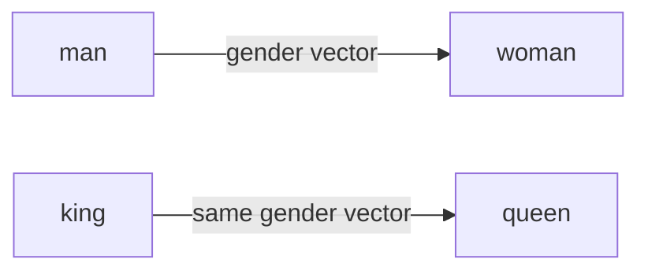
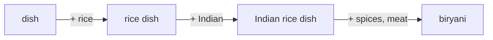

# Static vs Contextual Word Embeddings

## Why Word Embeddings Exist

Human language is understood through meaning; machines process numbers. **Word embeddings** bridge this gap by converting each word into a mathematical vector — a list of real numbers that encodes semantic properties.

$$\text{king} \rightarrow [0.2,\ -0.5,\ 0.8,\ \ldots]$$

The numbers are not arbitrary: they capture the essence of the word so that mathematical operations reveal relationships humans recognize intuitively.

---

## How Embeddings Are Created: The Property Encoding Model

Imagine encoding words by listing observable properties:

| Property | king | queen |
|----------|------|-------|
| Has authority | 1 | 1 |
| Gender (0=male, 1=female) | 0 | 1 |
| Is rich | 1 | 1 |

This yields:
- $\mathbf{v}_{\text{king}} = [1,\ 0,\ 1]$
- $\mathbf{v}_{\text{queen}} = [1,\ 1,\ 1]$

Add more properties (has moustache, war experience, trained in cooking) and the vectors grow in dimensionality. Different people might choose different properties — the scheme is arbitrary, but the principle is universal: **encode meaning as numbers along meaningful dimensions**.

Real models (Word2Vec, GloVe, BERT) learn hundreds of latent properties automatically — we do not know what each dimension represents, but we know the vectors work.

---

## Embedding Dimensionality

| Model | Typical Dimensions |
|-------|-------------------|
| Custom toy model | 3–8 |
| GloVe | 100–300 |
| Word2Vec | 300–500 |
| BERT-base | 768 |
| BERT-large | 1024 |
| OpenAI text-embedding-small | 1536 |

More dimensions capture finer-grained meaning but increase compute and storage cost.

---

## Vector Arithmetic and Relationships

### The King − Man + Woman = Queen Identity

$$\mathbf{v}_{\text{king}} - \mathbf{v}_{\text{man}} + \mathbf{v}_{\text{woman}} \approx \mathbf{v}_{\text{queen}}$$

**Intuition:** subtract "maleness" from "king" (leaving royalty/crown), add "femaleness" → arrive at "queen".

**Verification with property vectors:**

$$\begin{bmatrix}1\\0\\1\end{bmatrix} - \begin{bmatrix}0.1\\0\\0.2\end{bmatrix} + \begin{bmatrix}0.1\\1\\0.2\end{bmatrix} = \begin{bmatrix}1\\1\\1\end{bmatrix} \approx \mathbf{v}_{\text{queen}}$$

### Geographic Analogy

$$\mathbf{v}_{\text{Delhi}} - \mathbf{v}_{\text{India}} + \mathbf{v}_{\text{Russia}} \approx \mathbf{v}_{\text{Moscow}}$$

Remove "India" (leaving "capital-of"), apply to "Russia" → "Moscow".

---

## Relationship Vectors

The difference between two word vectors encodes a **relationship**:

$$\mathbf{r}_{\text{gender}} = \mathbf{v}_{\text{woman}} - \mathbf{v}_{\text{man}}$$

Transposing this relationship to royalty:

$$\mathbf{v}_{\text{king}} + \mathbf{r}_{\text{gender}} \approx \mathbf{v}_{\text{queen}}$$

Similarly, $\mathbf{v}_{\text{Delhi}} - \mathbf{v}_{\text{India}}$ encodes the "capital city" relationship, which transposes to Moscow − Russia.

---

## Static Word Embeddings

**Definition:** Each word has exactly **one fixed vector** regardless of context.

| Property | Static (Word2Vec, GloVe) |
|----------|--------------------------|
| Vectors per word | 1 |
| Context sensitivity | None |
| Polysemy handling | Poor |
| Training | Corpus-wide co-occurrence or prediction |
| Speed | Fast lookup |

### The Polysemy Problem

The word `bank` has one vector whether the sentence discusses a river bank or a financial bank. The model cannot distinguish meanings without surrounding context.

---

## Contextual Word Embeddings

**Definition:** The vector for a word **changes based on its surrounding context** in the sentence.

| Property | Contextual (BERT, GPT) |
|----------|------------------------|
| Vectors per word | One per occurrence |
| Context sensitivity | Full |
| Polysemy handling | Excellent |
| Training | Massive neural networks |
| Speed | Slower (requires full sentence) |

### Resolving "dish" Through Context

Consider: "I ate the **dish** last night."

| Context level | Embedding shifts toward |
|---------------|------------------------|
| `dish` alone | Ambiguous (food or utensil) |
| `rice dish` | Rice-based foods (biryani, risotto, kheer) |
| `Indian rice dish` | Indian rice foods (biryani, kheer) |
| `Indian rice dish with spices and meat` | **Biryani** |

Each additional context word shifts the embedding through **relationship vectors** in space:

The final contextual embedding for `dish` in this sentence is near biryani, not risotto or pizza.

### Context from Surrounding Text

**Example:** Two people with different food preferences:

- Utkarsh loves chole bhature, mutton biryani, kachori (Indian cuisine)
- Don Corleone loves risotto, pasta, calzone (Italian cuisine)
- Don Corleone invites Utkarsh for dinner at his home

**Prediction:** The blank "_____ cuisine" is most likely **Italian** (highest probability), not Indian or Brazilian — because contextual cues (Italian name, Italian food preferences, host's home) dominate.

Static embeddings would struggle; contextual models capture these cross-sentence relationships.

---

## Static vs Contextual: Comparison Table

| Criterion | Static | Contextual |
|-----------|--------|------------|
| Vectors per word | 1 (fixed) | Context-dependent |
| Polysemy | Cannot resolve | Resolves via context |
| Model examples | Word2Vec, GloVe | BERT, GPT, ELMo |
| Dimensions | 100–500 | 768–1536 |
| Compute | Low (lookup) | High (forward pass) |
| Analogy arithmetic | Strong | Less interpretable |
| Production use | Similarity, clustering | Classification, QA, generation |

---

## How Contextual Embeddings Are Built

Modern models (BERT, GPT) use massive neural networks with millions of parameters across many layers. These layers learn to:

1. Read the entire sentence (or document)
2. Compute attention-weighted combinations of all words
3. Produce a context-specific vector for each token

The components of a contextual embedding decompose into contributions from surrounding words — analogous to how biryani's embedding decomposes into dish + rice + Indian + spices + meat.

---

## Common Pitfalls / Exam Traps

- **"All embeddings are contextual"** — Word2Vec and GloVe are static; only one vector per word.
- **Confusing dimensions with properties** — we know dimension counts (768 for BERT) but not what each dimension means.
- **Assuming vector arithmetic works equally on contextual embeddings** — king − man + woman is demonstrated on static embeddings; contextual vectors change per sentence.
- **Exam trap: polysemy** — "bank" (river) vs "bank" (financial) is the classic example of static embedding failure.
- **"Higher dimensions always better"** — more dimensions help but increase cost; task-dependent trade-off.

---

## Quick Revision Summary

- Word embeddings convert words to numerical vectors that encode meaning.
- Embeddings are created by encoding properties as dimensions; real models learn latent properties automatically.
- Vector arithmetic captures relationships: king − man + woman ≈ queen.
- Relationship vectors (gender, capital-city) transpose across word pairs.
- Static embeddings: one fixed vector per word (Word2Vec, GloVe); fail on polysemy.
- Contextual embeddings: vectors change with sentence context (BERT, GPT); resolve ambiguity.
- "dish" → "Indian rice dish with spices and meat" → biryani demonstrates contextual resolution.
- BERT-base: 768 dims; GPT embeddings: up to 1536 dims.
