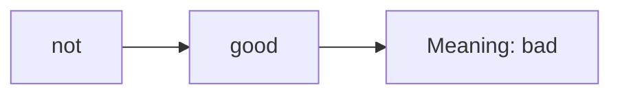

# Sequential Modelling: Module Overview

## Intuition: Language Is a Sequence, Not a Bag

Previous vectorization methods — TF-IDF, feedforward neural networks — treat text as a fixed-size feature vector. Two fundamental problems make this inadequate for real language understanding:

1. **Fixed input size** — vocabulary-sized vectors cannot naturally handle a 3-word sentence and a 1000-word paragraph differently
2. **Loss of word order** — "the dog bit the man" and "the man bit the dog" are identical to BoW/TF-IDF

Language is inherently **sequential**: the meaning of each word depends heavily on what came before it.

---

## The Two Core Problems

### Problem 1: Fixed Input Size

| Method | Input constraint |
|--------|-----------------|
| BoW / TF-IDF | Vector length = vocabulary size (fixed) |
| Feedforward NN | Input layer has fixed number of neurons |
| One-hot per sentence | Same dimension regardless of sentence length |

Variable-length text requires padding, truncation, or aggregation — all of which lose information.

### Problem 2: Loss of Order

| Sentence A | Sentence B |
|------------|------------|
| The dog bit the man | The man bit the man |

BoW representation: **identical** (same words, same counts).

But meaning: **opposite** (who is the biter?).

Negation is equally broken: "not good" vs "good" share the feature `good`.

---

## The Sequential Modelling Solution

Sequential models address both problems:

| Capability | How |
|------------|-----|
| **Variable length** | Process one token at a time; no fixed input size |
| **Temporal order** | Hidden state carries information from previous tokens |

**Key insight:** "not" coming before "good" changes meaning entirely — "not good" is bad. Order matters.

---

## What This Module Covers

| Topic | Purpose |
|-------|---------|
| Seq2Seq modelling | Encoder-decoder for sequence-to-sequence tasks |
| RNNs | Recurrent architecture with memory |
| RNN applications | Many-to-one, one-to-many, many-to-many |
| Vanishing gradients | Why RNNs forget long-range context |
| LSTM | Gated memory for long sequences |
| GRU | Simplified gated alternative |

---

## Why Sequential Models Matter in Production

| Application | Why sequence matters |
|-------------|---------------------|
| Machine translation | Word order differs across languages |
| Speech recognition | Audio is a temporal signal |
| Text summarization | Key facts at the start must influence the summary |
| Chatbots | Conversation history provides context |

Cloud services like Google Translate, AWS Transcribe, and Azure Speech all depend on sequential architectures (historically RNN/LSTM; now largely Transformer-based).

---

## Common Pitfalls / Exam Traps

- **"TF-IDF handles variable length"** — the vector size is fixed (vocabulary length); only the number of non-zero entries varies.
- **Confusing sequential models with n-grams** — n-grams capture local order in a fixed window; RNNs capture order across the full sequence.
- **Assuming BoW is never useful** — it remains valid for keyword tasks; sequential models are needed when order matters.
- **Exam trap: two problems** — fixed input size and loss of order are the two motivations for sequential modelling.

---

## Quick Revision Summary

- Two problems with prior methods: fixed input size and loss of word order.
- BoW treats "the dog bit the man" and "the man bit the dog" as identical.
- Sequential models process variable-length text token by token.
- Temporal order is preserved via hidden state memory.
- "not good" ≠ "good" — negation requires sequence awareness.
- This module covers Seq2Seq, RNN, LSTM, GRU, and vanishing gradients.
