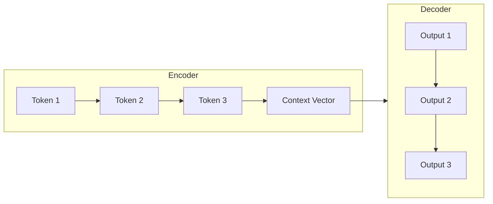
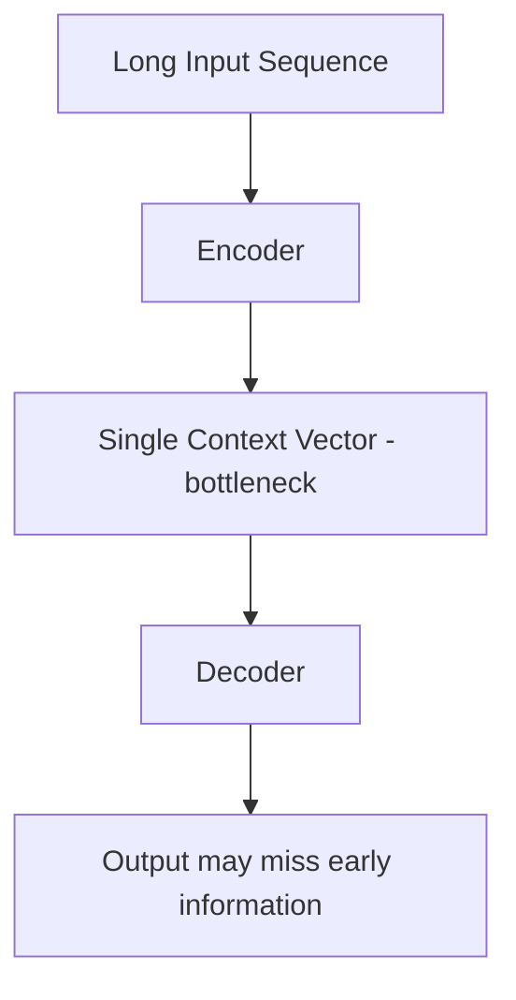

# Sequence-to-Sequence (Seq2Seq) Modelling

## Intuition: One Sequence In, Another Sequence Out

Many NLP tasks transform an input sequence into an output sequence of different length and content:

- English sentence → French sentence (translation)
- Long article → short summary (summarization)
- Audio waveform → text transcript (speech recognition)

**Sequence-to-sequence (Seq2Seq)** modelling trains systems to convert sequences from one domain into sequences in another. The architecture that powers this is the **encoder-decoder** framework.

---

## The Encoder-Decoder Architecture

### Encoder

- Consumes the input sequence **one token at a time**
- Progressively updates its internal state
- Compresses the entire input meaning into a single fixed-size vector: the **context vector** (or final hidden state)
- Analogy: reading an entire book and forming one mental summary

### Decoder

- Receives the context vector as its starting point
- Generates the output sequence **one token at a time**
- Each generated token feeds back as input for the next step
- Analogy: taking that mental summary and writing it in a different language

---

## Worked Example: English → French

**Input:** "I am fine"

| Step | Encoder reads | Hidden state updates |
|------|--------------|---------------------|
| 1 | `I` | $h_1$ |
| 2 | `am` | $h_2$ |
| 3 | `fine` | $h_3$ (context vector) |

**Decoder generates:**

| Step | Decoder outputs |
|------|----------------|
| 1 | `Je` |
| 2 | `vais` |
| 3 | `bien` |

Output: "Je vais bien" — French for "I am fine".

Input and output lengths differ (3 → 3 here, but can vary arbitrarily).

---

## Real-World Applications

| Application | Input Sequence | Output Sequence |
|-------------|-----------------|-----------------|
| Machine translation | Source language sentence | Target language sentence |
| Text summarization | Long article (1000+ words) | Short summary (50 words) |
| Speech recognition | Audio signal frames | Text transcript |
| Chatbot response | User message + history | System reply |

All share the pattern: **sequence in → sequence out**.

---

## The Information Bottleneck

The encoder must compress **everything** about a long input — grammar, tone, facts, entities — into a single fixed-size context vector.

| Input length | Challenge |
|-------------|-----------|
| Short (5 words) | Context vector is sufficient |
| Long (500 words) | Model forgets the beginning by the time it reaches the end |
| Very long (5000 words) | Severe information loss |

This bottleneck is the fundamental limitation of basic Seq2Seq and motivates **attention mechanisms** (covered in later modules), which allow the decoder to look back at all encoder states rather than relying on one compressed vector.

---

## Seq2Seq vs Other Architectures

| Architecture | Input | Output | Example |
|-------------|-------|--------|---------|
| Many-to-one | Sequence | Single label | Sentiment analysis |
| One-to-many | Single input | Sequence | Image captioning |
| Many-to-many (synced) | Sequence | Sequence (aligned) | POS tagging |
| Seq2Seq (many-to-many) | Sequence | Sequence (unaligned) | Translation |

Seq2Seq is the general many-to-many case where input and output lengths need not match.

---

## Common Pitfalls / Exam Traps

- **Confusing encoder and decoder roles** — encoder reads input; decoder generates output.
- **"Context vector captures everything perfectly"** — false for long sequences; this is the information bottleneck.
- **Assuming equal input/output length** — Seq2Seq handles different lengths (article → summary).
- **Exam trap: what solves the bottleneck** — attention mechanisms (not covered in basic Seq2Seq).

---

## Quick Revision Summary

- Seq2Seq converts input sequences to output sequences in a different domain.
- Encoder-decoder architecture: encoder compresses input → context vector → decoder generates output.
- Applications: translation, summarization, speech recognition.
- Encoder processes one token at a time; decoder generates one token at a time.
- Information bottleneck: single context vector cannot capture very long inputs.
- Attention mechanisms (future topic) address the bottleneck by allowing selective lookback.
