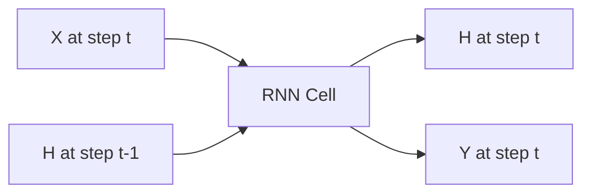
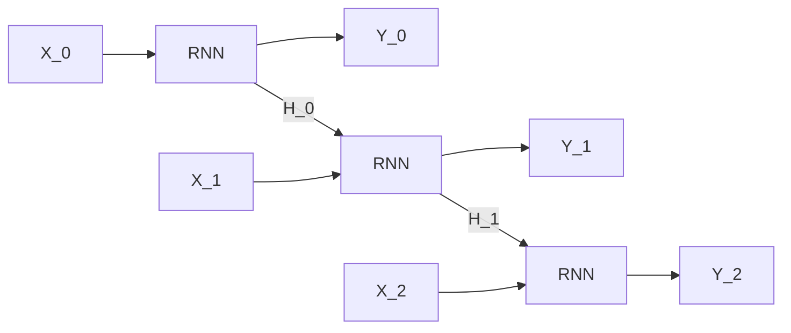

# Recurrent Neural Networks (RNNs)

## Intuition: Memory Through Feedback

A standard feedforward neural network maps input $X$ directly to output $Y$ — each input is processed independently with no memory of previous inputs. Language requires memory: the meaning of "bank" depends on whether the previous word was "river" or "financial".

**RNNs** introduce a **feedback loop**: the hidden state from the previous time step feeds into the current time step, creating persistent memory across the sequence.

---

## Feedforward vs Recurrent

| Feedforward NN | RNN |
|----------------|-----|
| $X \rightarrow H \rightarrow Y$ | $X_t + H_{t-1} \rightarrow H_t \rightarrow Y_t$ |
| No memory between inputs | Hidden state carries past context |
| Fixed input size | Variable sequence length |

---

## The RNN Computation at Time Step $t$

At each time step $t$:

- **Input:** $X_t$ (current token) and $H_{t-1}$ (previous hidden state / memory)
- **Output:** $Y_t$ (current prediction) and $H_t$ (updated hidden state)

$$H_t = \tanh\!\left(W_{hh} \cdot H_{t-1} + W_{xh} \cdot X_t + b_h\right)$$

$$Y_t = W_{hy} \cdot H_t + b_y$$

| Symbol | Meaning |
|--------|---------|
| $X_t$ | Input at current time step |
| $H_{t-1}$ | Previous memory (hidden state) |
| $H_t$ | Updated memory |
| $Y_t$ | Output at current time step |
| $W_{hh}, W_{xh}, W_{hy}$ | Weight matrices (shared across all time steps) |
| $\tanh$ | Activation function (bounds values to [−1, 1]) |

---

## The Hidden State as Memory

The hidden state $H_t$ is the **memory bucket** of the network:

- As the RNN reads word by word, it updates this bucket
- New information is added; old information may fade
- At step $t$, the network decides based on:
  - Current input $X_t$
  - Current context $H_t$ (being computed)
  - Past context $H_{t-1}$

---

## Unrolling Over Time

A 5-word sentence produces a chain of 5 identical RNN cells:

Each cell uses the **same weight matrices** ($W_{xh}$, $W_{hh}$, $W_{hy}$) — the model learns one general rule for processing language regardless of position in the sequence.

---

## Why Shared Weights Matter

| Property | Implication |
|----------|-------------|
| Same weights at every step | Position-invariant processing rules |
| Parameter efficiency | Few weights regardless of sequence length |
| Generalization | Rules learned at position 3 apply at position 300 |

This is analogous to applying the same reading comprehension strategy to every word in a sentence.

---

## RNNs and the Information Bottleneck

Basic Seq2Seq encoders are RNNs. The final hidden state $H_T$ serves as the context vector for the decoder. For short sequences, this works well. For long sequences, early information in $H_0, H_1, \ldots$ gets overwritten by later inputs — the memory bucket overflows.

This limitation leads to LSTM and GRU architectures (covered next).

---

## Common Pitfalls / Exam Traps

- **"RNN has different weights at each step"** — false; weights are shared (tied) across time steps.
- **Confusing $H_t$ and $Y_t$** — $H_t$ is internal memory; $Y_t$ is the output prediction.
- **Assuming RNN solves long-term memory** — vanilla RNNs suffer from vanishing gradients; LSTM/GRU are needed.
- **Exam trap: activation function** — RNN hidden state uses $\tanh$, not sigmoid.

---

## Quick Revision Summary

- RNNs add a feedback loop: previous hidden state $H_{t-1}$ feeds into current step.
- $H_t = \tanh(W_{hh} H_{t-1} + W_{xh} X_t + b_h)$
- Hidden state $H_t$ is the network's memory bucket.
- Unrolled RNN = chain of identical cells sharing weights.
- Same weight matrices at every time step — position-invariant processing.
- Vanilla RNNs handle short context but fail on long-range dependencies (vanishing gradients).
