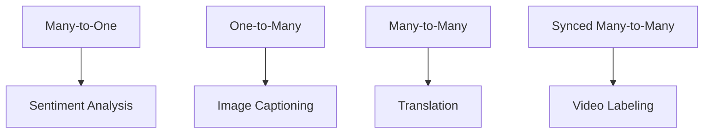

# RNN Architecture Patterns: Many-to-One, One-to-Many, Many-to-Many

## Intuition: Same RNN, Different Shapes

A single RNN cell can be wired differently depending on the task. The naming convention describes how many input time steps and how many output time steps the architecture uses:

$$\text{Input tokens} \rightarrow \text{RNN} \rightarrow \text{Output tokens}$$

Four patterns cover most sequence modelling tasks in production NLP and speech systems.

---

## The Four Architecture Types

---

## 1. Many-to-One

**Input:** sequence of tokens → **Output:** single label

| Component | Description |
|-----------|-------------|
| Input | Multiple words (sequence) |
| RNN | Processes all tokens, final hidden state summarizes |
| Output | One prediction (class label, score) |

**Example — Sentiment Analysis:**

- Input: "The movie is terrible"
- Output: `negative`

Like reading an entire review to decide thumbs up or down.

**Production uses:** product review scoring, ticket urgency classification, social media brand monitoring.

---

## 2. One-to-Many

**Input:** single token/vector → **Output:** sequence of tokens

| Component | Description |
|-----------|-------------|
| Input | One vector (image features, seed token) |
| RNN | Generates tokens sequentially from initial state |
| Output | Sequence of words |

**Example — Image Captioning:**

- Input: image feature vector (from CNN)
- Output: "A cat sat on a sofa"

The RNN looks at the photo representation and describes it word by word.

**Production uses:** automated alt-text generation, video thumbnail descriptions.

---

## 3. Many-to-Many (Seq2Seq)

**Input:** sequence → **Output:** sequence (lengths may differ)

| Component | Description |
|-----------|-------------|
| Input | Source language sentence |
| Encoder-decoder RNN | Compresses input, generates output |
| Output | Target language sentence |

**Example — Machine Translation:**

- Input: English sentence (5 words)
- Output: French sentence (7 words)

Input and output lengths are **not required to match**.

**Production uses:** Google Translate (historically), text summarization, chatbot response generation.

---

## 4. Synced Many-to-Many

**Input:** sequence → **Output:** sequence (aligned one-to-one)

| Component | Description |
|-----------|-------------|
| Input | One token per time step |
| RNN | Produces one output per input step |
| Output | One label per input step |

**Example — Video Frame Labeling / Subtitle Generation:**

- Input: video frames $[F_1, F_2, F_3, F_4]$
- Output: labels $[L_1, L_2, L_3, L_4]$ (running, jumping, running, sitting)

Each input time step maps to exactly one output time step.

**Production uses:** frame-level action recognition, phoneme-level speech alignment.

---

## Comparison Table

| Architecture | Input | Output | Input:Output ratio | Example |
|-------------|-------|--------|-------------------|---------|
| Many-to-one | Sequence | 1 label | N:1 | Sentiment analysis |
| One-to-many | 1 vector | Sequence | 1:N | Image captioning |
| Many-to-many | Sequence | Sequence | N:M (variable) | Translation |
| Synced many-to-many | Sequence | Sequence | N:N (aligned) | POS tagging, frame labels |

---

## Choosing the Right Architecture

| Task | Architecture | Why |
|------|-------------|-----|
| Classify a document | Many-to-one | Whole document → one category |
| Generate text from image | One-to-many | Single image → word sequence |
| Translate or summarize | Many-to-many (Seq2Seq) | Variable-length in and out |
| Tag each word | Synced many-to-many | One label per token |

---

## Common Pitfalls / Exam Traps

- **Confusing many-to-many with synced many-to-many** — Seq2Seq allows different lengths; synced requires 1:1 alignment.
- **"Sentiment analysis is one-to-many"** — false; it is many-to-one (many words → one label).
- **Image captioning as many-to-one** — false; it is one-to-many (one image → many words).
- **Exam trap: translation architecture** — many-to-many (Seq2Seq), not synced.

---

## Quick Revision Summary

- Four RNN patterns: many-to-one, one-to-many, many-to-many, synced many-to-many.
- Many-to-one: sequence input → single output (sentiment analysis).
- One-to-many: single input → sequence output (image captioning).
- Many-to-many: sequence → different-length sequence (translation, summarization).
- Synced many-to-many: one output per input step (POS tagging, frame labeling).
- Architecture choice depends on input/output cardinality, not the RNN cell itself.
