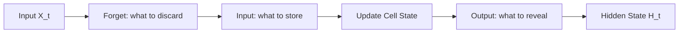

# Long Short-Term Memory (LSTM) Networks

## Intuition: A Computer Chip with Gates

Vanilla RNNs suffer from short-term memory — gradients vanish over long sequences. **LSTM** (Long Short-Term Memory) solves this by separating **short-term processing** (hidden state) from **long-term storage** (cell state) and using **gates** to control what information flows, stays, or gets discarded.

Think of LSTM not as a simple neuron but as a logic chip with selective memory management.

---

## Two Memory Stores

| Store | Role | Analogy |
|-------|------|---------|
| **Hidden state** $H_t$ | Short-term working memory | Current thought |
| **Cell state** $C_t$ | Long-term storage highway | Persistent notebook |

The cell state runs through the entire chain with minimal transformation — gradients flow backward through it largely unchanged, solving the vanishing gradient problem.

---

## The Four Components

```mermaid
flowchart TD
    XT[X_t] --> FG[Forget Gate]
    XT --> IG[Input Gate]
    XT --> OG[Output Gate]
    CT1[C_{t-1}] --> CS[Cell State Highway]
    FG --> CS
    IG --> CS
    CS --> CT[C_t]
    CT --> OG
    OG --> HT[H_t]
```

### 1. Cell State ($C_t$) — The Highway

Information flows straight down the cell state path with few interactions. This "superhighway" allows gradients to propagate backward without vanishing.

### 2. Forget Gate — What to Discard

Decides what information to **throw away** from the cell state.

- Uses **sigmoid** activation → output in $[0, 1]$
- 0 = forget completely; 1 = keep everything

**Example:** When the subject changes from singular to plural, forget the old singular subject information.

$$f_t = \sigma(W_f \cdot [H_{t-1}, X_t] + b_f)$$

### 3. Input Gate — What to Store

Decides what **new information** to write into the cell state.

- Sigmoid: what values to update
- Tanh: candidate new values

**Example:** Store the new gender of a plural subject.

$$i_t = \sigma(W_i \cdot [H_{t-1}, X_t] + b_i)$$
$$\tilde{C}_t = \tanh(W_C \cdot [H_{t-1}, X_t] + b_C)$$

### 4. Output Gate — What to Reveal

Decides what to **output** based on the current cell state.

**Example:** Output a verb conjugated for the new plural subject.

$$o_t = \sigma(W_o \cdot [H_{t-1}, X_t] + b_o)$$
$$H_t = o_t \odot \tanh(C_t)$$

---

## Simplified LSTM Flow



1. Receive input $X_t$ and previous states $H_{t-1}$, $C_{t-1}$
2. **Forget gate** removes irrelevant old information
3. **Input gate** adds relevant new information
4. **Cell state** is updated
5. **Output gate** filters cell state to produce $H_t$

---

## LSTM vs Vanilla RNN

| Criterion | Vanilla RNN | LSTM |
|-----------|-------------|------|
| Long-term memory | Poor (vanishing gradients) | Strong (cell state highway) |
| Gates | None | Forget, input, output |
| Parameters | Fewer | More (4 gate weight matrices) |
| Compute cost | Lower | Higher |
| Best for | Short sequences | Long paragraphs, translation |

---

## Practical Note

Understanding LSTM gate equations in full detail is valuable for research but **not required** to use LSTMs effectively in practice. Frameworks like PyTorch (`nn.LSTM`) and TensorFlow (`tf.keras.layers.LSTM`) handle the internals; practitioners focus on architecture design, hyperparameters, and data.

---

## Production Applications

| Task | Why LSTM |
|------|----------|
| Machine translation | Long source sentences require persistent memory |
| Speech recognition | Audio sequences span thousands of frames |
| Time-series forecasting | Long historical context (stock prices, sensor data) |
| Text generation | Maintain thematic coherence over paragraphs |

---

## Common Pitfalls / Exam Traps

- **Confusing hidden state and cell state** — $C_t$ is long-term storage; $H_t$ is short-term output.
- **"LSTM has no vanishing gradient problem"** — the cell state mitigates it; very extreme cases can still struggle.
- **Forget gate uses tanh** — false; forget gate uses sigmoid (0 to 1); tanh is for candidate values.
- **Exam trap: three gates** — forget, input, output (cell state is not a gate, it is the highway).

---

## Quick Revision Summary

- LSTM separates short-term (hidden state) and long-term (cell state) memory.
- Three gates: forget (discard), input (store), output (reveal).
- Cell state is a gradient highway — solves vanishing gradients.
- Forget/input gates use sigmoid; candidate values use tanh.
- More parameters than vanilla RNN but handles long sequences effectively.
- Frameworks abstract gate internals; focus on architecture and data for applied use.
