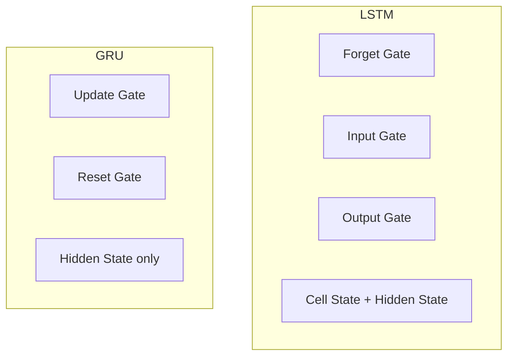

# Gated Recurrent Unit (GRU)

## Intuition: LSTM's Leaner Sibling

LSTM solved the long-term memory problem but at a cost: four gate weight matrices, separate cell and hidden states, and significant computational overhead. **GRU** (Gated Recurrent Unit) achieves comparable performance with a simplified architecture — merging the cell and hidden states and reducing three LSTM gates to two.

---

## GRU vs LSTM: Architectural Comparison

| Component | LSTM | GRU |
|-----------|------|-----|
| Memory stores | Cell state + hidden state | Hidden state only (merged) |
| Gates | 3 (forget, input, output) | 2 (update, reset) |
| Parameters | More | Fewer |
| Training speed | Slower | Faster |
| Long sequence performance | Slightly better | Comparable |

---

## The Two GRU Gates

### 1. Update Gate — Merge of Forget + Input

Combines LSTM's forget and input gates into one decision:

> "How much of the past should I keep, and how much new information should I let in?"

| Value | Behavior |
|-------|----------|
| Near 0 | Discard past, accept new information |
| Near 1 | Keep past, ignore new information |

**Analogy:** "Should I update my memory now?"

$$z_t = \sigma(W_z \cdot [H_{t-1}, X_t])$$

### 2. Reset Gate — Selective Context Ignoring

Decides how much of the **past information to ignore** when computing the new candidate state.

**Analogy:** "Drop the previous context for a moment — does this new word make sense on its own?"

$$r_t = \sigma(W_r \cdot [H_{t-1}, X_t])$$

The reset gate is useful when a new topic begins and prior context would mislead the prediction.

---

## GRU Computation (Simplified)

1. Compute update gate $z_t$ and reset gate $r_t$ from $H_{t-1}$ and $X_t$
2. Compute candidate hidden state $\tilde{H}_t$ (using reset gate to optionally ignore past)
3. Interpolate between old and new state using update gate:

$$H_t = (1 - z_t) \odot H_{t-1} + z_t \odot \tilde{H}_t$$

The update gate controls the blend: mostly old memory or mostly new information.

---

## When to Choose GRU vs LSTM

| Scenario | Recommendation | Reason |
|----------|---------------|--------|
| Small dataset (tweets, reviews) | **GRU** | Fewer parameters → less overfitting |
| Fast prototyping | **GRU** | Faster training |
| Very long sequences (translation, long text gen) | **LSTM** | Slightly better long-range memory |
| Limited compute budget | **GRU** | Fewer FLOPs per step |
| GRU underperforms on validation | **Switch to LSTM** | More capacity for complex patterns |

**Rule of thumb:** Start with GRU for speed. If validation performance is insufficient, upgrade to LSTM.

---

## Real-World Usage

| Application | Typical Choice |
|-------------|---------------|
| Tweet sentiment analysis | GRU (short sequences, small data) |
| Product review classification | GRU |
| Machine translation (production) | LSTM or Transformer (long sequences) |
| Time-series anomaly detection | GRU (speed matters for real-time) |

In cloud ML pipelines, GRU-based models deploy faster and cost less per inference — a meaningful advantage at scale when LSTM's marginal accuracy gain does not justify the overhead.

---

## GRU vs LSTM vs Transformer

| Model | Memory mechanism | Long-range | Speed | Era |
|-------|-----------------|------------|-------|-----|
| Vanilla RNN | Hidden state only | Poor | Fast | Legacy |
| GRU | Gated hidden state | Good | Fast | 2014+ |
| LSTM | Gated cell + hidden | Better | Moderate | 1997+/dominant 2014–2017 |
| Transformer | Self-attention | Best | Parallelizable | 2017+/current |

Modern production NLP (BERT, GPT) has largely replaced RNN/LSTM/GRU, but understanding gated architectures remains essential for legacy systems, resource-constrained deployments, and exam contexts.

---

## Common Pitfalls / Exam Traps

- **"GRU has a separate cell state"** — false; GRU merges cell and hidden state.
- **"GRU is always worse than LSTM"** — false; often comparable, especially on smaller datasets.
- **Confusing update and reset gates** — update: how much past to keep; reset: how much past to ignore for new candidate.
- **Exam trap: GRU gate count** — 2 gates (update + reset), not 3.

---

## Quick Revision Summary

- GRU is a simplified LSTM: 2 gates instead of 3, no separate cell state.
- Update gate: blends past and new information (replaces forget + input gates).
- Reset gate: optionally ignores past when computing new candidate state.
- Faster to train, fewer parameters, often matches LSTM on smaller datasets.
- Rule of thumb: start with GRU; switch to LSTM if underperforming on long/complex sequences.
- Transformers have largely superseded both in modern NLP, but GRU/LSTM remain relevant for constrained environments.
