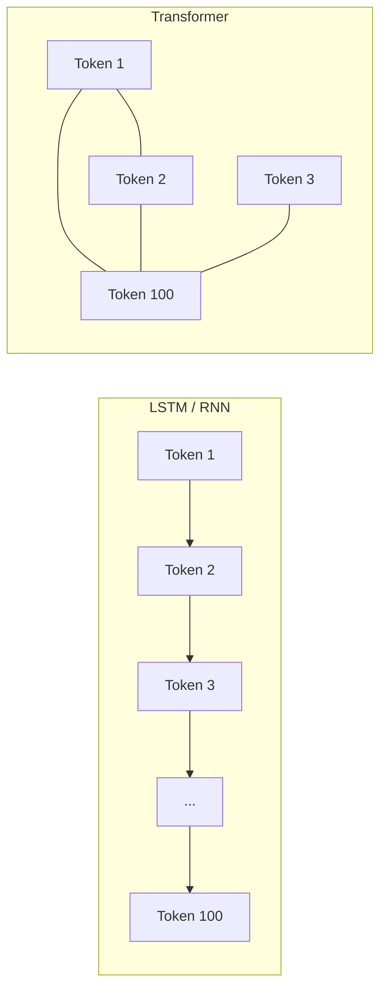

# From Sequential Models to Transformers: The Motivation

## Why RNNs and LSTMs Hit a Wall

Recurrent Neural Networks (RNNs) and their improved variant, Long Short-Term Memory (LSTM) networks, were designed to handle sequences by maintaining hidden state across time steps. LSTMs address the vanishing gradient problem better than plain RNNs and can retain information over longer spans — a genuine advance over earlier sequence models.

However, both architectures share a structural constraint: **sequential processing**. To compute the representation of the 100th token, the model must first process tokens 1 through 99. Each step depends on the previous one, so the computation graph unfolds strictly in order.

### The GPU Parallelism Problem

Modern GPUs excel at **massive parallel matrix operations** — the same kind of work that powers training on cloud ML platforms (AWS SageMaker, Google Vertex AI, Azure ML). Sequential models underutilize this hardware:

- Only one time step runs at a time per sequence
- Batch parallelism helps across sequences, but not within a single long document
- Training on large corpora (millions of sentences) becomes prohibitively slow

For a 100-word sentence, the bottleneck is manageable. For a document with 1,000–10,000 words, sequential dependency makes both **training time** and **inference latency** unacceptable at production scale.

### The Long-Distance Dependency Problem

Even with LSTM gating, information from early tokens tends to **fade** by the time the model reaches token 100. Real NLP tasks — coreference resolution ("it" referring to "animal"), document-level classification, long-form summarization — require linking distant words. LSTMs partially mitigate this but do not eliminate it.

## The Transformer Idea

Transformers abandon recurrence entirely. Instead, they rely on a mechanism that lets **any token attend to any other token in a single parallel pass**:

- Process the entire sentence (or chunk) at once
- Each word can directly "look at" every other word and compute a relevance score
- No waiting for prior tokens to finish processing

This design unlocks full GPU parallelism and direct long-range connections — the foundation of BERT, GPT, Gemini, Claude, and virtually every modern NLP system deployed in production.

| Limitation | LSTM / RNN | Transformer |
|------------|------------|-------------|
| Processing order | Sequential (token by token) | Parallel (all tokens at once) |
| GPU utilization | Low within a sequence | High — matrix ops across all positions |
| Long-range links | Indirect, decay over distance | Direct via attention weights |
| Training speed on large data | Slow | Much faster at scale |

## Common Pitfalls / Exam Traps

- **Trap:** "LSTMs solve all long-sequence problems." LSTMs improve memory but still process sequentially and still struggle with very long dependencies compared to attention.
- **Trap:** Confusing "parallel batching" (processing many sequences at once) with "parallel within-sequence processing" — only Transformers achieve the latter.
- **Trap:** Assuming Transformers eliminate the need for positional information — they process tokens in parallel but still need positional encoding to preserve word order.

## Quick Revision Summary

- LSTMs fix vanishing gradients but retain sequential processing as a core bottleneck.
- Sequential models cannot efficiently use GPU parallelism within a single long sequence.
- Long documents (1,000+ words) expose both speed and long-distance dependency failures in RNN/LSTM architectures.
- Transformers replace recurrence with attention: every token can relate to every other token in one step.
- This parallel design is the prerequisite for training on internet-scale data and building modern LLMs.
- The shift from LSTM-era NLP to Transformer-era NLP is driven by hardware efficiency and direct long-range modeling, not just incremental accuracy gains.
