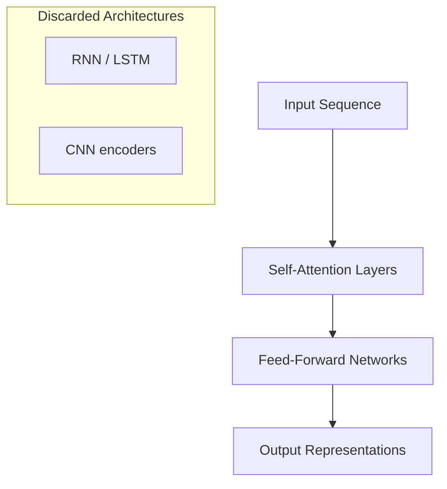

# Attention Is All You Need: Origins of the Transformer

## Historical Context

Before 2017, state-of-the-art sequence modeling relied heavily on **Recurrent Neural Networks (RNNs)** and **Convolutional Neural Networks (CNNs)** for tasks like machine translation. These architectures processed text step-by-step or through local convolution windows — workable, but slow and limited in capturing global context efficiently.

In 2017, researchers at Google Brain published **"Attention Is All You Need"** (Vaswani et al.). The paper's central proposal was radical in its simplicity:

> Discard RNNs and CNNs for sequence transduction. Use **self-attention** as the sole mechanism for relating tokens.

## The Core Idea: Self-Attention

Self-attention allows each position in a sequence to compute a weighted combination of representations from **all other positions**. No hidden state needs to propagate sequentially from left to right. The model learns which tokens matter for interpreting each token — in parallel.

## Impact on Scale and the LLM Era

The Transformer architecture enabled training on **massive corpora** that were impractical under sequential models:

- Full Wikipedia dumps
- Reddit comment archives
- Stack Overflow Q&A
- Broad web-scale crawls

Training became **orders of magnitude faster** because attention layers map cleanly to parallel GPU kernels. The result was not just faster experiments — it unlocked models large enough to exhibit emergent language understanding.

### What Followed

The paper directly enabled the modern large language model ecosystem:

| Model family | Role | Transformer variant |
|--------------|------|---------------------|
| BERT | Language understanding | Encoder-only |
| GPT-3 / GPT-4 | Text generation | Decoder-only |
| Gemini, Claude | General-purpose LLMs | Decoder-only (scaled) |
| T5, BART | Translation, summarization | Encoder-decoder |

Every major cloud NLP API — OpenAI, Google AI, Anthropic, Azure OpenAI — rests on Transformer derivatives trained on web-scale data.

## Why the Paper Mattered for Industry

- **Transfer learning at scale:** Pre-train once on huge data, fine-tune for downstream tasks (sentiment, NER, QA).
- **Infrastructure alignment:** Transformers match the hardware trend toward tensor-core GPUs and TPU pods.
- **Open ecosystem:** Architectures and weights published on Hugging Face accelerated adoption across startups and enterprises.

Real-world example: A fintech company routing support tickets previously used bag-of-words + logistic regression. After BERT-based fine-tuning (enabled by the Transformer paper's architecture), accuracy on intent classification jumped while the same cloud GPU budget supported larger batch sizes during training.

## Common Pitfalls / Exam Traps

- **Trap:** Crediting LSTMs as the foundation of GPT — GPT is **decoder-only Transformer**, not LSTM-based.
- **Trap:** Thinking "Attention Is All You Need" introduced attention for the first time — attention existed in seq2seq models before; the novelty was using **only** self-attention, removing recurrence entirely.
- **Trap:** Assuming the original Transformer is identical to GPT — the 2017 model had **both encoder and decoder**; GPT uses only the decoder stack.

## Quick Revision Summary

- Published in 2017 by Google Brain; title: "Attention Is All You Need."
- Proposed replacing RNNs and CNNs with pure self-attention for sequence modeling.
- Self-attention computes relationships between all token pairs in parallel.
- Enabled training on web-scale datasets (Wikipedia, Reddit, Stack Overflow) much faster than before.
- Directly birthed BERT, GPT, Gemini, Claude, and the modern LLM industry.
- The original architecture combined encoder and decoder; later models often use only one side.
- Cloud-scale NLP today is fundamentally a consequence of this architectural shift.
