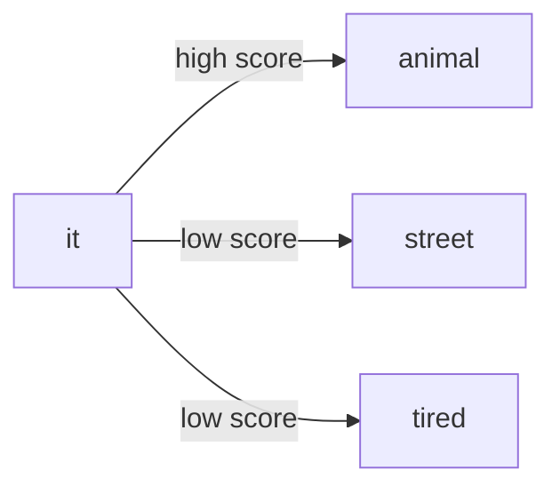
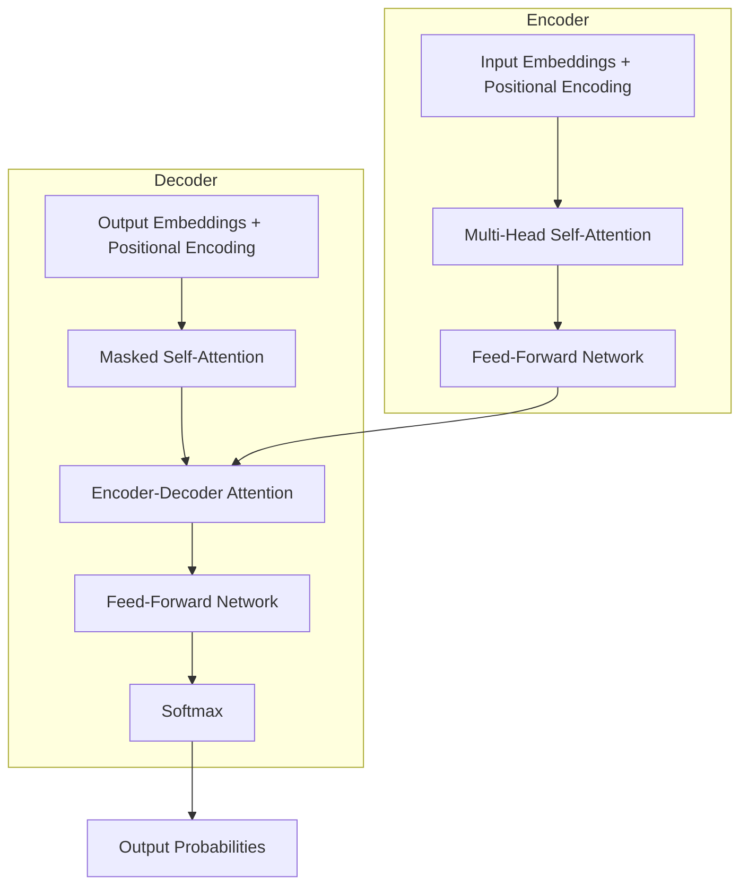

# Transformer Architecture: Self-Attention, Math, and Positional Encoding

## Self-Attention: Intuition First

Consider the sentence:

> The animal did not cross the street because **it** was too tired.

Who is "it"? A human reader resolves this instantly: **it** refers to **animal**, not **street**. Resolution requires comparing **it** against every other word and judging relevance.

Self-attention automates this process:

1. Each word generates a representation
2. Every word "looks at" every other word
3. A **relevance score** is computed for each pair
4. Higher scores mean stronger influence when building the final representation

For **it**, the relevance score with **animal** exceeds the score with **street**, so the model's representation of **it** is dominated by **animal**.

This bidirectional comparison happens for **every token simultaneously** — the defining property of self-attention.

## Full Transformer Architecture Overview

The original Transformer is an **encoder-decoder** model for sequence-to-sequence tasks (e.g., translation).

### Pipeline stages

| Stage | Purpose |
|-------|---------|
| Input embeddings | Convert token IDs to dense vectors |
| Positional encoding | Inject order information (see below) |
| Encoder self-attention | Tokens attend to all tokens in the source |
| Feed-forward network (FFN) | Non-linear transformation per position |
| Decoder masked attention | Tokens attend only to prior decoder positions |
| Encoder-decoder attention | Decoder queries attend to encoder outputs |
| Softmax | Convert logits to probability distribution over vocabulary |

**"Shifted right"** in decoder inputs means the decoder receives previously generated tokens as input during training (teacher forcing), shifted one position so it predicts the next token at each step.

## The Attention Equation

Scaled dot-product attention is defined as:

$$\text{Attention}(Q, K, V) = \text{softmax}\left(\frac{QK^T}{\sqrt{d_k}}\right) V$$

| Symbol | Meaning | Intuition |
|--------|---------|-----------|
| $Q$ (Query) | "What am I looking for?" | The token asking for context |
| $K$ (Key) | "What do I contain?" | Labels/tags used for matching |
| $V$ (Value) | "What information do I pass?" | Actual content aggregated after matching |
| $d_k$ | Key dimension | Scaling factor prevents dot products from growing too large |

**Softmax** converts raw scores into a probability distribution (values between 0 and 1 that sum to 1), determining how much each value vector contributes.

The scaling by $\sqrt{d_k}$ stabilizes gradients when dimensionality is high — a detail often tested in exams.

## Multi-Head Attention

One attention head captures one type of relationship. **Multi-head attention** runs several heads **in parallel**, each learning different patterns:

- Head 1: syntactic structure (subject–verb agreement)
- Head 2: semantic similarity (synonyms, related concepts)
- Head 3: coreference (pronouns → antecedents)

Outputs from all heads are **concatenated** and projected. This replaces sequential processing with parallel specialized attention — directly addressing the GPU efficiency problem.

## Positional Encoding: Why Order Matters

Because all tokens are processed simultaneously, the raw embedding of "The dog bit the man" is **identical** to "The man bit the dog" without additional information. Word order is lost.

**Solution:** Add a positional signal to each embedding using **sine and cosine waves** of different frequencies. Each position receives a unique encoding vector.

Example for two sentences with the same words in different order:

| Word | Sentence 1 position | Sentence 2 position |
|------|--------------------|--------------------|
| The | 1 | 1 (different role) |
| dog | 2 | 5 |
| bit | 3 | 3 |
| the | 4 | 4 |
| man | 5 | 2 |

The model can now distinguish "dog bit man" from "man bit dog" because positional encodings differ even when word embeddings repeat.

## Common Pitfalls / Exam Traps

- **Trap:** Saying self-attention is unidirectional in the encoder — encoder self-attention is **fully bidirectional**; only the decoder uses masking for autoregressive generation.
- **Trap:** Forgetting $\sqrt{d_k}$ in the attention formula — omitting it is a common exam error.
- **Trap:** Confusing Query/Key/Value with input/output embeddings — they are derived from the same input via learned linear projections.
- **Trap:** Assuming Transformers inherently know word order — positional encoding (or learned position embeddings in BERT/GPT) is **mandatory**.

## Quick Revision Summary

- Self-attention: each token scores its relationship with every other token; high scores drive the final representation.
- Coreference ("it" → "animal") is a canonical example of attention-based disambiguation.
- Encoder: bidirectional self-attention + FFN; Decoder: masked self-attention + cross-attention + FFN + softmax.
- Attention formula: $\text{softmax}(QK^T / \sqrt{d_k}) \cdot V$ with Query, Key, Value roles.
- Multi-head attention runs parallel specialized heads (grammar, semantics, coreference) and concatenates results.
- Positional encoding (sin/cos waves) injects order because parallel processing discards sequence information by default.
- Scaling by $\sqrt{d_k}$ prevents softmax saturation in high dimensions.
