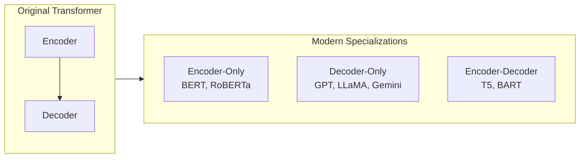

# Popular Transformer Model Families: Encoders, Decoders, and Seq2Seq

## From One Architecture to Three Ecosystems

The original 2017 Transformer combined an **encoder** (reads and understands input) and a **decoder** (generates output). Modern production models rarely use both stacks unchanged. Instead, practitioners pick the half that matches the task — or use the full encoder-decoder for transformation tasks.

## Encoder-Only Models: The Readers

Encoder-only models process the **entire input bidirectionally** — every token sees every other token. They excel at **understanding**, not generation.

| Model | Notes |
|-------|-------|
| BERT | Bidirectional Encoder Representations from Transformers |
| RoBERTa | Robustly optimized BERT (more data, no NSP) |
| DistilBERT | Smaller, faster distilled BERT |

**Strengths:**

- Text classification (spam, intent, topic)
- Sentiment analysis
- Named Entity Recognition (NER)
- Question answering (with fine-tuning)
- Semantic similarity

**Real-world use:** A cloud support platform fine-tunes DistilBERT on ticket text to route "billing" vs "technical" vs "cancellation" requests — low latency on CPU-friendly deployments.

**Key property:** Sees context from **both left and right** simultaneously (bidirectional).

## Decoder-Only Models: The Writers

Decoder-only models generate text **autoregressively** — each new token is predicted from all **prior** tokens only (left context). They cannot see future tokens during generation.

| Model | Notes |
|-------|-------|
| GPT (Generative Pre-trained Transformer) | The **T** stands for Transformer |
| LLaMA | Meta's open-weight decoder family |
| Gemini | Google's multimodal decoder stack |

**Strengths:**

- Open-ended text generation
- Code completion
- Chat and dialogue
- Creative writing, summarization (via prompting)

**Real-world use:** GitHub Copilot and ChatGPT-style assistants are decoder-only models scaled to billions of parameters and aligned with human feedback.

**Key property:** **Causal / unidirectional** attention — only past tokens inform the next prediction.

## Encoder-Decoder Models: The Translators

These retain both stacks: the encoder builds a rich representation of the source; the decoder generates the target sequence while attending to the encoder.

| Model | Notes |
|-------|-------|
| T5 (Text-to-Text Transfer Transformer) | Frames all tasks as text-to-text |
| BART | Denoising autoencoder pre-training |

**Strengths:**

- Machine translation
- Abstractive summarization
- Data-to-text generation
- Any task mapping one sequence to another

**Real-world use:** Google Translate pipelines and enterprise document summarization APIs often use encoder-decoder Transformers fine-tuned per language pair.

## Comparison Table

| Aspect | Encoder-Only | Decoder-Only | Encoder-Decoder |
|--------|--------------|--------------|-----------------|
| Direction | Bidirectional | Unidirectional (left-to-right) | Encoder: bidirectional; Decoder: causal |
| Primary task | Understanding / classification | Generation | Sequence transformation |
| Examples | BERT, RoBERTa, DistilBERT | GPT, LLaMA, Gemini | T5, BART |
| Sees full input at once? | Yes | No (during generation) | Encoder yes; decoder incrementally |
| Typical deployment | Classification APIs, search | Chatbots, copilots | Translation, summarization |

## Common Pitfalls / Exam Traps

- **Trap:** Using GPT (decoder-only) for bidirectional NER without adaptation — GPT sees only left context unless fine-tuned with special prompting; BERT is the natural choice for token-level understanding.
- **Trap:** Forgetting that **T in GPT = Transformer**, not "trained" or "text" alone.
- **Trap:** Assuming BERT can generate long coherent paragraphs out of the box — BERT is not autoregressive; it needs a classification head or separate generation stack.
- **Trap:** Treating T5 and BART as encoder-only — they require **both** halves for seq2seq.

## Quick Revision Summary

- Original Transformer = encoder + decoder; modern models often use one side or both depending on task.
- Encoder-only (BERT family): bidirectional readers — classification, sentiment, NER, QA.
- Decoder-only (GPT family): left-to-right writers — generation, chat, code; T = Transformer.
- Encoder-decoder (T5, BART): translators — translation, summarization, seq2seq.
- Choose architecture by task: understand → encoder; generate → decoder; transform sequence → encoder-decoder.
- DistilBERT and similar variants trade minimal accuracy for speed — common in production edge deployments.
