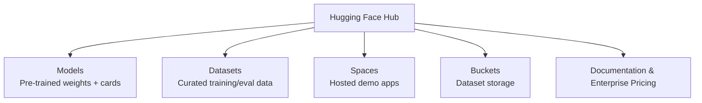

# Hugging Face: The Open ML Hub for Models, Data, and Apps

## What Hugging Face Is

Hugging Face (`huggingface.co`) is a collaborative platform where the machine learning community publishes and consumes **models**, **datasets**, and **applications**. It began as an aggregator for open-source Transformer weights and evolved into a full ecosystem for AI developers — comparable to GitHub for code, but centered on ML artifacts.

As of recent counts, the hub hosts **over 2 million models**, spanning NLP, vision, audio, and multimodal systems. Major contributors include Meta (Facebook), Mistral, Baidu, Cohere, and thousands of independent researchers.

## Platform Layout

## Models Hub

The core value proposition: **download and run state-of-the-art models in a few lines of Python**.

### Exploring a model page (e.g., `bert-base-uncased`)

Each model page typically includes:

- **Model card:** Description, training data, intended use, limitations
- **Variations:** Related checkpoints (uncased, cased, fine-tuned variants)
- **Usage snippet:** Copy-paste Python with `transformers` library
- **Interactive widget:** Test inference in the browser without local setup

**Fill-in-the-blank example:** Input "Paris is the ___" → model predicts **capital** with ~99% confidence. Alternatives (heart, centre, city) rank lower — demonstrating masked language modeling behavior.

**Custom input example:** "The cat ___ on the mat" → top prediction **sat** (16.8% among plausible verbs: lay, landed, collapsed). The highest-probability token reflects training data statistics, not universal truth.

### Integration paths

- **Colab / Kaggle:** One-click notebook links from model pages
- **Local Python:** Copy `pipeline` or `AutoModel` snippets into scripts
- **Enterprise:** Hosted inference endpoints with pricing tiers

**Real-world use:** A startup building a document QA product prototypes with `bert-base-uncased` from Hugging Face, then swaps to a domain fine-tune (`legal-bert`) without changing pipeline code — only the model ID changes.

## Datasets Hub

Hugging Face also hosts high-value datasets with documentation and loading scripts:

- Reasoning traces synthesized by frontier models
- Multilingual corpora
- Domain-specific medical, legal, and financial text

Each dataset page describes schema, license, size, and a `load_dataset()` code example — enabling reproducible training pipelines on cloud VMs.

## Spaces: Hosted Applications

**Spaces** let developers deploy Gradio or Streamlit apps powered by Hugging Face models. Anyone can try the app in a browser.

Example workflow:

1. Build a speech-to-text app using a multilingual ASR model
2. Deploy to Spaces
3. Users upload audio and receive transcripts without installing dependencies

This lowers the barrier from "research checkpoint" to "demoable product" — useful for portfolio projects and stakeholder demos.

## Buckets: Dataset Storage

A newer offering: **managed storage** for private or team datasets, analogous to cloud object storage integrated with the hub workflow. Teams training custom models on proprietary data can keep artifacts in one ecosystem.

## Getting Started

1. Create a free account (email + password)
2. Browse trending models on the homepage or search by name (e.g., "BERT", "Mistral")
3. Read the model card for license and limitations
4. Copy the usage snippet into Colab or local environment
5. Optionally follow organizations for updates on new releases

## Common Pitfalls / Exam Traps

- **Trap:** Assuming all Hugging Face models are free for commercial use — always check the **license** on the model card (Apache 2.0, MIT, CC, research-only, etc.).
- **Trap:** Confusing the **website widget** results with guaranteed production accuracy — browser demos use default checkpoints and may differ from fine-tuned deployments.
- **Trap:** Thinking Hugging Face only hosts NLP models — the hub includes vision (OCR), audio, and multimodal checkpoints.
- **Trap:** Ignoring **model limitations** sections — bias, language coverage, and domain mismatch are documented for a reason.

## Quick Revision Summary

- Hugging Face is the primary open hub for sharing and running ML models, datasets, and demo apps.
- Models hub: 2M+ checkpoints with cards, usage code, and browser testing widgets.
- Datasets hub: documented corpora loadable via `datasets` library.
- Spaces: host interactive Gradio/Streamlit apps for public demos.
- Buckets: storage for custom datasets within the platform.
- Typical workflow: search model → read card → copy Python snippet → run in Colab or cloud VM.
- Always verify license, limitations, and domain fit before production deployment.
