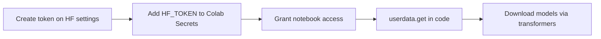

# Hugging Face Tokens and Model Implementation in Colab

## Why You Need an Access Token

Many models on Hugging Face are public and download without authentication. However, **gated models**, private checkpoints, and higher rate limits require an **access token**. Best practice: configure the token once per notebook session so any model download succeeds without embedding secrets in source code.

## Step 1: Generate an Access Token

1. Log in at `huggingface.co`
2. Open profile menu → **Access Tokens** (`huggingface.co/settings/tokens`)
3. Click **Create new token**
4. Assign a descriptive name (e.g., `colab-research`)
5. Click **Create token** at the bottom
6. **Copy the token immediately** — it may not be shown again in full

Token management options after creation:

- Edit permissions (read vs write)
- Refresh or revoke
- Delete compromised tokens

**Security rule:** Never commit tokens to Git, share them in screenshots, or hardcode them in notebook cells visible to others.

## Step 2: Store the Token Securely in Google Colab

Colab **Secrets** keep credentials out of notebook source:

1. Click the **key icon** (Secrets) in the left sidebar
2. Add new secret:
   - **Name:** `HF_TOKEN` (exact spelling matters for lookup)
   - **Value:** paste your token
3. Toggle **Notebook access** to grant the runtime permission

Retrieve the secret in code:

```python
from google.colab import userdata
hf_token = userdata.get('HF_TOKEN')
```

Store in a variable — do not print the token after loading.



## Step 3: Load and Run a Model (Fill-in-the-Blank / MLM)

Copy the usage snippet from a model page (e.g., `bert-base-uncased`):

```python
from transformers import pipeline

fill_mask = pipeline("fill-mask", model="bert-base-uncased")
fill_mask("Hello I'm a [MASK] model.")
# Top prediction: "fashion" (among role, new, super, fine, etc.)

fill_mask("The cat sat on the [MASK].")
# Top predictions: floor, bed, couch, sofa, ground
```

**Checkpoint:** The model identifier string (e.g., `bert-base-uncased`) points to weights + config on the hub. `from_pretrained(checkpoint)` downloads and caches locally.

Not every model requires a token, but loading `HF_TOKEN` upfront avoids failures on gated checkpoints.

## Step 4: Sequence-to-Sequence Translation Example

For translation (encoder-decoder), the pattern uses **AutoTokenizer** and **AutoModelForSeq2SeqLM**:

```python
from transformers import AutoTokenizer, AutoModelForSeq2SeqLM

checkpoint = "surya7/en-ta-translator"  # example English→Tamil
tokenizer = AutoTokenizer.from_pretrained(checkpoint)
model = AutoModelForSeq2SeqLM.from_pretrained(checkpoint)

def translate(text):
    inputs = tokenizer(text, return_tensors="pt")
    outputs = model.generate(**inputs)
    return tokenizer.decode(outputs[0], skip_special_tokens=True)

translate("Hard work never fails.")
translate("The cat sat on the mat.")
```

| Component | Role |
|-----------|------|
| `checkpoint` | Hub model ID — selects weights and vocabulary |
| `AutoTokenizer` | Text → token IDs (subword segmentation) |
| `AutoModelForSeq2SeqLM` | Encoder-decoder LM for input sequence → output sequence |
| `model.generate()` | Autoregressive decoding to produce target text |

**Seq2Seq** = sequence-to-sequence: one text sequence in, one text sequence out (translation, summarization).

## Tokenizer vs Model

- **Tokenizer:** Splits text into subword tokens, maps to IDs, handles padding/truncation
- **Model:** Neural network forward pass producing logits or generated sequences

Both must come from the **same checkpoint** — mixing tokenizer and model from different families causes garbage output.

## Common Pitfalls / Exam Traps

- **Trap:** Hardcoding `hf_...` tokens in notebook cells — use Colab Secrets or environment variables.
- **Trap:** Mismatching tokenizer and model checkpoints — always pair them from the same repo.
- **Trap:** Assuming all models work with `pipeline("fill-mask")` — task type must match architecture (MLM vs seq2seq vs classification).
- **Trap:** Forgetting `truncation=True` on long inputs — BERT-family models typically cap at 512 tokens; longer text is silently truncated or errors without the flag.
- **Trap:** Printing secrets after `userdata.get()` — exposes credentials in notebook output logs.

## Quick Revision Summary

- Generate HF access tokens at Settings → Access Tokens; copy once at creation.
- Store as `HF_TOKEN` in Colab Secrets; load via `userdata.get('HF_TOKEN')`.
- Never expose tokens in source code, commits, or printed output.
- `pipeline()` offers high-level task APIs (fill-mask, sentiment, translation).
- Seq2Seq: `AutoTokenizer` + `AutoModelForSeq2SeqLM.from_pretrained(checkpoint)` + `generate()`.
- Checkpoint = hub model ID linking tokenizer weights and architecture.
- Pre-load token even for public models — gated models will fail without it.
