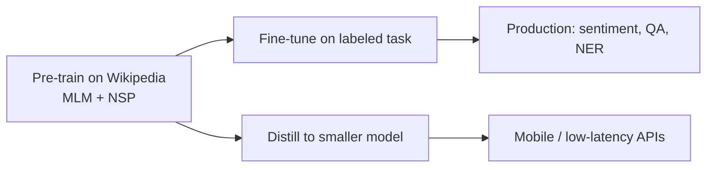

# BERT and Contextual Embeddings: Beyond Static Word Vectors

## The Problem with Static Embeddings

Before BERT, dominant word representations — Word2Vec, GloVe, fastText — assigned **one fixed vector per word type**. The word "bank" received the same embedding whether the sentence discussed a **riverbank** or **Bank of America**.

This is the **polysemy problem**: one surface form, multiple meanings. Static embeddings average or collapse senses into a single point in vector space, limiting downstream task accuracy.

| Approach | "bank" (river) | "bank" (financial) |
|----------|----------------|---------------------|
| Word2Vec / GloVe | Same vector | Same vector |
| BERT | Context-dependent vector | Different vector |

## What BERT Is

**BERT** = **B**idirectional **E**ncoder **R**epresentations from **T**ransformers

BERT is an **encoder-only Transformer stack** pre-trained on large text corpora. It revolutionized Natural Language Understanding (NLU) by producing **contextual embeddings** — the vector for each token depends on **all surrounding tokens**.

## Contextual Embeddings: Intuition

When BERT processes "I deposited money at the bank near the river," the representation of **bank** incorporates **deposited**, **money**, and **river**. The same word form in a financial headline gets a different internal representation because its neighbors differ.

This directly addresses limitations of Word2Vec-era pipelines used in early cloud search and recommendation systems.

## Transfer Learning in the BERT Era

Training BERT from scratch requires enormous compute (Wikipedia-scale data, many GPU-days). **Transfer learning** reuses pre-trained weights:

1. **Pre-training:** Learn general language structure (self-supervised on unlabeled text)
2. **Fine-tuning:** Add a task-specific head; train on labeled data for classification, QA, NER, etc.
3. **Distillation:** Compress a large teacher model into a smaller student (e.g., DistilBERT) for mobile or real-time inference

**Real-world example:** An e-commerce platform fine-tunes BERT on 50k product reviews instead of training a classifier on bag-of-words from scratch — achieving higher F1 on aspect sentiment with less labeled data.

## Why BERT Matters for Downstream Tasks

- **Classification:** `[CLS]` token embedding → softmax over labels
- **Question answering:** Predict start/end spans in passage
- **NER:** Per-token labels from contextual representations

All benefit from bidirectional context unavailable to left-to-right models at pre-training time.

## Common Pitfalls / Exam Traps

- **Trap:** Calling BERT embeddings "static" — they are **contextual**; only the pre-training objective is fixed, not the runtime vectors.
- **Trap:** Confusing BERT with GPT — BERT is **encoder-only** and **bidirectional**; GPT is **decoder-only** and **unidirectional**.
- **Trap:** Assuming fine-tuning replaces pre-training entirely — fine-tuning **starts from** pre-trained weights; training from random init rarely matches performance.
- **Trap:** Using "BERT" and "Transformers" interchangeably — BERT is one specific encoder-only instantiation.

## Quick Revision Summary

- Static embeddings (Word2Vec, GloVe): one vector per word regardless of context.
- BERT: Bidirectional Encoder Representations from Transformers — encoder-only stack.
- Contextual embeddings change per occurrence based on surrounding tokens.
- Polysemy ("bank" river vs financial) motivated the shift from static to contextual models.
- Transfer learning: pre-train once, fine-tune for classification, QA, NER; distill for speed.
- BERT is the foundation model for modern NLU pipelines before the GPT chat era dominated generation tasks.
