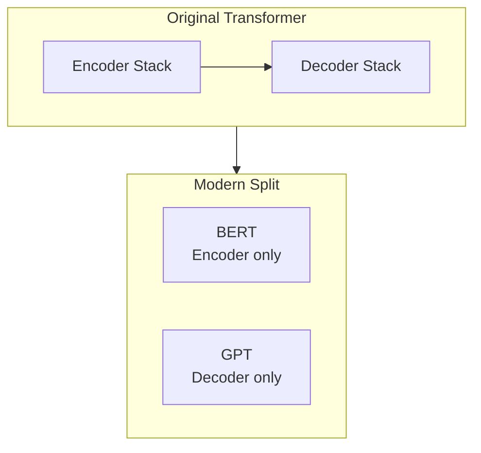
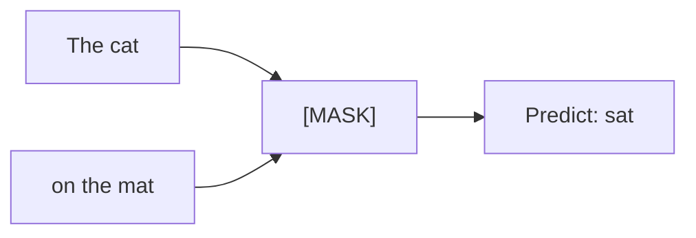

# BERT Architecture and Pre-Training Objectives

## BERT as Encoder-Only Transformer

BERT is a **stack of Transformer encoder blocks** — the encoder half of the original "Attention Is All You Need" architecture, without the decoder. GPT occupies the decoder side; BERT occupies the encoder side.

### Model sizes

| Variant | Encoder layers | Typical use |
|---------|---------------|-------------|
| BERT-base | 12 | Default for fine-tuning experiments |
| BERT-large | 24 | Higher capacity; more compute |

BERT was **not** trained for translation or autoregressive generation. It was pre-trained to **understand** language via two self-supervised tasks on Wikipedia (and BooksCorpus).

## Pre-Training Task 1: Masked Language Modeling (MLM)

**Goal:** Force the model to use **bidirectional context** to predict hidden words.

**Procedure:**

1. Take a sentence: "The cat sat on the mat"
2. Randomly mask ~15% of tokens (e.g., hide **sat** → "The cat [MASK] on the mat")
3. Model predicts the original token using **both left and right** context
4. Repeat across millions of sentences with different masks each epoch

**Why "bidirectional":** Unlike GPT (left-to-right only), BERT sees **sat**'s neighbors on both sides when filling the blank. The label for **sat** depends on **cat**, **on**, and **mat** simultaneously.

**Training detail (often tested):** Of selected tokens, 80% are replaced with `[MASK]`, 10% with random words, 10% unchanged — reducing train/serve mismatch.

## Pre-Training Task 2: Next Sentence Prediction (NSP)

**Goal:** Teach **inter-sentence relationships** — critical for QA, natural language inference, and summarization.

**Procedure:**

1. Split text into sentence pairs:
   - Sentence A: "The man went to the store"
   - Sentence B: "He bought milk"
2. Training examples include:
   - **IsNext:** B truly follows A in the original document
   - **NotNext:** B is a random sentence from elsewhere
3. Model predicts whether B is the actual next sentence

**Why it matters:** Question-passage pairs, premise-hypothesis pairs, and multi-sentence inputs require knowing whether two spans are related — not just whether individual words co-occur.

| Task | What the model learns |
|------|----------------------|
| MLM | Token-level meaning from full context |
| NSP | Discourse / sentence-pair coherence |

## Input Format

BERT inputs concatenate segments with special tokens:

`[CLS] sentence_A [SEP] sentence_B [SEP]`

- `[CLS]` — classification aggregate used for sentence-level tasks
- `[SEP]` — separator between segments

Segment embeddings + token embeddings + positional embeddings are summed before entering the encoder stack.

## Common Pitfalls / Exam Traps

- **Trap:** Saying BERT is trained left-to-right — MLM is **bidirectional**; only the decoder in GPT is strictly causal.
- **Trap:** Confusing MLM with autoregressive LM — MLM predicts **masked** positions with full context; GPT predicts **next** token with left context only.
- **Trap:** Assuming NSP is universally kept — RoBERTa **removed NSP** after ablations showed limited benefit; exam questions may contrast BERT vs RoBERTa on this point.
- **Trap:** Stating BERT-base has 24 layers — **12 layers**; 24 is BERT-large.

## Quick Revision Summary

- BERT = stack of Transformer **encoders only** (no decoder).
- BERT-base: 12 layers; BERT-large: 24 layers.
- Pre-trained on Wikipedia-scale text, not for translation/generation.
- **MLM:** mask tokens; predict using bidirectional context → contextual embeddings.
- **NSP:** predict if sentence B follows sentence A → sentence-pair understanding.
- Input uses `[CLS]`, `[SEP]`, token, segment, and positional embeddings.
- RoBERTa later dropped NSP; BERT original recipe includes both MLM and NSP.
