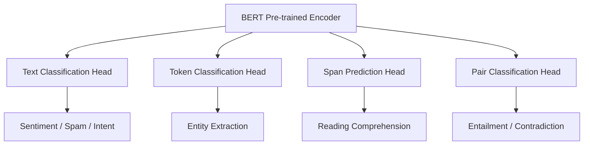

# Applications of BERT in Production NLP

## Why BERT Excels at Understanding Tasks

BERT produces **deep contextual representations** for every token plus a sentence-level `[CLS]` embedding. After pre-training, a lightweight task-specific layer is added and fine-tuned on labeled data — far less data and compute than training from scratch.

Because BERT sees **full bidirectional context**, it outperforms bag-of-words, TF-IDF, and static embedding classifiers on nuanced text.

## Text Classification

Assign a **single label** (or multi-label set) to an entire document or sentence.

| Application | Label examples |
|-------------|----------------|
| Sentiment analysis | positive, negative, neutral |
| Spam detection | spam, not spam |
| Intent recognition | book_flight, cancel_reservation, track_order |
| Topic labeling | sports, finance, politics |
| Ticket routing | billing, technical, account |

**Mechanism:** Fine-tune BERT with `[CLS]` output → linear layer → softmax.

**Real-world use:** Gmail-style spam filtering and Zendesk-style support ticket categorization on cloud NLP APIs often use fine-tuned BERT or DistilBERT backends.

## Named Entity Recognition (NER)

Extract **structured entities** from unstructured text — persons, organizations, locations, dates, medical terms.

Example: "Apple announced a new office in Austin" → `ORG: Apple`, `LOC: Austin`

**Mechanism:** Fine-tune with a **token classification head** — each subword token receives a BIO tag (Begin, Inside, Outside).

**Real-world use:** Healthcare pipelines extract drug names and dosages from clinical notes; legal tech extracts party names and jurisdictions from contracts.

## Question Answering (QA)

Given a **question** and a **context passage**, predict the **start and end span** of the answer in the passage.

Example:
- Context: "The Transformer was published in 2017 by Google Brain."
- Question: "Who published the Transformer?"
- Answer span: "Google Brain"

**Mechanism:** Two logits per token (start probability, end probability); highest-scoring valid span wins.

**Real-world use:** Enterprise search over internal wikis; customer support bots retrieving policy clauses.

## Natural Language Inference (NLI)

Determine the logical relationship between a **premise** and a **hypothesis**:

- **Entailment:** hypothesis must be true if premise is true
- **Contradiction:** hypothesis cannot be true if premise is true
- **Neutral:** neither entailed nor contradicted

Example:
- Premise: "It rained all day."
- Hypothesis: "The ground is wet." → Entailment

**Mechanism:** Sentence pair input `[CLS] premise [SEP] hypothesis [SEP]` → classification head.

**Real-world use:** Fact-checking pipelines, contract compliance checking (does clause A imply obligation B?).

## Application Comparison

| Task | Output granularity | Typical head |
|------|-------------------|--------------|
| Text classification | One label per document | `[CLS]` + linear |
| NER | Label per token | Token-wise linear |
| QA | Span (start, end) | Two span logits |
| NLI | Label per pair | `[CLS]` + linear |

## Common Pitfalls / Exam Traps

- **Trap:** Using BERT for open-ended story generation without a generative decoder — BERT is not autoregressive; use GPT/T5 for free-form generation.
- **Trap:** Confusing QA **extractive** (span from passage) with **generative** QA (model writes answer in own words) — classic BERT QA is extractive.
- **Trap:** Assuming NER tags apply to whole words — BERT uses **subword tokens**; post-processing merges WordPiece fragments.
- **Trap:** Listing only sentiment as a BERT application — NER, QA, and NLI are equally core exam topics.

## Quick Revision Summary

- BERT fine-tuning adds a small head on pre-trained encoders for downstream tasks.
- **Text classification:** sentiment, spam, intent, topic — `[CLS]` embedding → label.
- **NER:** token-level BIO tags for persons, orgs, locations, domain entities.
- **QA:** predict answer start/end spans in context passages.
- **NLI:** classify premise-hypothesis as entailment, contradiction, or neutral.
- All applications leverage bidirectional contextual representations from MLM pre-training.
- Production systems (search, support, healthcare, legal) deploy fine-tuned BERT variants via Hugging Face pipelines or custom serving.
