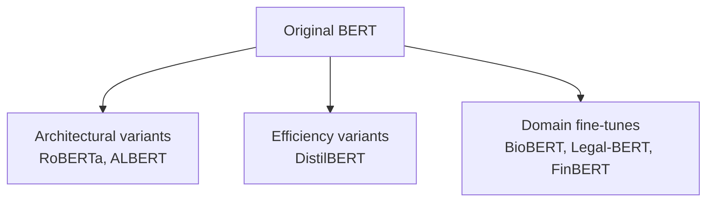
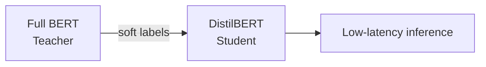

# BERT Variants: RoBERTa, ALBERT, DistilBERT, and Domain Fine-Tunes

## Why So Many "BERTs"?

The original BERT checkpoint is a starting point, not the final word. Researchers and practitioners have created **architectural variants** (different pre-training recipes), **efficiency variants** (smaller/faster), and **domain fine-tunes** (specialized vocabulary and corpora). Hugging Face lists hundreds of checkpoints when searching "BERT."

## Architectural and Training Variants

### RoBERTa (Robustly Optimized BERT)

- Developed by Facebook AI
- Same Transformer encoder architecture as BERT
- Trained **longer** on **more data** (including CC-News, OpenWebText, Stories)
- **Removed Next Sentence Prediction (NSP)** — ablations showed NSP added little
- **Case-sensitive** (cased checkpoints common)
- Typically **outperforms** original BERT on GLUE and related benchmarks

| Feature | BERT | RoBERTa |
|---------|------|---------|
| NSP task | Yes | No |
| Training duration | Shorter | Longer |
| Data volume | Wikipedia + BooksCorpus | Larger mix |
| Case handling | uncased & cased variants | primarily cased |

### ALBERT (A Lite BERT)

- Reduces memory via **parameter sharing** across layers (same weights reused)
- **Case-sensitive**
- Fewer unique parameters → lower GPU memory for same depth
- Trade-off: sometimes slightly lower accuracy vs full BERT-large at equal compute

**Use case:** Training large-depth models on memory-constrained cloud instances.

### DistilBERT

- **Knowledge distillation** from full BERT teacher to smaller student
- Student mimics teacher's **output probability distributions**, not just hard labels
- Results: **~40% smaller**, **~60% faster**, retains **~97%** of BERT-base performance
- Ideal for **mobile**, **edge**, and **real-time** APIs (sentiment on live chat streams)

## Domain-Specific Fine-Tunes

General BERT knows broad English; domain models adapt vocabulary and semantics to specialized text.

| Model | Domain | Language / notes |
|-------|--------|------------------|
| FinBERT | Financial literature | Market reports, earnings calls |
| PubMedBERT | PubMed biomedical abstracts | Clinical NLP, literature mining |
| BioBERT / SciBERT | Biomedical & scientific text | Entity extraction in papers |
| Legal-BERT | Legal documents | Contracts, case law |
| German BERT variants | Medical/legal German | e.g., GermEval-BERT |

**Real-world use:** A hospital NLP pipeline uses PubMedBERT for extracting diagnosis codes from notes — general `bert-base-uncased` underperforms on medical abbreviations and drug names.

## Choosing a Variant

| Requirement | Recommended direction |
|-------------|----------------------|
| Maximum accuracy, GPU budget available | RoBERTa-large or BERT-large |
| Latency-sensitive / CPU inference | DistilBERT |
| Memory-constrained training | ALBERT |
| Financial text | FinBERT |
| Biomedical NER | PubMedBERT / BioBERT |
| Legal clause classification | Legal-BERT |

## Common Pitfalls / Exam Traps

- **Trap:** RoBERTa "changes the Transformer architecture entirely" — it mainly changes **training procedure** (no NSP, more data).
- **Trap:** DistilBERT numbers — remember **40% smaller, 60% faster, ~97% performance** (approximate; common exam fodder).
- **Trap:** Assuming all BERT searches on Hugging Face return interchangeable models — **cased vs uncased** and **domain** matter for tokenization and vocabulary.
- **Trap:** Confusing **fine-tuning** (task labels) with **distillation** (compressing teacher → student) — DistilBERT uses distillation during pre-training of the student.
- **Trap:** ALBERT being "uncased by default" — ALBERT is **case-sensitive**.

## Quick Revision Summary

- BERT spawned architectural, efficiency, and domain-specific variants on Hugging Face.
- **RoBERTa:** longer training, more data, **no NSP**, case-sensitive, usually beats BERT.
- **ALBERT:** parameter sharing → lower memory footprint; case-sensitive.
- **DistilBERT:** knowledge distillation → 40% smaller, 60% faster, ~97% of BERT performance.
- Domain models: FinBERT (finance), PubMedBERT (medicine), Legal-BERT (law), language-specific medical BERTs.
- Pick variant by accuracy budget, latency, memory, and domain vocabulary — not all "BERT" checkpoints are equivalent.
