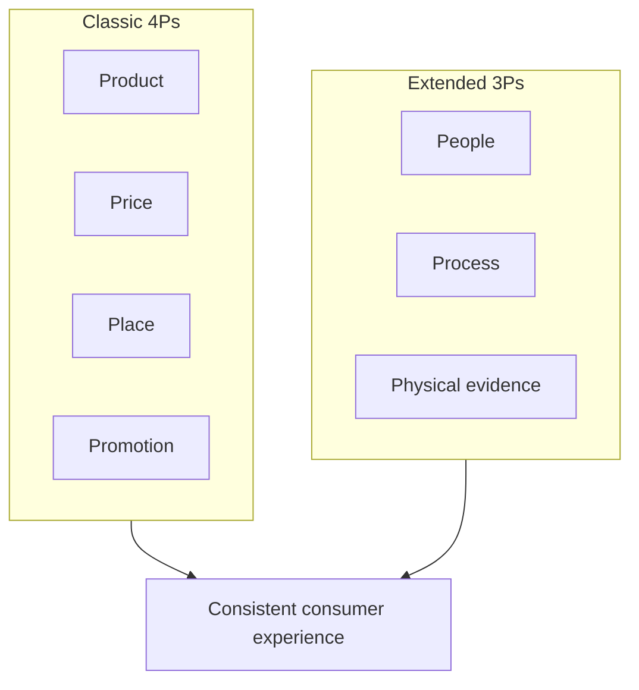

# The Four Ps and Seven Ps in Detail

## Intuition First

Each P is a decision cluster. Product answers "what do we sell?"; Price "what is the exchange?"; Place "how do they get it?"; Promotion "how do they find out and want it?" The extended Ps answer who delivers, how delivery stays consistent, and what tangible cues prove the offer is real.

---

## Product

What the firm offers consumers — not only the physical good, but the full value package.

| Dimension | Examples |
|-----------|----------|
| Quality and value | Specs, durability, performance vs expectation |
| Branding and imagery | Name, logo, associations |
| User experience | Ease of use, delight in interacting with the offer |
| Key features | Differentiating capabilities |
| Warranties / trust signals | Guarantees, support promises |

---

## Price

Value exchange and cost of purchase — including all terms that change willingness to pay.

| Element | Role |
|---------|------|
| Pricing strategy | Premium, penetration, value-based, etc. |
| List price | Stated sticker price |
| Discounts | Temporary or segment-specific reductions |
| Payment methods | Card, EMI, UPI, wallet — friction and access |
| Free elements | Freemium, trials, gifts with purchase |
| Credit terms | Pay-later, net-30 B2B — cash-flow and risk |

---

## Place

How and where customers can purchase — availability at the right location and time.

| Channel type | Examples |
|--------------|----------|
| Owned digital | Company website, app |
| Marketplaces | Amazon, eBay, Flipkart |
| Retail | Stores, pop-ups |
| International | Export, local partners |
| Wholesale / resellers | Indirect distribution |

---

## Promotion

How consumers discover the product and why they should care.

| Lever | Examples |
|-------|----------|
| Messaging | Core story and claims |
| Search marketing | SEO/SEM |
| Social ads | Paid social |
| Direct marketing | Email, SMS, CRM |
| Partnerships | Co-marketing, affiliates |
| Offline | Events, OOH, PR |
| Word of mouth | Organic advocacy |
| Campaigns | Time-bound promotions |

---

## Extended Ps: People, Process, Physical Evidence

### People

Who is hired and how they act.

- Employees, founders, consumer-facing staff
- Culture and image
- Training and behaviour standards

### Process

How products or services are delivered consistently.

- Standardisation and measurement
- Delivery methods
- Complaint handling and response time
- Ongoing R&D / improvement loops

### Physical Evidence

The environment surrounding the customer experience — the tangible proof of an often intangible service.

| Cue | Examples |
|-----|----------|
| Environment | Offices, stores, app UI |
| Packaging | Unboxing, materials |
| Facilities | Equipment, cleanliness |
| Ambience | Interior design, music, smell |
| Social proof | Recommendations, reviews |
| People cues | Staff appearance |

---

## Why All Seven Matter Together

The 7Ps help marketers design **consistent, consumer-focused experiences**. A strong product with poor people or a broken process still fails; premium branding collapses if physical evidence (store dirt, broken packaging) contradicts the promise.

---

## Common Pitfalls / Exam Traps

- **Trap**: Reducing Product to "features only" — brand, UX, and warranties are product decisions.
- **Trap**: Treating Price as only the number on the tag — payment methods and credit terms belong to Price.
- **Trap**: Confusing Place with Promotion (where you buy vs how you hear about it).
- **Trap**: Skipping Physical evidence in pure digital cases — UI, emails, and packaging still count as evidence.
- **Trap**: Listing seven Ps without linking them to a coherent experience (exam cases reward integration).

---

## Quick Revision Summary

- Product = offer package (quality, brand, UX, features, trust)
- Price = value/cost including strategy, discounts, payment, credit
- Place = purchase channels (web, marketplace, retail, wholesale, export)
- Promotion = discovery and persuasion channels
- People = who delivers; Process = how delivery stays consistent
- Physical evidence = tangible cues of the experience
- 7Ps together design consistent, consumer-focused experiences

---

**← [Previous](02-marketing-mix-foundation-transcript.md) · [Index](../README.md) · [Next](04-copywriting-transcript.md) →**
