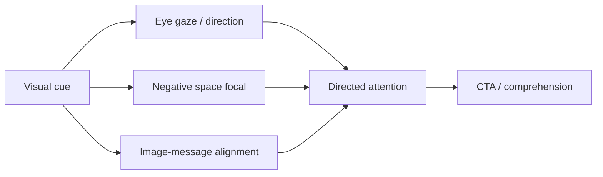

# Visuals, Design Principles, and Visual Cues

## Intuition First

Words persuade; visuals decide where the eye goes first. Design principles and subtle cues shape attention, interpretation, and action without requiring conscious analysis — like traffic signals on a road of competing page elements.

---

## Rule of Thirds

Divide the frame into a 3×3 grid (two horizontal + two vertical lines). The four intersections are natural focus points.

| Principle | Practice |
|-----------|----------|
| Placement | Put key subjects on lines or intersections, not always dead centre |
| Coverage heuristic | Subject ~33% of area; remaining ~66% breathing room |
| Effect | Better balance; more dynamic, interesting compositions |

Photographers use this constantly; marketers borrow it for ads, heroes, and product shots.

---

## Positive vs Negative Space

| Term | Meaning |
|------|---------|
| **Positive space** | Primary subject — what you want noticed |
| **Negative space** | Everything around the subject (often "empty" or white space) |

**Why it works**: Negative space creates a clear focal point, pulls attention to the subject, and (with rule-of-thirds placement) adds energy and premium calm. Crowded layouts compete; sparse layouts signal importance.

### Marketing example: Apple-style product hero

- Generous white space around headline → signals importance
- Phone separated from text → no clutter; natural gaze path
- CTA with space around it → easy to find without feeling shouty
- Overall: clarity, focus, premium confidence

---

## When to Break the Rule of Thirds

| Short answer | Long answer |
|--------------|-------------|
| You *can* break it | Learn the rule first; break only with **intentional concept** |

If the idea is stronger than classical composition (award-winning conceptual portraits often ignore intersections), concept can outweigh composition — but random centring without reason usually looks amateur.

---

## Visual Cues (Visual Guidance)

**Visual cues**: Signals in design that the brain recognises quickly, shaping where attention moves and how the message is interpreted.

Analogy: roads without signals create chaos; pages without cues create confusion and drop-off.

### Types of cues

| Cue type | Mechanism | Example |
|----------|-----------|---------|
| **Eye gaze** | Viewers follow where a depicted person looks | Model looks at headline, not camera → attention shifts to text |
| **Directional cues** | Gestures/angles act as arrows | Characters pointing arms inward → frame headline → lead to CTA |
| **Layout / motif alignment** | Image content reinforces message | Illustration of completed building mirrors "design better buildings" copy |

**Strategic role**: Design supports strategy — messages land faster and stronger when cues align with the desired path (headline → proof → CTA).

---

## Common Pitfalls / Exam Traps

- **Trap**: Centring every subject "to be safe" — often flatter and less clear than thirds + space.
- **Trap**: Filling every gap (fear of empty space) — kills hierarchy and premium feel.
- **Trap**: Decorative imagery that points away from the offer (gaze toward camera while CTA is left).
- **Trap**: Breaking composition rules without a concept — looks accidental, not bold.
- **Trap**: Treating visuals as cosmetics rather than attention routing for strategy.

---

## Quick Revision Summary

- Rule of thirds: 3×3 grid; place subjects on intersections; ~1/3 subject, ~2/3 space
- Positive space = subject; negative space = surrounds that create focus
- Learn rules before intentional breaks driven by concept
- Visual cues = subconscious guides (eye gaze, directional gestures, motif alignment)
- Good design routes attention to message and CTA with clarity and calm

---

**← [Previous](04-copywriting-transcript.md) · [Index](../README.md) · [Next](06-creative-execution-transcript.md) →**
