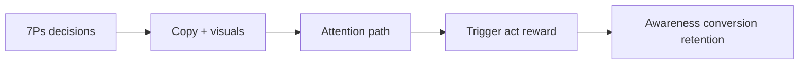

# Week Summary: Mix, Copy, Design, and Behaviour

## Intuition First

This module's ideas form one stack: control the mix, persuade with copy, guide attention with design, and intervene on the right ABC stage so behaviour sticks.

---

## What to Lock In

| Theme | Core takeaway |
|-------|---------------|
| **4Ps / 7Ps** | Controllable levers for product, price, place, promotion + people, process, physical evidence |
| **Copywriting** | Persuasive short-form writing for immediate action; distinct from educational content |
| **Design foundations** | Rule of thirds, positive/negative space, intentional rule-breaking |
| **Visual cues** | Eye gaze and directional signals route attention to message and CTA |
| **ABC model** | Antecedents, behaviour, consequences — diagnose and design interventions |

---

## One Mental Model

---

## Common Pitfalls / Exam Traps

- **Trap**: Revising Ps as a list without applying them to a service case (need 7Ps).
- **Trap**: Confusing copy goals with content goals.
- **Trap**: Designing beautiful pages that still send the eye away from the CTA.
- **Trap**: Fixing ads when the real ABC break is consequence (retention).

---

## Quick Revision Summary

- Marketing mix: right product, place, price, time via controllable Ps
- 7Ps add people, process, physical evidence for experience markets
- Copy drives action; content builds trust/education
- Visual hierarchy: thirds, space, gaze/direction cues
- ABC: fix the right stage — awareness, friction, or reward
- Apply frameworks where decisions meet consumers — campaigns, UX, loyalty

---

**← [Previous](06-creative-execution-transcript.md) · [Index](../README.md) · [Next](../week-05/01-consumer-behavior-transcript.md) →**
