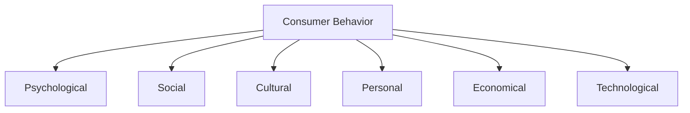
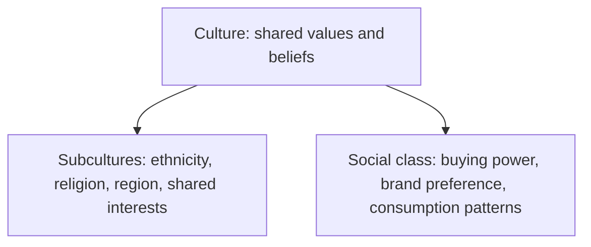

# Consumer Behavior: Social and Cultural Influences

## Intuition First

People do not buy in isolation. A purchase is shaped by who they live with, who they imitate, where they sit in society, and which cultural rules feel "normal." Consumer behavior is the study of how individuals, groups, and organizations select, purchase, use, and dispose of goods, services, ideas, or experiences to satisfy needs and desires.

---

## Definition and Scope

| Aspect | Meaning |
|--------|---------|
| **Who** | Individuals, groups, organizations |
| **What** | Goods, services, ideas, experiences |
| **Stages** | Select → purchase → use → dispose |
| **Focus** | Decision process + internal and external influences |

Understanding these influences lets marketers design offers, messages, and channels that match how real buyers decide — not how a spreadsheet assumes they should.

---

## Six Major Factors Affecting Consumer Behavior

| Factor | Core idea |
|--------|-----------|
| **Psychological** | Motivation, perception, learning, attitudes |
| **Social** | Family, peers, roles, status, social proof |
| **Cultural** | Values, subcultures, social class |
| **Personal** | Age, lifestyle, occupation, self-concept |
| **Economical** | Income, price sensitivity, purchasing power |
| **Technological** | Devices, platforms, access to information |

Social and cultural factors are especially powerful because they operate *before* the shopper reaches a product page — they shape what feels acceptable, desirable, and "for people like me."

---

## Social Factors

Social factors shape early preferences and ongoing buying habits through relationships and social position.

| Element | How it influences buying | Example |
|---------|--------------------------|---------|
| **Family** | Foundation for early preferences and brand habits | Parents choose toothpaste brand; children often stick with it later |
| **Reference groups & social networks** | Peers and circles set norms for what to wear, use, or try | Teenagers buy clothing brands to fit in with friends |
| **Roles and status** | Products signal social position and life stage | Adults join a gym or take up hobbies that match their circle |
| **Social proof** | Reviews and endorsements from similar or admired people reduce risk | Positive reviews or influencer endorsements drive purchase |

**Key insight**: People trust those they perceive as similar to themselves. Endorsements work less because of celebrity fame alone and more because of perceived similarity or aspirational identity.

---

## Cultural Factors

Culture shapes values, beliefs, and habitual buying patterns. It operates at several nested levels.

| Level | Definition | Marketing implication |
|-------|------------|------------------------|
| **Culture** | Shared values, beliefs, and habits of a society | Messaging must fit cultural norms (e.g., family first vs self-expression) |
| **Subculture** | Groups defined by ethnicity, religion, geography, or shared interest | Same product, different rituals or language of benefit |
| **Social class** | Position related to income, education, occupation | Affects brand preference, channel, and consumption pattern |

### Collectivism vs Individualism

| Cultural orientation | Decision style | Buying lean |
|----------------------|----------------|-------------|
| **Collectivist** | Choices that benefit family or group | Joint decisions; products framed as family good |
| **Individualist** | Personal preference and self-expression | Unique identity; products as personal statement |

**Example**: In a collectivist context, a smartphone campaign may stress "for the whole family." In an individualist context, the same phone may stress self-expression and personal status.

---

## How Social and Cultural Factors Interact

| Influence | Primary mechanism | Typical outcome |
|-----------|-------------------|-----------------|
| Social | Relationships and status signals | Brand choice to belong or stand out |
| Cultural | Shared meaning and class norms | What is considered appropriate or aspirational |
| Combined | Norms + peer pressure | Stronger pull than price alone for many categories |

Together they explain why two buyers with the same income can still choose very different brands.

---

## Common Pitfalls / Exam Traps

- **Trap**: Treating consumer behavior as only "why someone clicked buy." It covers select, purchase, use, *and* dispose.
- **Trap**: Listing only personal or psychological factors and ignoring social/cultural drivers (family, class, collectivism).
- **Trap**: Equating social proof with "any celebrity." Similarity and trust matter more than fame alone.
- **Trap**: Assuming culture is one-size-fits-all. Subcultures and social class create distinct patterns within the same country.
- **Trap**: Confusing social class with income alone — brand preference and consumption *pattern* also matter.

---

## Quick Revision Summary

- Consumer behavior = how people/groups/orgs select, purchase, use, dispose to satisfy needs
- Six factors: psychological, social, cultural, personal, economical, technological
- Social: family, reference groups, roles/status, social proof
- Culture → subcultures → social class shape values and buying power signals
- Collectivist cultures prioritize group benefit; individualist cultures prioritize self-expression
- People trust reviewers/endorsers who feel similar to them
- Social + cultural forces often override purely rational product comparisons

---

**← [Previous](../week-04/07-summary-transcript.md) · [Index](../README.md) · [Next](02-branding-transcript.md) →**
