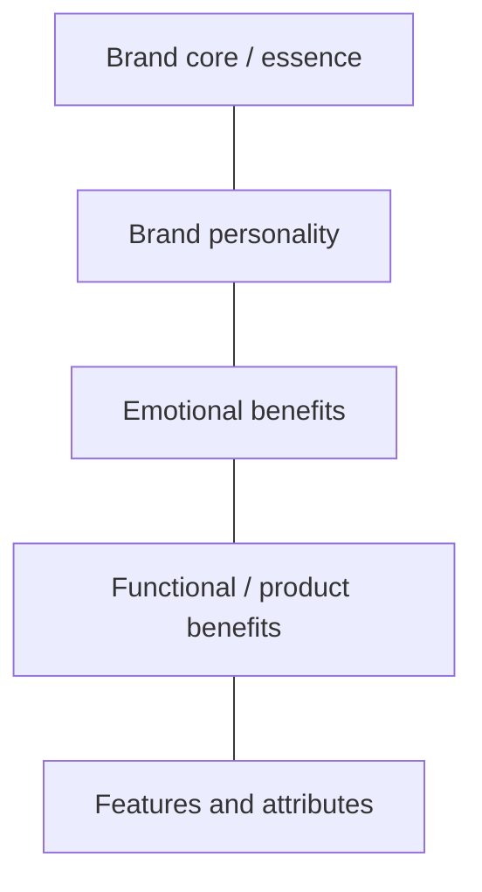

# Brand Architecture Pyramid

## Intuition First

The brand architecture pyramid (also called brand pyramid or brand hierarchy) organizes brand identity from the concrete to the ethereal. At the base sit tangible features and benefits; at the peak sits intangible brand essence. Strong brands climb the pyramid coherently so customers remember not just *what the product does* but *what the brand means*.

---

## Pyramid Structure

| Level (bottom → top) | Nature | Role |
|----------------------|--------|------|
| **Features & attributes** | Tangible | What the product *has* |
| **Functional / product benefits** | Practical | What it *does* or delivers |
| **Emotional benefits** | Feeling | How it makes the customer *feel* |
| **Brand personality** | Character | Human traits of the brand |
| **Brand core / essence** | Meaning | Enduring idea / positioning rally cry |

Build clear features and benefits at the base; elevate them into a powerful essence at the top.

---

## Case: IndiGo Airlines

| Level | Content |
|-------|---------|
| **Features & benefits** | On-time performance, courteous staff, spotless interiors |
| **Functional benefits** | Low-cost airline with high performance |
| **Emotional benefits** | Affordable and dependable |
| **Brand core / essence** | Sincere yet fun; spunky, young brand — making the dream of every Indian flying come true |

IndiGo's pyramid ties operational reliability to an emotional promise of accessible flight for a broad audience.

---

## Case: Apple

| Level | Content |
|-------|---------|
| **Product / feature attributes** | Rich UI, water resistance, slim design, iOS |
| **Product benefits** | Highly secure, elegant, easy to use |
| **Emotional benefits** | Premium status, belonging, exclusivity |
| **Brand personality** | Non-corporate, artistic, sophisticated, creative |
| **Brand core / essence** | Think different |

Apple moves from specs to identity: owning a device becomes membership in a mindset.

---

## Case: Disney

| Level | Content |
|-------|---------|
| **Product attributes** | Family-friendly animation, cartoons, pictures |
| **Product benefits** | Reliable quality, great value, own branded content |
| **Emotional benefits** | Family bonding, joy, nostalgia, childhood memories |
| **Brand personality** | Young at heart, classic, playful, heartwarming |
| **Brand core / essence** | Happiest / magical place on earth |

Disney's essence is emotional: magic and happiness, not merely "animation quality."

---

## Comparative Snapshot

| Brand | Base focus | Peak essence |
|-------|------------|--------------|
| **IndiGo** | On-time, clean, courteous, low-cost performance | Dream of flying for every Indian; sincere + fun |
| **Apple** | Design, OS, security, ease | Think different |
| **Disney** | Family entertainment quality | Magical / happiest place |

Same pyramid logic — different category truths and emotional peaks.

---

## Why the Pyramid Matters

| Benefit | Explanation |
|---------|-------------|
| Organization | Forces clarity from features → meaning |
| Elevation | Prevents stuck-at-features branding |
| Consumer connection | Emotional and essence layers build lasting preference |
| Consistency | Personality and essence guide campaigns and product choices |

A brand that only advertises features is stuck at the base. A brand that claims "magical" without delivery at the base feels hollow.

---

## Common Pitfalls / Exam Traps

- **Trap**: Reversing the pyramid — treating essence as a product feature.
- **Trap**: Confusing functional benefits with emotional benefits (e.g., "low cost" vs "dependable/affordable *feeling*").
- **Trap**: Skipping personality when going from emotion to essence.
- **Trap**: Mixing the three brand examples (IndiGo / Apple / Disney) when asked for level content.
- **Trap**: Assuming architecture pyramid = brand development grid (extension strategies). Different tools: identity structure vs growth options.

---

## Quick Revision Summary

- Brand architecture pyramid = hierarchy from tangible features up to intangible essence
- Levels: features → functional benefits → emotional benefits → personality → core/essence
- IndiGo: on-time/low-cost performance → sincere, fun, fly-for-everyone dream
- Apple: design/security/ease → think different; sophisticated, creative personality
- Disney: family content quality → magic/happiness; playful, nostalgic personality
- Strong brands build clear bases and rise to a memorable essence
- Use the pyramid to organize identity and tighten consumer connection

---

**← [Previous](04-brand-personality-transcript.md) · [Index](../README.md) · [Next](06-brand-development-strategy-transcript.md) →**
