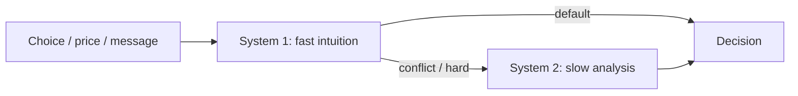

# Psychological Principles: Thinking Fast and Slow

## Intuition First

Most buying happens on mental autopilot. Daniel Kahneman's *Thinking, Fast and Slow* frames two systems: a fast, intuitive **System 1** (~$95\%$ of thinking) and a slow, analytical **System 2** (~$5\%$). Marketers who understand that split can design choices that feel easy — or that nudge risk, value, and urgency.

---

## The Bat-and-Ball Intuition Trap

**Puzzle**: A bat and a ball cost $\$1.10$ together. The bat costs $\$1.00$ more than the ball. How much is the ball?

| Response | Calculation | Result |
|----------|-------------|--------|
| **System 1 jump** | Ball $=\$0.10$, bat $=\$1.10$ | Total $=\$1.20$ (wrong) |
| **Correct (System 2)** | Ball $=\$0.05$, bat $=\$1.05$ | Total $=\$1.10$ |

The wrong "10 cents" answer feels obvious because System 1 grabs an easy difference. System 2 must check the logic.

---

## System 1 vs System 2

| Dimension | System 1 | System 2 |
|-----------|----------|----------|
| Speed | Fast | Slow |
| Style | Intuitive, instinctive, automatic | Analytical, deliberate |
| Conscious effort | Low / unconscious | High effort |
| Relies on | Associations and heuristics | Logic and controlled thought |
| Share of thinking | ~$95\%$ | ~$5\%$ |
| Vulnerability | Bias, snap errors | Laziness, fatigue |

System 2 is often lazy or easily fatigued — people do not engage it unless forced.

---

## Encouraging Faster (System 1) Decisions

| Tactic | Mechanism | Example angle |
|--------|-----------|---------------|
| **Time pressure** | Less room for System 2 | Limited-time offers |
| **Deplete System 2** | Fatigue reduces scrutiny | Cookie offer at 8 p.m. vs 8 a.m. |
| **Raise cognitive load** | Multitasking → instinct | Decisions while distracted |
| **Simplify choice sets** | Lower paradox of choice | Curated few options vs huge assortment |

Goal for many retail and CPG contexts: make the preferred option easy for System 1 without requiring a spreadsheet.

---

## Paradox of Choice (Jam Study)

| Assortment | Shoppers who stopped | Shoppers who bought |
|------------|----------------------|---------------------|
| **24 jams** | $60\%$ | $3\%$ |
| **6 jams** | $40\%$ | $30\%$ |

Fewer options → fewer browsers but **much higher** conversion. More choice can reduce purchase likelihood.

**Marketing takeaway**: Curation often beats endless shelves.

---

## Anchoring

People judge value relative to a reference (anchor), not in isolation.

| Offer | Sticker story | Felt deal |
|-------|---------------|-----------|
| **Price A** | $\$500$ | Fair / ordinary |
| **Price B** | Was $\$1{,}000$, now $\$500$ | Bargain (same final price) |

Identical final price; the struck-through anchor makes B feel better.

**Product comparison pattern**: Show the most expensive smartphone first. Mid and base models then feel more affordable by contrast.

---

## Loss Aversion and Framing

People generally try to limit losses; losses loom larger than equivalent gains (**loss aversion**).

### Risk Attitude Is Contextual

| Idea | Meaning |
|------|---------|
| Risk spectrum | Some people avoid risk; others accept it |
| Same person, different contexts | Can be cautious and risky depending on domain |
| Example | Drive carefully / buy a safe car, yet smoke or drink heavily |

### Framing Gains vs Losses

| Frame | Typical preference |
|-------|--------------------|
| Decision presented as a **gain** | Prefer safer option |
| Decision framed as **avoiding a loss** | More willing to take risk |

| Weaker frame | Stronger (loss) frame |
|--------------|------------------------|
| "Save ₹10,000 per month by switching" | "Stop losing ₹10,000 every month" |

Same math; loss language feels more urgent.

---

## Marketer's Use Map

| Principle | Design lever |
|-----------|--------------|
| System 1 dominance | Defaults, familiar brands, simple cues |
| Fatigue / load | Timing and environment of the ask |
| Paradox of choice | Fewer SKUs on display; guided selling |
| Anchoring | Compare-at prices; premium-first assortments |
| Loss aversion | Frame inaction as ongoing loss |

---

## Common Pitfalls / Exam Traps

- **Trap**: Flipping System 1/2 shares — System 1 is ~$95\%$, System 2 ~$5\%$.
- **Trap**: Ball cost $=\$0.10$ (wrong). Correct $=\$0.05$; bat $=\$1.05$.
- **Trap**: Paradox of choice means "more SKUs always convert better." Jam study shows the opposite for purchase rate.
- **Trap**: Anchoring requires different final prices — it works even when finals are equal.
- **Trap**: Assuming one person has a single risk type. Context flips risk appetite; framing flips safety vs risk preferences.

---

## Quick Revision Summary

- System 1: fast, automatic, ~$95\%$; System 2: slow, effortful, ~$5\%$
- Bat-and-ball: correct ball $=\$0.05$, not $\$0.10$
- Time pressure, fatigue, and cognitive load push System 1 decisions
- Jam study: 24 options → $3\%$ buy; 6 options → $30\%$ buy
- Anchoring: ₹/ $\$$ compare-at prices make identical deals feel better
- Show premium options first so others feel affordable
- Loss aversion: "stop losing" often beats "save"; gain frames favor safer choices
- Risk attitude varies by situation for the same person

---

**← [Previous](07-purchase-decision-involvement-transcript.md) · [Index](../README.md) · [Next](../week-06/01-module-introduction-transcript.md) →**
