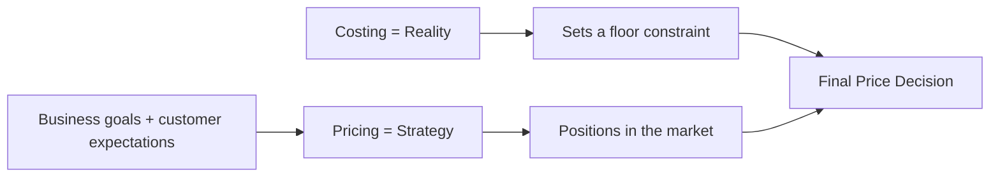

# Pricing Concepts: What Price Really Means

## Intuition First

Price is often reduced to “what we charge,” but strategically it is the **total value consumers exchange** for the benefits they receive. Cost tells you what you must cover to stay alive; price tells you how you choose to compete and position. Confusing the two produces weak strategy.

---

## Definition of Price

**Price** is:

1. The amount of money charged for a product or service, **or**
2. More importantly, the **total value** consumers are willing to exchange for the benefits of using it

The second framing matters because customers pay with money, time, effort, and opportunity cost — not only the sticker figure.

| Framing | Meaning | Example |
|---------|---------|---------|
| **Monetary** | Rupees/dollars on the tag | Coffee priced at ₹200 |
| **Exchange value** | What the buyer gives up for benefits received | ₹200 + queue time + switching from home brew for taste and status |

---

## Costing vs Pricing

These are distinct concepts. Mixing them is a classic failure mode.

| Concept | Nature | Question It Answers |
|---------|--------|---------------------|
| **Costing** | Reality | What must we cover to produce or deliver? |
| **Pricing** | Strategy | How do we position the offer to hit business goals and customer expectations? |

### Worked Contrast

| Approach | Logic | Risk |
|----------|-------|------|
| Cost-led only | Cost + markup = price | Ignores willingness to pay; may underprice luxury or overprice commodities |
| Strategy-led | Start from value, competition, goals; check costs remain viable | Requires research and discipline |

**Example**: A handmade bag may cost ₹800 to make. Costing says you need at least that plus margin. Pricing asks whether the brand story, craftsmanship, and scarce design support ₹4,000 — or whether a commodity bag in a crowded aisle can only clear ₹900.

---

## Why the Distinction Matters for Marketers

- Cost sets a **constraint**, not a positioning statement.
- Price communicates quality, status, and segment fit.
- Strategy connects price to brand, demand, and profit goals — not only accounting recovery.

---

## Common Pitfalls / Exam Traps

- **Trap**: Defining price only as “money charged.” The stronger definition includes total exchange value for benefits.
- **Trap**: Treating costing and pricing as synonyms. Costing is reality; pricing is strategy.
- **Trap**: Assuming cost-plus always yields the “right” price. It may ignore perceived value and competitive reference points.
- **Trap**: Ignoring non-monetary exchange (time, effort, switching costs) when explaining consumer acceptance of a price.

---

## Quick Revision Summary

- Price = money charged, or total value exchanged for benefits
- Costing = what you must cover (reality)
- Pricing = how you position to meet goals and expectations (strategy)
- Cost constrains; it does not automatically determine market price
- Strong pricing starts from customer value and market position, then checks cost viability

---

**← [Previous](01-module-introduction-transcript.md) · [Index](../README.md) · [Next](03-price-vs-promotion-transcript.md) →**
