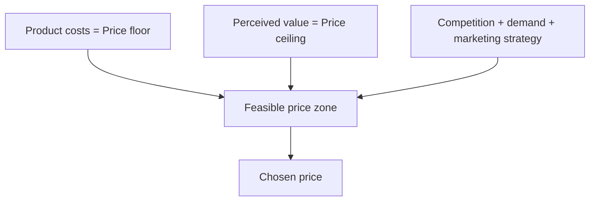
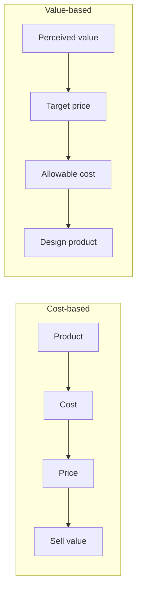

# Pricing Strategies from a Marketer’s Perspective

## Intuition First

Every workable price sits between a floor and a ceiling. **Costs set the floor** (below which profit vanishes). **Customer perceived value sets the ceiling** (above which buyers walk away). Competition and strategy fill the zone in between. Marketer pricing frameworks are ways of navigating that zone deliberately — not guessing a number.

---

## The Three Forces of Pricing

| Force | Bound | Meaning |
|-------|-------|---------|
| **Product costs** | Floor | Minimum to stay profitable |
| **Consumer perception of value** | Ceiling | Maximum consumers will pay |
| **Competition & external factors** | Mid-zone | Competitor prices, demand, own marketing strategy |

Effective pricing finds a level customers see as valuable while keeping the business profitable.

---

## Cost-Based vs Value-Based Pricing

| Aspect | Cost-based | Value-based |
|--------|------------|-------------|
| **Starting point** | Product and internal cost | Customer needs and perceived value |
| **Sequence** | Design product → calculate cost → set price → convince buyers of value | Understand value → set target price → determine allowable cost → design product to deliver at that price |
| **Driver** | Internal cost structure | Customer expectations and perceived value |
| **Direction** | Company → consumer | Consumer → company |

### Classic Contrast: Maruti Alto vs Porsche

| Brand | Logic | Price source |
|-------|-------|--------------|
| **Maruti Alto** | Cost-based leaning | Build cost + margin |
| **Porsche** | Value-based | Brand, performance, luxury, experience — not cost alone |

---

## Competition-Based Pricing

Prices are set mainly from the **prevailing market rate**. A firm may price:

| Stance | Signal / Goal |
|--------|----------------|
| **Above competitors** | Premium quality |
| **Below competitors** | Attract cost-conscious buyers |
| **At parity** | Align with market expectations |

| Works best when | Risk |
|------------------|------|
| Products are nearly identical (commodities, fuel, generic groceries) | Continuous undercutting → **price wars** where no one makes a profit |

Price often becomes the main differentiator in homogeneous markets — which is why wars escalate quickly.

---

## Value-Added Pricing

Enhance the offer with features, benefits, or experiences that justify a **higher** price versus cheaper alternatives. Goal: increase **pricing power** so buyers stop comparing you as a pure commodity.

| Example | Added value that justifies price |
|---------|----------------------------------|
| Cinema | Luxury reclining seats + gourmet snacks |
| Software | 24/7 dedicated human support in the package |

---

## Market Skimming

Launch at a **high** price, then gradually reduce to “skim” successive segments — from those willing to pay most down to more price-sensitive buyers.

| Condition for success | Why |
|-----------------------|-----|
| Strong high-quality image | High price must feel deserved |
| Enough early adopters wanting the product immediately | First-wave revenue exists |

**Example**: Smartphones launch at premium; older models discount as new generations arrive — capturing value across the life cycle.

---

## Market Penetration Pricing

Set a **low** initial price to attract many buyers quickly and win market share. High volume enables economies of scale; thin margins discourage entry.

**Example**: Streaming services use low or free intro plans to acquire millions of users, then raise prices after scale and habit form.

| Dimension | Skimming | Penetration |
|-----------|----------|-------------|
| Initial price | High | Low |
| Primary aim | Maximise early surplus / segment skim | Share, scale, deter rivals |
| Later move | Price steps down | Often price steps up after lock-in |
| Typical fit | Innovation with strong image | Markets where scale and network matter |

---

## Choosing a Marketer Strategy

| Situation | Lean toward |
|-----------|-------------|
| Strong brand, rare experience, inelastic segment | Value-based / skimming |
| Commodity, transparent rivals | Competition-based (with war caution) |
| Need rapid share and unit cost decline | Penetration |
| Cheap rivals exist; you can add distinctive extras | Value-added |
| Cost visibility dominates org culture | Cost-based (know its limits) |

---

## Common Pitfalls / Exam Traps

- **Trap**: Reversing cost-based and value-based sequences. Cost-based starts with product/cost; value-based starts with perceived value and target price.
- **Trap**: Saying competition-based pricing always means pricing below rivals. It can be above, below, or at parity.
- **Trap**: Ignoring price-war risk when defending share only with cuts.
- **Trap**: Using skimming without a quality image or early adopters — the high opening price fails.
- **Trap**: Confusing penetration (“start low for share”) with skimming (“start high, then step down”).

---

## Quick Revision Summary

- Floor = costs; ceiling = perceived value; middle = competition and strategy
- Cost-based: product → cost → price → convince value
- Value-based: value → target price → allowable cost → design product
- Competition-based follows market rates; best for near-identical goods; watch for wars
- Value-added builds pricing power through extras that block cheap comparisons
- Skimming: high then down by segment; penetration: low then scale (and often later increases)

---

**← [Previous](03-price-vs-promotion-transcript.md) · [Index](../README.md) · [Next](05-pricing-strategies-economist-transcript.md) →**
