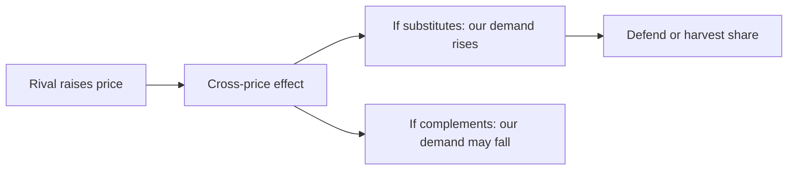

# Why Price Elasticity Matters for Marketers

## Intuition First

Great marketing often aims to make demand **more inelastic** — so strong preference that price becomes secondary. Elasticity is not only a homework formula; it tells you whether to promote hard on price, raise margins, skim a launch, or differentiate to escape price wars.

---

## Marketing Goal and Elasticity

Marketing can be framed as making a product so desirable that demand becomes **inelastic**: consumers want *your* brand enough that small price gaps hurt less.

| Brand strength | Typical price sensitivity | Pricing room |
|----------------|---------------------------|--------------|
| Weak / commodity | High elasticity | Compete on deals; thin margin risk |
| Strong preference / unique | Lower elasticity | Premium and margin expansion possible |

---

## Cross-Price Elasticity of Demand

**Cross-price elasticity** measures how demand for product A changes when the price of product B changes.

$E_{AB} = \dfrac{\%\ \text{change in quantity demanded of A}}{\%\ \text{change in price of B}}$

| Sign / pattern | Relationship |
|----------------|--------------|
| Positive $E_{AB}$ | Substitutes (rival’s price up → your demand up) |
| Negative $E_{AB}$ | Complements (other’s price up → your demand down) |

Marketers use this when a competitor raises price: Will share shift to us? How much?

---

## Elasticity-Guided Strategy Playbook

| Goal / context | Elasticity picture | Typical move |
|----------------|--------------------|--------------|
| Grow **market share** | High elasticity markets | Aggressive price promotions |
| Grow **profit margins** | Less elastic demand | Raise prices; premium / luxury positioning |
| **New product launch**; WTP uncertain | Elasticity unknown | Price skimming to reveal max willingness to pay |
| Defend vs rivals / substitutes | Pressure from comparison | Differentiation to cut direct price comparisons and lower sensitivity |

---

## Worked Marketing Scenarios

| Scenario | Elasticity logic | Action |
|----------|------------------|--------|
| Two nearly identical snack brands | High own-price and cross-price sensitivity | Promo wars common; differentiation (flavour, occasion, pack) needed to escape |
| Iconic sports shoe with few true substitutes | Relatively inelastic core fans | Margin via price rises + storytelling; promo more about drop culture than deep cuts |
| Entering a new SaaS category | Unknown elasticity | Skim tiers or geo prices to learn WTP before broad penetration |
| Private-label cola undercuts national brand | High cross-price for switchers | National brand differentiates taste/status to reduce comparison on ₹ alone |

---

## Linking Back to the Mix

- **Promotion** is especially potent when demand is elastic and share is the KPI.
- **Premium positioning** works when brand work has already reduced elasticity.
- **Skimming** is a learning and surplus tool under uncertainty.
- **Differentiation** is the anti-elasticity weapon against substitutes.

---

## Common Pitfalls / Exam Traps

- **Trap**: Treating own-price elasticity and cross-price elasticity as the same. Own-price: your $P$ vs your $Q$. Cross-price: their $P$ vs your $Q$.
- **Trap**: Saying marketers always want elastic demand. Often the goal is to **reduce** sensitivity (make demand more inelastic).
- **Trap**: Using penetration-style heavy discounts in an inelastic premium segment — you may leave margin on the table and train deal-seeking.
- **Trap**: Forgetting differentiation as the response to substitute pressure — not only matching prices forever.

---

## Quick Revision Summary

- Strong marketing often aims to make demand more inelastic
- Cross-price elasticity: $\%$ΔQ_A / $\%$ΔP_B — substitutes vs complements
- High elasticity + share goal → aggressive price promotions
- Low elasticity + margin goal → raise price, premium positioning
- Uncertain launch elasticity → skimming to discover WTP
- Rival/substitute pressure → differentiate to reduce price comparison

---

**← [Previous](06-price-elasticity-of-demand-transcript.md) · [Index](../README.md) · [Next](08-competitive-strategy-pricing-transcript.md) →**
