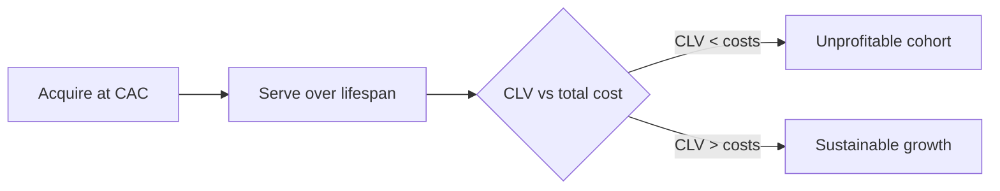

# Customer Lifetime Value and Competitive Pricing Strategy

## Intuition First

A price that looks winning on a single order can still lose the war. **Customer lifetime value (CLV / LTV)** asks how much a customer is worth across the entire relationship — after acquisition and service costs. Competitive pricing strategy that ignores CLV optimises for the wrong customer: the deal-chaser who churns before you recover CAC.

---

## What CLV Means

**Customer lifetime value (CLV)** is the total revenue (and, in net form, profit) a business can expect from a customer over the full relationship. It is **forward-looking**: not only past spend, but expected future value. Focus shifts from one-off transactions to long-term engagement and repeat purchase.

| Lens | Question |
|------|----------|
| Transaction | Did this sale clear margin today? |
| Lifetime | Will this relationship repay acquisition and serving costs and still earn? |

---

## Subscription Example: Not All Buyers Are Equal

Assume a subscription at $\$50$ per month. Three archetypes:

| Customer | Behaviour | Lifetime revenue | Economics after costs |
|----------|-----------|------------------|------------------------|
| **Cautious Claire** | Cancels after first delivery | $\$50$ | CAC $\$70$ + serve $\$25$ → firm loses $\$45$ |
| **Experimental Eric** | Cancels after second payment | $\$100$ | Still loses $\sim\$20$ after acquisition and two months of product/shipping |
| **Loyal Luke** | Stays $\ge 5$ months | $\$250+$ | After costs, $\sim\$55$ profit and may continue |

Same monthly price; radically different CLV. Competitive strategy must attract and retain lukes — not only convert claires with aggressive acquisition pricing.

---

## Simple CLV Calculation

A practical form:

$\text{CLV}_{\text{net}} = (\text{Average revenue per customer} \times \text{Customer lifespan}) - \text{Total cost to serve}$

Gross before costs:

$\text{CLV}_{\text{gross}} = \text{Average revenue per customer} \times \text{Customer lifespan}$

Works best with reliable history and a fairly consistent pricing model.

### Numeric Example

- Spend: ₹$10{,}000$ per year
- Lifespan: $5$ years
- $\text{CLV}_{\text{gross}} = 10{,}000 \times 5 = ₹50{,}000$
- Cost to serve over period: ₹$15{,}000$
- $\text{CLV}_{\text{net}} = 50{,}000 - 15{,}000 = ₹35{,}000$

---

## Metrics That Drive CLV

| Metric | Definition / idea | Why it matters |
|--------|-------------------|----------------|
| **Average purchase value** | Total revenue ÷ number of purchases | Size of each buy |
| **Purchase frequency** | How often a customer buys in a period | Repeat engine |
| **Customer lifespan** | Average length of relationship | Duration of revenue |
| **Churn rate** | % who stop buying / cancel over time | Inverse of retention |
| **Customer profitability score** | Revenue vs cost to serve | High-touch vs low-touch accounts |
| **User adoption** (digital subs) | Active engagement over time | Usage predicts renewal |
| **Engagement score** | Logins, events, interactions | Leading indicator of retention |
| **Product expansion** | Growth across offerings, not only spend | Cross-sell / upsell upside |

Together these metrics help predict and improve CLV — which in turn disciplines acquisition bids, discount depth, and service investment.

---

## Pricing Strategy Links

| Pricing move | CLV caution |
|--------------|-------------|
| Deep intro discount | May attract Claire-type churners; watch payback |
| Premium / value-based price | Can raise ARPU if retention holds |
| Penetration / free trial | Only works if conversion to loyal cohorts is high |
| High CAC channels | Need higher CLV or shorter payback to justify |

---

## Common Pitfalls / Exam Traps

- **Trap**: Equating CLV with last month’s revenue. CLV spans the relationship, often including expected future value.
- **Trap**: Using only gross CLV. Net CLV subtracts cost to serve (and strategy must also face CAC).
- **Trap**: Assuming identical prices imply identical customer value. Same $\$50$/month can be profitable or loss-making by retention.
- **Trap**: Optimising only acquisition volume. Competitive advantage often comes from cohorts with higher lifespan and engagement.
- **Trap**: Ignoring leading metrics (adoption, engagement) in subscription contexts — churn often shows up late.

---

## Quick Revision Summary

- CLV = value expected across the full customer relationship (forward-looking)
- Same price ≠ same CLV — retention and costs decide profit
- Simple net form: $(\text{ARPU-like revenue} \times \text{lifespan}) - \text{cost to serve}$
- Track AOV/purchase value, frequency, lifespan, churn, profitability, adoption, engagement, expansion
- Price and promo decisions should be judged by cohort CLV, not first-order alone
- Competitive pricing wins when it builds lukes, not only converts claires

---

**← [Previous](07-why-price-elasticity-matters-transcript.md) · [Index](../README.md) · [Next](09-netflix-vs-nike-pricing-transcript.md) →**
