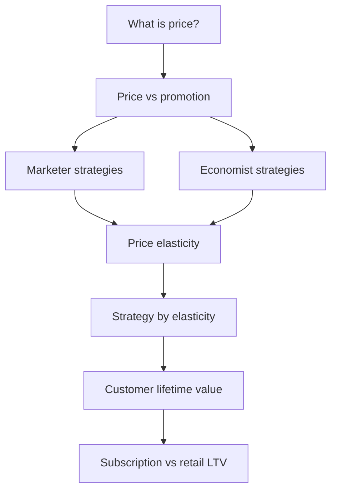

# Week 6 Summary: Pricing Strategy Toolkit

## Intuition First

This week’s ideas form one chain: define price correctly, separate it from promotion, choose marketer and economist tools deliberately, read elasticity before moving price, then judge success by **lifetime value** — not only the first sale. Flexible problem-solving means picking the right link in that chain for each case.

---

## Concept Map

---

## Block-by-Block Recap

### 1. Pricing Concepts

| Idea | Takeaway |
|------|----------|
| Price | Money charged **or** total value exchanged for benefits |
| Costing vs pricing | Costing = reality (must cover); pricing = strategy (positioning + goals) |

### 2. Price vs Promotion

| | Price | Promotion |
|--|-------|-----------|
| Role | Monetary value of exchange | Communicate and persuade |
| P&L | Direct on revenue/margins | Usually expense for growth |
| Perception | Worth / status | Awareness / desirability |

**Mnemonic**: Price captures value; promotion creates communication and demand.

### 3. Marketer Strategies

| Strategy | Core idea |
|----------|-----------|
| Three forces | Cost floor, value ceiling, competition in between |
| Cost-based | Product → cost → price → convince value |
| Value-based | Value → target price → allowable cost → design |
| Competition-based | Set vs market rate; war risk in commodities |
| Value-added | Extras create pricing power |
| Skimming | High then step down by segment |
| Penetration | Low then scale (margins thin; deter entry) |

### 4. Economist Strategies

| Tool | Core idea |
|------|-----------|
| 1st degree | Individual max WTP; surplus → seller |
| 2nd degree | Self-select by quantity/version |
| 3rd degree | Segments by elasticity |
| Two-part tariff | Fixed access + usage fee |
| Bundling | Package to lift perceived value and volume |
| Tactical discounts | Screen by time vs money; seasonal demand |

### 5. Elasticity

$E_d = \dfrac{\%\Delta Q}{\%\Delta P}$

| Type | Price up → revenue |
|------|---------------------|
| Elastic | Down |
| Inelastic | Up |
| Unitary | Unchanged |

### 6. Why Elasticity Matters

| Situation | Move |
|-----------|------|
| High elasticity, share goal | Aggressive price promos |
| Low elasticity, margin goal | Raise price / premium |
| Uncertain launch WTP | Skimming to learn |
| Substitute pressure | Differentiate |

Cross-price: $E_{AB} = (\%\Delta Q_A) / (\%\Delta P_B)$.

### 7. CLV and Model Contrast

$\text{CLV}_{\text{net}} \approx (\text{Revenue per customer} \times \text{Lifespan}) - \text{Cost to serve}$

| Model | LTV shape | Primary focus |
|-------|-----------|---------------|
| Subscription (Netflix-like) | Fee × months | Retention / churn |
| Retail (Nykaa-like) | AOV × frequency × lifespan | Basket + repeat |

---

## Exam-Ready Decision Tree

| Problem framing | Reach for |
|-----------------|-----------|
| “Is this cost or market/value logic?” | Costing vs pricing; cost- vs value-based |
| “Ads vs list price?” | Price vs promotion table |
| “Same product, different prices?” | Degrees of discrimination / discounts |
| “Should we raise price?” | Elasticity → revenue table |
| “Rival just raised price?” | Cross-price + differentiation |
| “Aggressive acquisition OK?” | CLV vs CAC / cost to serve |
| “Sub vs commerce brand?” | Retention metrics vs AOV/frequency |

---

## Common Pitfalls / Exam Traps

- **Trap**: Equating costing with pricing, or promotion with permanent pricing strategy.
- **Trap**: Reversing cost-based and value-based sequences.
- **Trap**: Mixing 1st / 2nd / 3rd degree discrimination definitions.
- **Trap**: Claiming elastic demand means “raise price to grow revenue” (opposite is true).
- **Trap**: Judging price success only on first purchase when CLV and churn say otherwise.
- **Trap**: Using one LTV formula for both subscription and retail models.

---

## Quick Revision Summary

- Price = exchange value; costing constrains, pricing strategises
- Price captures value; promotion builds demand and awareness
- Marketers: floor/ceiling + cost, value, competition, skim, penetrate, value-add
- Economists: discrimination degrees, two-part tariffs, bundling, tactical discounts
- Elasticity links $\%\Delta P$ to $\%\Delta Q$ and revenue; marketing often seeks more inelastic demand
- CLV forces long-horizon thinking; Netflix-like vs Nykaa-like engines use different LTV knobs
- Use the right tool from this toolkit for the problem — that is flexible marketing judgment

---

**← [Previous](09-netflix-vs-nike-pricing-transcript.md) · [Index](../README.md) · [Next](../week-07/01-module-introduction-transcript.md) →**
