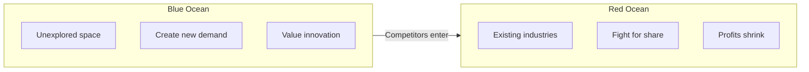
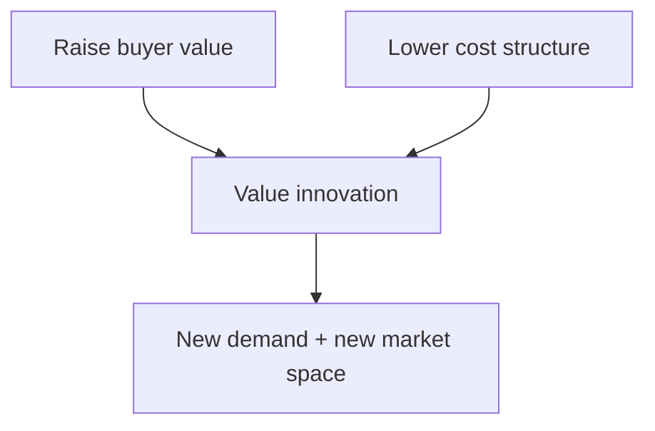

# Blue Ocean vs Red Ocean Strategy

## Intuition First

Competition is not always about beating rivals at the same game. Red oceans are crowded pools where firms fight over existing demand; blue oceans are open waters where firms create new demand so that competition becomes less relevant — at least for a while.

---

## Market Universe

Kim and Mauborgne (Chan Kim and Renee Mauborgne) use red and blue oceans to describe the market universe.

| Ocean | Meaning | Nature of competition |
|-------|---------|------------------------|
| **Red ocean** | All industries that exist today — known market space | Industry boundaries clear; rivals fight for share |
| **Blue ocean** | Industries that do not yet exist — unknown market space | Little or no direct rivalry; new demand created |

---

## Red Oceans

- Known market space with defined industry boundaries
- Firms compete to outperform rivals and capture existing demand
- As rivalry intensifies, the “water turns red”: crowded markets, cutthroat tactics, shrinking profits
- Growth is limited because everyone fights over the same consumers

**Example:** Budget airlines and mid-range airlines competing on routes, fares, and ancillaries in a saturated corridor.

---

## Blue Oceans

- Unexplored, largely untouched market spaces
- Instead of stealing demand from rivals, firms unlock new demand
- Offer room for profitable growth that saturated markets cannot

**Example:** Cirque du Soleil reframing circus entertainment by combining theatre and spectacle without animal shows — creating a new kind of experience rather than out-clowning traditional circuses.

---

## Strategy Contrast

| Dimension | Red ocean strategy | Blue ocean strategy |
|-----------|--------------------|---------------------|
| Market stance | Compete in existing markets | Create new market space |
| Demand | Exploit existing demand | Generate and capture new demand |
| Competitive goal | Outperform rivals | Make competition irrelevant |
| Value–cost logic | Choose **differentiation** or **low cost** | Break the trade-off — pursue **both** |
| Focus model | Cost differential / beat rivals | **Value max** — raise buyer value |
| Risk over time | Crowding and shrinking opportunity | Attracts imitators; space fills up |

---

## Value Innovation

Blue ocean logic rests on **value innovation**:

- Raise buyer value (differentiation)
- Reduce cost simultaneously
- Align activities so the firm is not stuck choosing only one side of the classic trade-off

**Red ocean mindset:** Keep costs low and win within a cost–differential competition model.

**Blue ocean mindset:** Create more value for the buyer, open new demand, and leave the head-to-head fight.

---

## Are Blue Oceans Permanent?

**No.** A forever-uncontested space is a myth.

1. A firm creates a blue ocean and value becomes visible
2. Competitors notice and enter
3. The calm water fills up and turns into a red ocean

**Strategic implication:** Do not hunt for a permanent blue ocean. Continuously innovate, refresh value, and open new spaces before rivals catch up.

**Example:** Early ride-hailing felt like a blue ocean; once many apps and fleets competed on the same urban demand, it behaved increasingly like a red ocean.

---

## When to Lean Red vs Blue

| Situation | Lean toward |
|-----------|-------------|
| Mature category, clear rivals, share battles | Red ocean tools (cost, differentiation, efficiency) |
| Underserved jobs-to-be-done, new combinations of value | Blue ocean (redefine boundaries, create demand) |
| Your “new” category is already copying others | Likely already reddening — innovate again |

---

## Common Pitfalls / Exam Traps

- **Trap**: Equating blue ocean with “any innovation.” Blue ocean means new market space and new demand, not a minor feature update in a crowded category.
- **Trap**: Saying blue oceans last forever. They turn red as imitators arrive.
- **Trap**: Claiming red ocean = only low cost and blue ocean = only premium. Blue ocean aims at **both** differentiation and low cost via value innovation.
- **Trap**: Treating “make competition irrelevant” as ignoring rivals forever. It means changing the game; rivals may still follow.
- **Trap**: Confusing red ocean with “bad strategy.” Competing well in existing markets can be necessary; blue ocean is an alternative logic, not a moral upgrade.

---

## Quick Revision Summary

- Red ocean: known markets, fight for existing demand, profits pressured
- Blue ocean: unexplored space, create new demand, competition less relevant
- Red strategy: outperform rivals; choose differentiation **or** low cost
- Blue strategy: value innovation — differentiation **and** low cost
- Blue oceans are temporary; successful ones attract competitors and redden
- Key skill: keep creating and refreshing value, not clinging to one blue space

---

**← [Previous](01-module-introduction-transcript.md) · [Index](../README.md) · [Next](03-understand-product-lifecycle-transcript.md) →**
