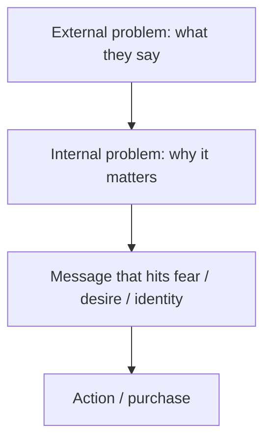

# Internal vs External Consumer Problems

## Intuition First

We often design funnels as if people buy through cold logic — compare features, then decide. Most purchases run on emotion, intuition, and quick feelings. Surface complaints are **external problems**; the deeper drivers — fear, desire, identity — are **internal problems**. Marketing that only mirrors the surface message misses why people actually say yes.

---

## How We Think vs How We Buy

| Assumption (how we think they buy) | Reality (how they often buy) |
|------------------------------------|------------------------------|
| Long rational evaluation | Fast emotional triggers |
| Feature comparison first | Feeling and intuition first |
| Linear logic to “yes” | Emotion guides, then reasons justify |

Understanding the gap lets marketers craft messages that connect emotionally and guide consumers toward a decision.

---

## External vs Internal Problems

| | External problem | Internal problem |
|--|------------------|------------------|
| Nature | Visible symptoms on the surface | Deeper causes behind the symptoms |
| How expressed | Easy to say out loud | Often hidden (shame, embarrassment, unawareness, complexity) |
| Role in talk | What customers *claim* they need | What actually *forces* the decision |
| Marketing use | Entry language / category cue | Emotional creative and positioning |

---

## Mapping Consumer Problems

1. Listen for the external problem (easy language)
2. Dig for the internal struggle (identity, belonging, status, fear of missing out, clutter, loneliness)
3. Speak to the deeper driver while remaining credible on the surface need

Customers narrate the external problem; the internal problem is the real force behind the decision.

---

## Examples

| External (what they say) | Internal (what drives them) | Marketing implication |
|--------------------------|-----------------------------|------------------------|
| “I need a cool backpack” | Express a conscious, authentic self; functional + tasteful + artisan values | Sell craftsmanship, identity, zipper-level utility as self-expression — not only “cool” |
| “I want to get better at drawing” | “I want to become an artist” — creative identity and long-term practice | Position as artistic journey, community, mastery — not only tutorial tips |
| “I need a better design library” | Work life is cluttered; want to fix a few things | Sell clarity, control, and less chaos — not only asset count |
| “I want to take a trip” | Missing friends; do not want to be alone at Thanksgiving / festive season | Sell togetherness and belonging — not only hotel amenities |

---

## Designing Communications

| Step | Practice |
|------|----------|
| Capture both layers | Map external claim ↔ internal motivation for the segment |
| Lead with emotion | Hook identity/fear/desire first |
| Support with product truth | Features prove you can solve the external job |
| Stay specific | Vague “inspiration” without a product fit feels manipulative |

**Example:** Travel brand for festival loneliness — creative about reunion and shared tables; landing page with group packages and flexible dates that make reunion logistics easy.

---

## Why This Matters Strategically

- Feature-only messaging assumes a rational buyer who rarely exists
- Competitors can copy features faster than emotional positioning if you own the internal job
- Insight quality determines whether campaigns feel “about me” or about SKUs

---

## Common Pitfalls / Exam Traps

- **Trap**: Treating internal and external as rival frameworks. External is the symptom; internal is the cause — use both.
- **Trap**: Equating “emotional buying” with irrational waste. Emotion is the primary path; reason often justifies after.
- **Trap**: Copying the customer’s exact external sentence as the whole campaign. That alone does not motivate action.
- **Trap**: Inventing internals without evidence. Depth without insight becomes projection.
- **Trap**: Ignoring shame/embarrassment as reasons internals stay unspoken. Silence is a clue, not absence of a problem.

---

## Quick Revision Summary

- People often buy emotionally; rational steps are frequently post-hoc
- External = visible, easy-to-state symptom
- Internal = deeper fear, desire, or identity behind the symptom
- Customers talk external; decisions run on internal
- Map both layers to design communication and strategy
- Examples: backpack → authentic self; art skill → artist identity; trip → belonging

---

**← [Previous](04-modeling-a-perceived-risk-for-consumers-transcript.md) · [Index](../README.md) · [Next](06-sales-vs-marketing-transcript.md) →**
