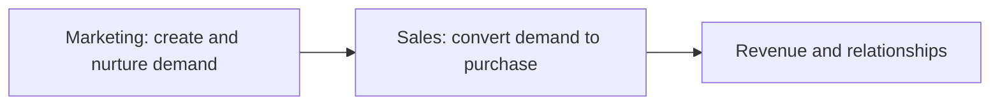
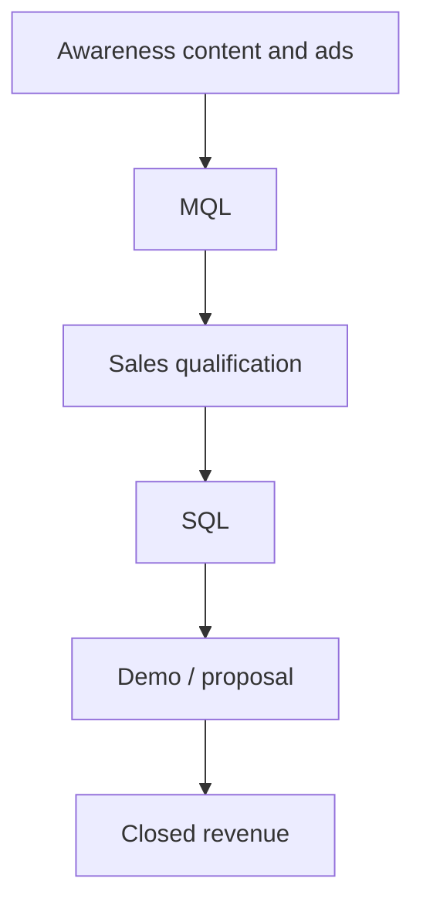

# Sales vs Marketing

## Intuition First

Sales and marketing are not rival tribes. Marketing finds needs, builds awareness, and creates demand; sales converts that demand into purchases. In that sense, sales is part of marketing — a promotional, action-oriented tool that turns strategy into closed deals.

---

## Relationship in One Line

Misconception: separate and competing functions.
Reality: sales operates within the broader marketing system.

---

## How They Differ

| Dimension | Marketing | Sales |
|-----------|-----------|-------|
| **Primary goal** | Brand awareness / demand generation | Lead conversion |
| **Target focus** | Audience segmentation | Personalised outreach to specific prospects |
| **Time horizon** | Longer-term (visibility, pipeline) | Shorter-term (close now) |
| **KPIs** | Traffic, visibility, MQLs | SQLs, deals closed, revenue |
| **Channels** | Websites, ads, SEO, webinars, events | Emails, calls, demos, meetings |

Both are designed to work together to drive business results.

---

## Skills Compared

| Capability area | Marketing strength | Sales strength |
|-----------------|--------------------|----------------|
| Insight | Analytical thinking (data → strategy) | Active listening (uncover client needs) |
| Communication | Broad audience messaging | One-to-one prospect dialogue |
| Knowledge systems | Consumer / segment knowledge | CRM — track interactions and relationships |
| Creative / close | Creativity for campaigns and positioning | Negotiation to finalise agreements |
| Opportunity response | Problem solving when markets shift | Networking to expand pipeline |
| Technical craft | CMS, SEO, social, analytics | Product knowledge and pitching |

Shared need: strong communication — applied at different scales.

---

## Hand-off Logic

| Stage | Owner | Typical outcome |
|-------|-------|-----------------|
| Attract and educate | Marketing | Awareness, interest, MQLs |
| Qualify and deepen | Shared / sales | SQL readiness |
| Demo, negotiate, close | Sales | Deal and revenue |
| Feedback into offer and messaging | Both | Better next campaigns and pitches |

---

## Marketing Examples

| Context | Marketing does | Sales does |
|---------|----------------|------------|
| B2B SaaS | SEO, webinars, case studies → MQLs | Discovery calls, demos, contract negotiation |
| Auto dealership | Brand campaigns, inventory ads | Test drive, financing conversation, close |
| FMCG / retail | Mass brand building | Trade sales, distributor relationships (B2B side) |

---

## Why Alignment Matters

| Failure mode | Result |
|--------------|--------|
| Marketing floods unqualified leads | Sales wastes time; trust erodes |
| Sales ignores brand promise | Conversions undercut positioning |
| KPI silos only | Local wins, shared pipeline stalls |

Marketing builds demand strategically; sales turns it into measurable results.

---

## Common Pitfalls / Exam Traps

- **Trap**: Saying sales and marketing are fully separate. Sales is a promotional conversion arm within marketing’s wider system.
- **Trap**: Swapping KPIs — MQLs are marketing; SQLs and closed deals are sales.
- **Trap**: Claiming marketing is only short-term. Marketing usually has the longer horizon; sales is shorter-cycle closing.
- **Trap**: Equating marketing channels with sales channels (SEO/webinars vs calls/demos).
- **Trap**: Listing identical skills for both. Analytical ↔ listening; creativity ↔ negotiation; CMS/SEO ↔ product pitch.

---

## Quick Revision Summary

- Sales is part of marketing: converts demand created by marketing
- Marketing: awareness, segmentation, long horizon, MQLs, broad channels
- Sales: conversion, personalised outreach, short horizon, SQLs/revenue, direct interaction
- Skills differ in application but both need strong communication
- Together: marketing generates leads; sales closes deals

---

**← [Previous](05-understanding-consumer-internal-vs-external-problems-transcript.md) · [Index](../README.md) · [Next](07-sales-tactics-waterfall-vs-sprinkler-transcript.md) →**
