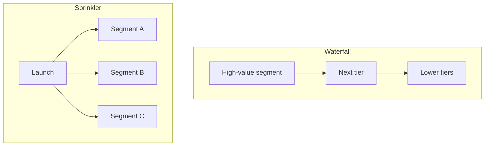
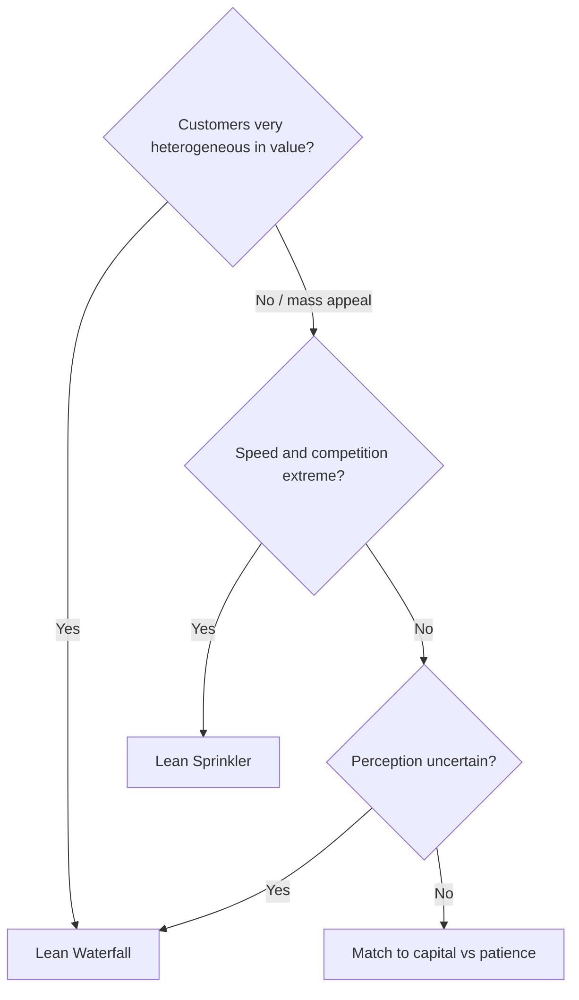

# Sales Tactics: Waterfall vs Sprinkler

## Intuition First

Not every go-to-market should blast every segment on day one. **Waterfall** rolls out sequentially — highest-value customers first, then down. **Sprinkler** sprays many segments at once for speed and mass share. Choose based on how different customers are, how competitive the race is, and how much capital and patience you have.

---

## Two Tactics at a Glance

| | Waterfall | Sprinkler |
|--|-----------|-----------|
| Pattern | Step-by-step; priority segments first | Many segments simultaneously |
| Metaphor | Cascade down the value ladder | Spray across the lawn |
| Scope | Focused and sequential | Broad and rapid |

---

## When to Use Each

### Waterfall — suitable when

- Consumer base is **heterogeneous** (customers differ a lot in value)
- Product perception is **uncertain** or not extreme
- Key action: separate high-value from low-value customers and prioritise systematically

### Sprinkler — suitable when

- Need to hit **multiple segments at once** to gain share quickly
- Market is **highly competitive** and **speed** is critical
- Product has **mass appeal**

---

## Operational Differences

| Dimension | Waterfall | Sprinkler |
|-----------|-----------|-----------|
| **Risk** | Low, controlled (gradual rollout) | Higher risk and cost (scale from day one) |
| **Speed** | Slow and steady; learn each stage | Fast and aggressive; immediate impact |
| **Customisation** | High (one segment at a time) | Low (mass message) |
| **Key resource** | Time and patience | Capital and infrastructure |

---

## Marketing Examples

| Firm / category | Tactic | Why it fits |
|-----------------|--------|-------------|
| Microsoft (enterprise software) | Waterfall | Sell to Fortune 500 in the US first, learn, then expand to mid-sized firms in Europe months later |
| H&M / Zara (fashion) | Sprinkler | Short trend shelf life; same product for many markets — global/same-day style launches |
| Candy Crush–style mobile games | Sprinkler | Mass appeal; compete for attention and downloads at once |

---

## Choosing the Tactic

| If you have… | Lean toward |
|--------------|-------------|
| Time, learning loops, segment differences | Waterfall |
| Capital, short product life, mass sameness | Sprinkler |

Ultimate choice depends on market conditions and strategic priorities — not on which name sounds better.

---

## Common Pitfalls / Exam Traps

- **Trap**: Calling waterfall “mass market.” Waterfall is sequential focus; sprinkler is broad simultaneous reach.
- **Trap**: Saying sprinkler is low risk. It is higher risk and higher upfront cost.
- **Trap**: Using waterfall when trend life is days long (fashion/games). Speed usually demands sprinkler.
- **Trap**: Using sprinkler when values differ wildly and messages must be customised. Waterfall fits better.
- **Trap**: Forgetting resource asymmetry: waterfall burns **time**; sprinkler burns **capital/infrastructure**.

---

## Quick Revision Summary

- Waterfall: sequential, highest-value first — for heterogeneous buyers and uncertain perception
- Sprinkler: simultaneous multi-segment push — for speed, competition, mass appeal
- Waterfall: low risk, slow, high customisation, needs patience
- Sprinkler: higher risk/cost, fast, low customisation, needs capital
- Examples: enterprise software waterfall; fashion/games sprinkler
- Match tactic to market conditions and business priorities

---

**← [Previous](06-sales-vs-marketing-transcript.md) · [Index](../README.md) · [Next](08-summary-transcript.md) →**
