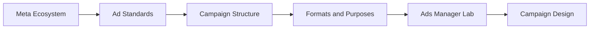

# Meta Ads Foundations: Module Overview

## Intuition First

Meta Ads is not “one Facebook button.” It is a multi-platform advertising system spanning Facebook, Instagram, and WhatsApp. This module builds the skill stack to choose formats, structure campaigns, and match creative to goals — from awareness to conversion.

---

## Learning Objectives

By the end of this module, you should be able to:

| Objective | Why It Matters |
|-----------|----------------|
| Describe Meta Ads basics and structure | Know where campaigns sit in the broader marketing mix |
| Explain major ad formats and purposes | Image, video, carousel, and lead formats solve different jobs |
| Choose format by goal and audience | Wrong format wastes budget even with a strong product |
| Create ads that resonate | High engagement, lead gen, and product promotion need different creative |

---

## Module Roadmap

| Block | Core Question |
|-------|---------------|
| Ecosystem and standards | What is Meta, and what rules keep ads safe and compliant? |
| Structure | How do campaign → ad set → ad layers work together? |
| Formats | Which creative type fits awareness, traffic, engagement, leads, or app installs? |
| Platform lab | How do you build and measure a real campaign in Ads Manager? |

---

## Platforms in Scope

| Platform | Marketing Role |
|----------|----------------|
| **Facebook** | Broad reach, Feed/Marketplace/right-column placements, community engagement |
| **Instagram** | Visual discovery, Stories, Reels, brand and product storytelling |
| **WhatsApp** | Conversations, messages, direct lead and service pathways |

**Example**: A fashion DTC brand might use Instagram carousel ads for product discovery, Facebook lead forms for a style quiz, and WhatsApp CTA for sales chat — all under one Meta campaign structure.

---

## How Themes Connect

1. **Standards come first** — non-compliant creative never gets a chance to convert.
2. **Objective drives everything** — format, targeting, and budget allocation follow the campaign goal.
3. **Structure keeps work measurable** — campaign (what to optimise), ad set (whom/where), ad (what people see).

---

## Common Pitfalls / Exam Traps

- **Trap**: Treating Meta Ads as Facebook-only. The ecosystem includes Instagram and WhatsApp placements and messaging.
- **Trap**: Memorising formats without linking them to objectives. Exams expect “format → purpose” (e.g., lead forms for signup capture on-platform).
- **Trap**: Assuming one creative works for every goal. Awareness, engagement, and conversion need different ad designs and CTAs.
- **Trap**: Skipping structure. Knowing image vs video is not enough if you cannot place decisions at campaign vs ad set vs ad.

---

## Quick Revision Summary

- Meta Ads = paid reach across Facebook, Instagram, WhatsApp
- Module focus: foundations, formats, structure, and platform setup
- Formats: image, video, carousel, lead (and related immersive types)
- Goals span awareness → traffic → engagement → leads → app promotion
- Match format and creative to audience and objective
- Campaign hierarchy organises optimisation, targeting, and creative

---

**← [Previous](../week-07/08-summary-transcript.md) · [Index](../README.md) · [Next](02-foundational-knowledge-transcript.md) →**
