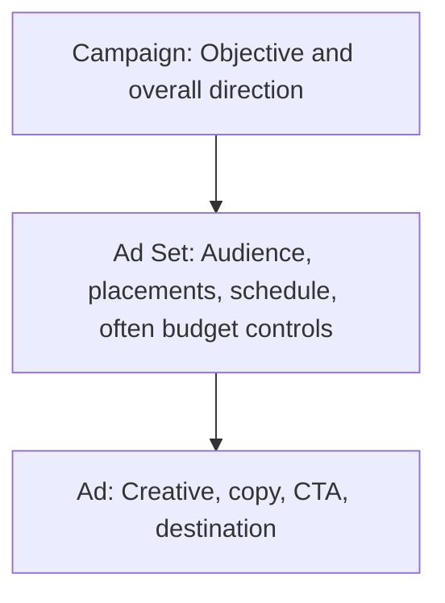
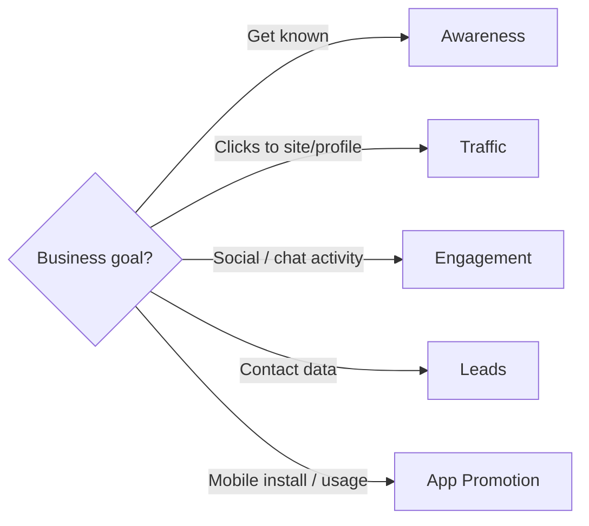
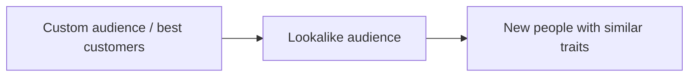
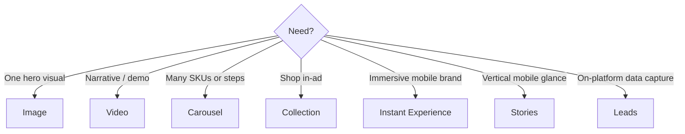

# Meta Ads Structure, Objectives, Targeting, and Formats

## Intuition First

Meta organises advertising like a company org chart: the **campaign** sets the goal, the **ad set** chooses who sees it and where, and the **ad** is the creative people actually see. Get any layer wrong and the algorithm optimises for the wrong outcome — or shows great creative to the wrong audience.

---

## Three-Layer Structure

| Layer | Job | Key Decisions |
|-------|-----|---------------|
| **Campaign** | Sets direction and optimisation goal | Objective (awareness, traffic, engagement, leads, app promotion, etc.) |
| **Ad set** | Defines *who* and *where* | Audience, placements, demographics, interests, behaviours |
| **Ad** | Defines *what* people see | Images/videos, headline, primary text, links |

**Exam phrasing**: Campaign tells Meta *what to optimise for*; ad set focuses on *exactly whom to reach*; ad is the creative unit.

---

## Campaign Objectives

Meta asks for an objective at campaign creation. That choice shapes targeting logic, budget distribution, and how performance is judged.

| Objective | Primary Aim | Typical Use |
|-----------|-------------|-------------|
| **Awareness** | Reach people who may care, even if not ready to buy | New store launch, brand introduction |
| **Traffic** | Send people to a destination | Website, app, Instagram profile, landing page, blog, event page |
| **Engagement** | Drive interactions | Likes, comments, shares, video views, Messenger/Instagram/WhatsApp conversations |
| **Leads** | Capture prospect information | Instant forms, event RSVP, survey, insurance callback |
| **App promotion** | Drive installs and continued use | App installs, in-app events |

**Marketing example**: An insurance brand needing callback requests chooses **Leads** with instant forms — not Traffic to a long PDF — so Meta optimises for form completion, not empty clicks.

---

## Ad Set: Where the “Magic” Happens

At ad set level you define audience and placements. While the campaign chooses the objective, the ad set chooses the match between message and people.

### Setup Flow

1. Create or select audience (age, location, interests, behaviours)
2. Choose placements (manual or automatic)
3. Align targeting detail with the campaign objective

### Placements

| Mode | Meaning |
|------|---------|
| **Manual placements** | You pick surfaces (e.g., Instagram Stories, Facebook Feed, Marketplace, right column) |
| **Automatic placements** | Meta spreads delivery and shifts toward surfaces that engage best at efficient cost |

**Recommendation pattern**: Automatic placements are Meta’s default guidance for reach/cost efficiency unless creative or brand rules require exclusion (e.g., avoid right-column display for a tall video creative).

---

## Targeting Options at Ad Set Level

| Targeting Type | Basis | Example |
|----------------|-------|---------|
| **Demographic** | Age, gender, location, language, basic details | Women 25–35 in Mumbai |
| **Interest** | Hobbies, followed pages, activities | Fashion, fitness, cooking |
| **Behaviour** | Online actions, device use, purchase signals | Online shoppers, specific device users |
| **Custom audiences** | Your first-party data / existing customers | Email list, past buyers, website visitors |
| **Lookalike audiences** | People similar to your best customers | Expand from high-LTV buyer seed list |

**Brand example**: A beauty brand uploads VIP buyers as a custom audience, builds a lookalike, and runs engagement ads before converting lookalikes with a lead or traffic offer.

---

## Ad Layer: Creative Unit

The ad includes message, media, headline, body copy, and destination (site, Instagram page, etc.). In competitive categories (fashion, accessories, beauty), creative polish is often the differentiator — not targeting alone.

**Example cue**: Premium product ads with polished imagery raise perceived quality before the click.

---

## Meta Ad Formats and Purposes

| Format | Strength | Best For |
|--------|----------|----------|
| **Image ads** | Clean, direct, visually striking | Single product, event highlight |
| **Video ads** | Storytelling; product in action | Short attention grabs or longer demos |
| **Carousel ads** | Multiple cards, each with own destination | Product range, step-by-step story |
| **Collection ads** | Browse and purchase from the ad | Catalog-style shopping |
| **Instant Experience** (formerly Canvas) | Mobile-only immersive (swipe, tilt, zoom); loads up to ~$10\times$ faster than typical mobile web | Deep mobile engagement; reduce drop-off |
| **Story ads** | Full-screen vertical on FB/IG Stories | Quick, intimate mobile impressions |
| **Lead ads / forms** | Capture details without leaving Meta | Newsletters, signups, inquiries |

**Selection rule**: Choose format from **goal + audience context**, not habit. Lead forms beat out-of-platform landing pages when form completion is the KPI; carousels beat single images when the value is assortment.

---

## Putting It Together: Sample Path

| Layer | Decision | Example |
|-------|----------|---------|
| Campaign | Traffic | Drive landing-page visits for a new apparel drop |
| Ad set | Women 25–35; interest = women’s clothing / online shopping; automatic placements | Match intent and browsing behaviour |
| Ad | Carousel of 5 SKUs + “Shop the drop” CTA | Show assortment, not one dress |

---

## Common Pitfalls / Exam Traps

- **Trap**: Confusing campaign with ad set. Objective lives at campaign; audience/placement detail lives at ad set.
- **Trap**: Using Traffic when you need Leads. Clicks ≠ contact data; Meta optimises to the objective you picked.
- **Trap**: Treating lookalike audiences as the same as custom audiences. Custom = your people; lookalike = Meta finds *similar* new people.
- **Trap**: Listing formats without purposes. Exams reward “carousel for multi-product storytelling” over mere name recall.
- **Trap**: Forcing manual placements by default. Automatic placements often improve cost efficiency unless you have a clear reason to constrain.

---

## Quick Revision Summary

- Structure: Campaign (objective) → Ad set (audience/placements) → Ad (creative)
- Objectives: awareness, traffic, engagement, leads, app promotion
- Ad set = targeting magic: demographics, interests, behaviours, custom, lookalike
- Placements: manual or automatic (Meta often recommends automatic)
- Formats: image, video, carousel, collection, Instant Experience, Stories, lead forms
- Instant Experience: mobile immersive; faster load vs typical mobile web; lowers drop-off
- Match format to goal: assortment → carousel; signup on Meta → lead form; story → video/Stories

---

**← [Previous](02-foundational-knowledge-transcript.md) · [Index](../README.md) · [Next](04-meta-ads-platform-lab-transcript.md) →**
