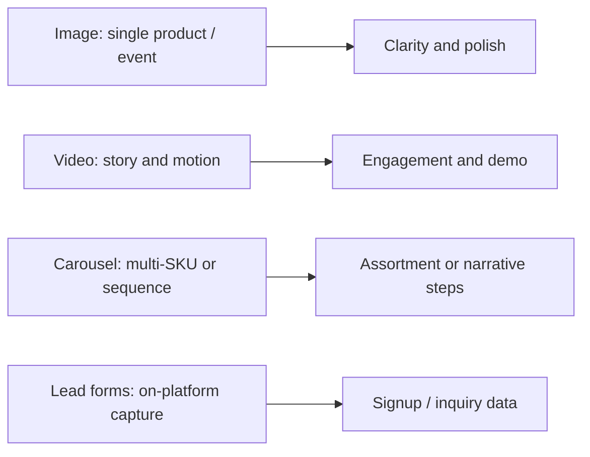
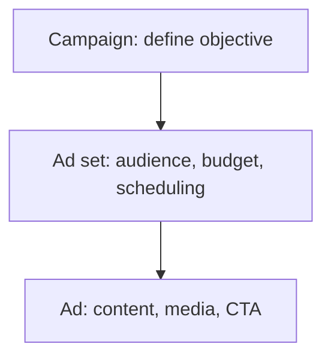

# Meta Ads Week Wrap-Up: Structure, Formats, and Targeting

## Intuition First

Week 8 turns Meta from “social posts” into a measurable ad system: platforms for reach, standards for trust, a three-layer structure for control, formats for creative jobs, and targeting (including custom and lookalike) for precision. If you can map **goal → objective → format → audience → metric**, you can design campaigns that are organised and result-driven.

---

## What Meta Ads Unlocks

| Idea | Implication for Marketers |
|------|---------------------------|
| Multi-platform ecosystem | Reach users on Facebook, Instagram, and related Meta surfaces |
| Global + targeted delivery | Scale awareness while narrowing to people who match your ICP |
| Objective-led optimisation | Meta allocates delivery toward the outcome you selected |

**Why it matters**: Modern digital marketing needs both creative storytelling and precise delivery. Meta combines them under one Ads Manager workflow.

---

## Formats Recap (Purpose Lens)

| Format | Job |
|--------|-----|
| **Image** | Simple, effective product or event showcase |
| **Video** | Dynamic engagement; show product in use |
| **Carousel** | Multiple products or a step-by-step story |
| **Lead forms** | Collect customer info without forcing users off Meta |

(Other formats covered in depth elsewhere in the week — collection, Instant Experience, Stories — follow the same rule: pick by goal, not vanity.)

---

## Structure Recap for Campaign Success

| Layer | You Define |
|-------|------------|
| Campaign | Objective aligned to marketing goal |
| Ad set | Audience, budget, schedule |
| Ad | Creative assets, copy, call to action |

This hierarchy keeps campaigns organised and goal-aligned — each layer answers a different management question.

---

## Audience Targeting Recap

| Lever | Precision Benefit |
|-------|-------------------|
| Demographics | Age, location, gender, language bases |
| Interests | Affinity and lifestyle match |
| Behaviours | Action and purchase signals |
| **Custom audiences** | Reach people you already know (CRM, site, app) |
| **Lookalike audiences** | Expand to people similar to strong existing customers |

**Impact logic**: Better targeting raises relevance → improves engagement and conversion odds → stretches budget toward measurable outcomes.

---

## Choosing the Right Format for Goals

| Marketing Goal | Format Tendency |
|----------------|-----------------|
| Engagement | Video, Stories, engagement-oriented creative |
| Lead generation | Lead forms / instant forms |
| Product promotion | Image, carousel, collection |
| Multi-product storytelling | Carousel (or Instant Experience for immersive mobile) |

**Selection skill**: Know each format’s strength, then tailor the campaign — format is strategy, not decoration.

---

## Capability Checkpoint

You should now be able to:

1. Navigate the Meta Ads ecosystem and its role in digital marketing
2. Map formats to purposes (image, video, carousel, leads, and related types)
3. Build campaigns with correct campaign → ad set → ad logic
4. Apply demographic, interest, behaviour, custom, and lookalike targeting
5. Select formats against engagement, lead gen, or product-promotion goals
6. Move into Ads Manager with enough structure to create, manage, and begin optimising toward measurable results

---

## Common Pitfalls / Exam Traps

- **Trap**: Recalling platform names without the three-layer structure. Exams often test where objective vs audience live.
- **Trap**: Matching formats to vague “visibility” instead of specific goals (awareness vs leads vs installs).
- **Trap**: Treating custom and lookalike as interchangeable. Custom = your people; lookalike = similar new people.
- **Trap**: Ignoring that Meta optimisation follows the objective you chose — wrong objective yields “good” metrics for the wrong job.
- **Trap**: Memorising tools without the outcome chain: right audience + right format + clear CTA → measurable result.

---

## Quick Revision Summary

- Meta Ads: Facebook, Instagram, and related Meta surfaces for targeted digital advertising
- Formats: image (clarity), video (motion/story), carousel (multi/sequence), lead forms (on-platform capture)
- Structure: campaign (objective) → ad set (audience/budget/schedule) → ad (creative + CTA)
- Targeting: demographics, interests, behaviours; custom + lookalike maximise relevance
- Choose format from goal: engagement, lead gen, or product promotion
- Skill outcome: create, manage, and optimise Meta campaigns for measurable business impact

---

**← [Previous](04-meta-ads-platform-lab-transcript.md) · [Index](../README.md) · [Next](../week-09/01-introduction-to-google-ads-transcript.md) →**
