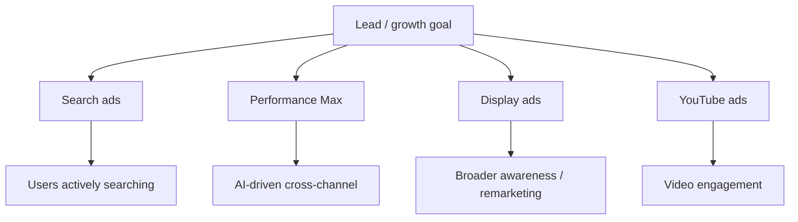
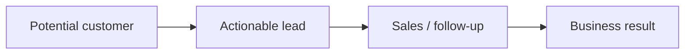

# Introduction to Google Ads for Lead Generation

## Intuition First

Google Ads is **performance marketing** — spend money only when the platform can drive measurable business outcomes (leads, calls, form fills, sales). For lead-gen businesses (insurance, education, B2B services), the goal is not vanity reach; it is capturing high-quality contact information that sales can convert into revenue.

---

## What Google Ads Is For

| Focus | Meaning |
|-------|---------|
| **Performance marketing** | Drive real-world results (leads, conversions), not just awareness |
| **Lead generation** | Capture actionable customer information (phone, email, form fills) |
| **Primary use cases** | Insurance, education, professional services — any business needing leads |

**Marketing example**: An insurance company runs Google Ads so someone searching "car insurance quote online" lands on a form, submits details, and becomes a sales-ready lead.

---

## Module Learning Goals

By mastering Google Ads for lead gen, you should be able to:

1. Apply **foundational basics** — account structure, targeting, bidding — with a lead-gen lens
2. Choose the right **campaign type** for the goal
3. Drive **meaningful conversions**, not just clicks

---

## Campaign Types at a Glance

| Campaign type | Purpose for lead gen |
|---------------|----------------------|
| **Search** | Capture users already looking for the service |
| **Performance Max (PMax)** | Automated ads across Google inventory from one campaign |
| **Display** | Reach a broader audience while they browse websites/apps |
| **YouTube** | Video storytelling and engagement to warm or convert |

---

## Lead Generation Framing

Lead generation sits between awareness and sale:

- **Search** → highest intent when keywords match the offer
- **PMax** → maximises conversions with less manual channel picking
- **Display / YouTube** → expand reach, retarget, or educate before the form fill

---

## Common Pitfalls / Exam Traps

- **Trap**: Treating Google Ads only as brand awareness. For this module, the frame is **performance and leads**.
- **Trap**: Confusing a click with a lead. A lead is captured customer information that can drive further action.
- **Trap**: Assuming one campaign type fits all. Search ≠ Display ≠ PMax in intent and control.
- **Trap**: Ignoring lead quality. Volume of form fills without sales fit is not success.

---

## Quick Revision Summary

- Google Ads here = performance marketing for **lead-gen** businesses
- Goal: attract high-quality leads and convert them into business results
- Core types: Search, PMax, Display, YouTube
- Search targets active seekers; PMax automates cross-channel; Display/YouTube broaden and engage
- Success = meaningful conversions, not just traffic

---

**← [Previous](../week-08/05-summary-transcript.md) · [Index](../README.md) · [Next](02-real-time-auction-bidding-model-transcript.md) →**
