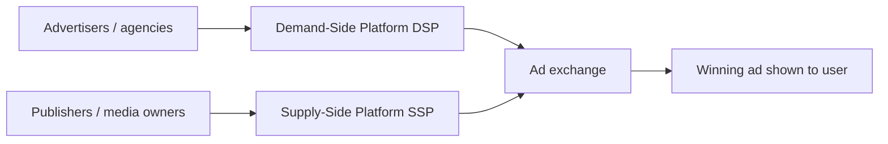

# Real-Time Bidding (RTB) and Programmatic Advertising

## Intuition First

Every time a page or app loads with an empty ad slot, an **auction happens in milliseconds** before the user sees anything. Advertisers do not negotiate each placement by email; software bids automatically. That instant auction is **real-time bidding (RTB)** — the engine behind most programmatic digital ads.

---

## What Is Real-Time Bidding?

**RTB** is programmatic advertising where digital ad spaces are bought and sold instantly through automated auctions.

| Step | What happens |
|------|----------------|
| 1 | User visits a website or opens a mobile app |
| 2 | Available ad space goes to auction in real time |
| 3 | Advertisers bid to show ads to that specific user |
| 4 | Within milliseconds, the system selects the winner |
| 5 | Winning ad renders as the page/app loads |

**Marketing example**: You open a news site; before the articles finish loading, insurers, edtech brands, and retailers have already competed for the banner slot next to the article.

---

## Why RTB Matters

| Traditional advertising | Real-time bidding |
|-------------------------|-------------------|
| RFPs, negotiation, insertion orders | Automated bidding |
| Slow to launch and adjust | Instant placement and flexible control |
| Manual deal-making | Speed, efficiency, campaign agility |

RTB compresses what used to take days of media buying into a fraction of a second per impression opportunity.

---

## Programmatic Stack: DSP, SSP, Ad Exchange

Programmatic buying rests on three software platforms (not physical machines):



| Platform | Who uses it | Role |
|----------|-------------|------|
| **DSP (Demand-Side Platform)** | Advertisers, media agencies | Store target audience, campaign rules, max bid |
| **SSP (Supply-Side Platform)** | Publishers, media owners | Manage inventory, audience on site/app, floor/minimum price |
| **Ad exchange** | Marketplace between DSP and SSP | Auctions inventory when advertiser criteria match supply |

**Win logic**: Highest bid **plus** relevancy and ad quality typically wins; the ad is then displayed to the user.

Providers are often labelled by role: DSP providers, SSP providers, or ad exchange providers.

---

## The Auction Timeline

```mermaid
sequenceDiagram
    participant User
    participant Page as Page / app
    participant SSP
    participant Exchange
    participant DSP
    User->>Page: Opens page with ad slot
    Page->>SSP: Ad request
    SSP->>Exchange: Offer inventory
    Exchange->>DSP: Auction invitation
    DSP->>Exchange: Bids + criteria match
    Exchange->>Page: Winning creative
    deactivate Exchange
    Page->>User: Ad displays during page load
```

| Scenario | Result |
|----------|--------|
| Page loads **without** an ad | Content shows; ad slot stays empty |
| Page loads **with** an ad | RTB ran in the background; winner appears almost instantly |

The entire auction can complete in a few milliseconds as the page loads.

---

## Common Pitfalls / Exam Traps

- **Trap**: Thinking RTB is a human auction that takes minutes. It is automated and finishes in **milliseconds**.
- **Trap**: Confusing DSP and SSP. DSP = **buyer** side; SSP = **seller/publisher** side.
- **Trap**: Believing only the highest bid always wins regardless of quality. Relevancy and ad quality also matter.
- **Trap**: Equating "programmatic" with "random spray." Criteria (audience, bid caps, inventory) still gate who enters the auction.
- **Trap**: Treating ad exchange as physical hardware. It is a **software marketplace**.

---

## Quick Revision Summary

- RTB = automated, real-time auction for digital ad space
- Runs when a user opens a page/app with available inventory
- Stack: **DSP** (buy) ↔ **ad exchange** ↔ **SSP** (sell)
- Wins on bid, relevancy, and quality — then ad renders instantly
- Replaces slow RFP/IO media buying with speed and flexibility

---

**← [Previous](01-introduction-to-google-ads-transcript.md) · [Index](../README.md) · [Next](03-foundational-knowledge-transcript.md) →**
