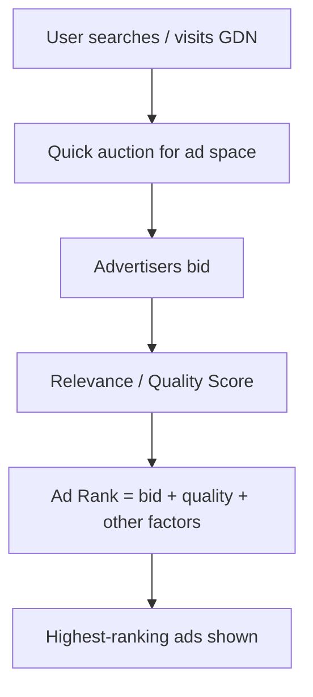
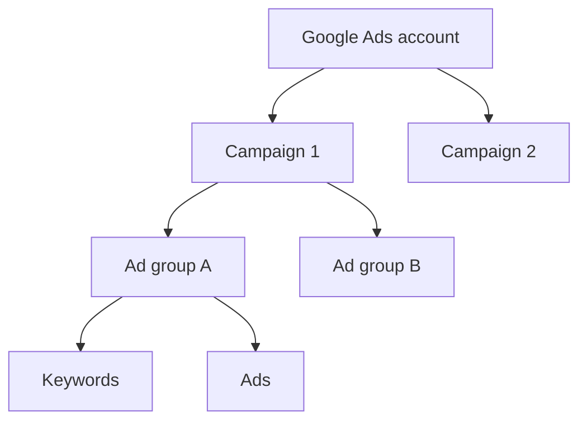
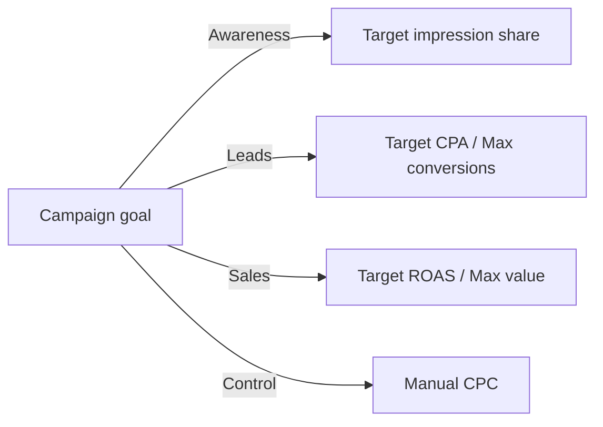

# Google Ads Foundational Knowledge: Policies, Auction, Structure, Targeting, Bidding

## Intuition First

Google Ads is not "upload creative and hope." It is a **policy-bounded auction** plus a **structured account** (campaign → ad group → keywords/ads) that decides *who* sees *which* ad and *how much* you pay toward a goal. Policies protect the ecosystem; Quality Score and Ad Rank decide visibility; targeting and bidding decide whether spend buys the right people.

---

## Google Ads Policies (Four Areas)

Google aims for a trustworthy ecosystem for users, advertisers, and publishers. Policies keep experiences safe and lawful and keep harmful content out.

| Policy area | Meaning |
|-------------|---------|
| **Prohibited content** | Content that **cannot** be advertised on Google Network |
| **Prohibited practices** | Actions you cannot take if you want to advertise |
| **Restricted content and features** | Allowed only with **limitations** |
| **Editorial and technical standards** | Quality bars for ads, websites, and apps |

---

## How Google Ads Serving Works

1. User searches on Google or visits the **Google Display Network (GDN)**
2. Google runs a quick auction for available space
3. Ads are scored for **relevance** to the query or content
4. **Quality Score** reflects overall ad quality
5. Google combines **bid** and **Quality Score** into **Ad Rank**
6. Highest Ad Rank ads are shown; position follows Ad Rank and other factors

---

## Account Structure

| Level | Role |
|-------|------|
| **Account** | Overall Google Ads account |
| **Campaign** | Budget, goal, network, location — e.g. Campaign 1, Campaign 2 |
| **Ad group** | Theme cluster of keywords + ads (analogous to Meta's **ad set**) |
| **Keywords + ads** | What triggers the auction and what creative users see |

**Meta vs Google naming**: Meta uses **campaign → ad set → ad**; Google uses **campaign → ad group → ad**.

---

## Targeting Options

| Lever | What it does | Example |
|-------|--------------|---------|
| **Keywords** | Phrases that trigger Search ads | "term life insurance quote" |
| **Audiences** | Interest / behaviour groups | Online bookstore → literature lovers |
| **Demographics** | Age, gender, income, etc. | Luxury watches → high-income brackets |
| **Location** | Country, city, town | Local clinic → one city or radius |

**Tool**: Google Keyword Planner helps discover relevant industry keywords.

---

## Bidding Strategies

Google offers **smart/automated** and **manual** options. Choose by campaign goal.

| Strategy family | Examples | Typical use |
|-----------------|----------|-------------|
| Conversion-focused | Maximise conversions (± target CPA) | Lead gen |
| Value-focused | Maximise conversion value (± target ROAS) | E-commerce |
| Traffic / visibility | Maximise clicks; Target impression share | Traffic growth, awareness |
| Manual control | Manual CPC | Tight budget control |

### Goal → Strategy Map

| Goal | Prefer |
|------|--------|
| Brand awareness | Target impression share (or maximise clicks for traffic) |
| Lead generation | Target CPA or maximise conversions |
| E-commerce sales | Target ROAS or maximise conversion value / conversions |
| Strict spend control | Manual CPC |
| Competitive visibility | Target impression share |

---

## Common Pitfalls / Exam Traps

- **Trap**: Mixing Meta's "ad set" with Google's "ad group." Same idea, different name.
- **Trap**: Thinking highest bid alone wins. **Ad Rank = bid + Quality Score (+ other factors)**.
- **Trap**: Using maximise conversions on an account with no conversion data yet — smart bidding needs signal.
- **Trap**: Broad geographic + no demographics for luxury/high-ticket offers — wastes spend.
- **Trap**: Ignoring prohibited/restricted policy areas until accounts get suspended.

---

## Quick Revision Summary

- Four policy buckets: prohibited content, prohibited practices, restricted content, editorial/technical standards
- Auction: relevance + Quality Score + bid → **Ad Rank** → placement
- Structure: Account → Campaign → Ad group → Keywords/Ads
- Targeting: keywords, audiences, demographics, location
- Match bidding strategy to goal: awareness, leads, sales, or manual control

---

**← [Previous](02-real-time-auction-bidding-model-transcript.md) · [Index](../README.md) · [Next](04-different-types-and-purpose-transcript.md) →**
