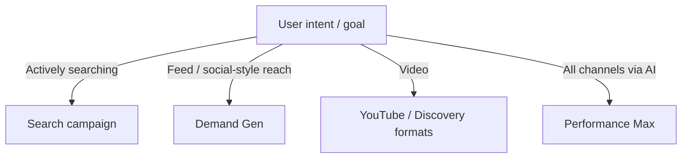
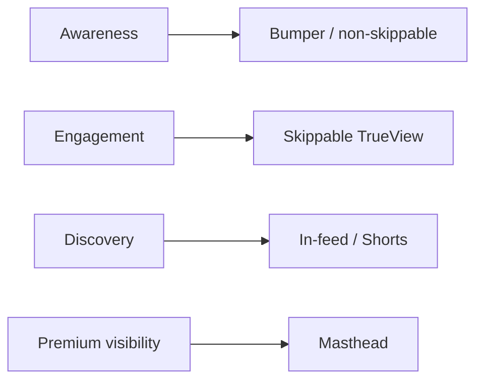

# Google Ads Campaign Types: Search, Demand Gen, Discovery/YouTube, Performance Max

## Intuition First

Campaign type is a **channel and automation choice**. Search captures existing demand; Demand Gen and YouTube create or re-engage demand across feeds and video; Performance Max lets Google's AI hunt conversions across almost every Google surface from one campaign. Wrong type = paying for the wrong moment in the customer journey.

---

## Campaign Types Overview

| Type | Where it shows | Best for |
|------|----------------|----------|
| **Search** | Google Search results | High-intent queries |
| **Demand Gen** | YouTube Shorts / in-stream / in-feed, Discover, Gmail | Re-engage and expand with rich creatives |
| **Discovery / YouTube video** | YouTube surfaces | Awareness, engagement, video storytelling |
| **Performance Max** | YouTube, Display, Search, Discover, Gmail, Maps | Max conversions with minimal channel picking |

---

## Search Campaigns

Appear when users **actively search** for information, products, or services. Can include **extensions** (ratings, callouts, structured snippets, sitelinks) for more information and CTR lift.

### Editorial Guidelines (Search Ads)

| Rule | Detail |
|------|--------|
| ALL CAPS | Not allowed except promotional codes |
| "Trick to click" | Phrases like "click here" often flagged |
| Exclamation points | Max one; none in headlines |
| Display URL | Root domain must match destination URL |

### Bidding on Search

Aligned to goals such as conversions, leads, sales, clicks, views, engagement, impressions.

| Smart bidding (needs sufficient conversion history) | Manual |
|-----------------------------------------------------|--------|
| Target ROAS, maximise conversion value | Manual CPC |
| Maximise conversions, Target CPA | |

---

## Keyword Match Types

| Match type | Triggers on | Reach | Relevance |
|------------|-------------|-------|-----------|
| **Broad match** | Synonyms and related searches | Highest | More diluted |
| **Phrase match** | Phrase + close variants | Medium | Medium |
| **Exact match** | Exact term + close variants | Lowest | Highest |
| **Negative match** | Blocks unwanted queries | Protects budget | Improves relevance |

**Marketing example**: Exact match `"car insurance quote"` for an insurer; negative `"free job"` or `"career"` if irrelevant traffic appears.

---

## Quality Score

Quality Score combines three factors:

| Component | Approx. weight | Focus |
|-----------|----------------|-------|
| **Landing page experience** | ~39% | Relevance, usability, load/UX of destination |
| **Expected CTR** | ~39% | Likelihood users click the ad |
| **Ad relevance** | ~22% | Ad text fit to keyword/query |

Higher Quality Score improves Ad Rank and can lower cost for the same position.

---

## Ad Extensions

| Extension | Purpose |
|-----------|---------|
| Sitelinks | Deep links to key pages |
| Ratings / reviews | Social proof |
| App links | Drive installs |
| Price / promotion | Surface offers |
| Call / location | Phone and map actions |
| Disclosures | Required legal/offer clarity |

Extensions add information and actions without replacing the core ad.

---

## Demand Gen Campaigns

Reach across **YouTube Shorts, in-stream, in-feed, Discover, and Gmail**. Assets: images, headlines, descriptions, logos, CTAs, URLs, business name.

| Use | Approach |
|-----|----------|
| Re-engage | Remarketing / existing audiences |
| Expand | Custom intent, in-market, affinity |
| Structure | Ad groups by in-market, custom intent, remarketing, customer match |

### In-Market vs Custom Intent

| Concept | Meaning | Example |
|---------|---------|---------|
| **In-market** | Users actively shopping a category (known buying pattern) | Annual car insurance renewer |
| **Custom intent** | New/emerging interest signalled by recent behaviour/searches | First-time "best guitar course for beginners" searcher |

Other audience themes: weddings, financial services, apparel, electronics, education, real estate, etc.

---

## YouTube / Discovery Video Formats

Bidding often uses **CPA** (cost per action) or **CPM** (cost per 1,000 impressions).

| Format | Behaviour | Notes |
|--------|-----------|-------|
| **TrueView / skippable in-stream** | Skippable after 5 seconds | Pay when viewers watch past 5s (classic popular format) |
| **Non-skippable** | Full message required | Guarantees complete view of short spot |
| **Bumper** | ~6 seconds, non-skippable | Often at start; quick brand hit |
| **In-feed video** | Appears as users discover content | Discovery-driven |
| **YouTube Shorts ads** | Mobile-first Shorts inventory | Vertical, fast consumption |
| **Masthead** | Prominent homepage / home feed placement | High visibility "banner"-scale presence |

---

## Performance Max (PMax)

Single campaign across **YouTube, Display, Search, Discover, Gmail, and Maps**. Complements keyword-based Search; uses AI to push conversions across Google inventory.

| When to use Search | When to use PMax |
|--------------------|------------------|
| Full keyword control, query-intent capture | Max conversions with less channel management |
| Transparent query reports and structure | Broader inventory coverage via AI |

---

## Common Pitfalls / Exam Traps

- **Trap**: Using broad match without negatives — reach without relevance.
- **Trap**: Mixing all goals into one campaign type; Search ≠ Demand Gen ≠ PMax.
- **Trap**: Forgetting Quality Score weights — landing page and expected CTR dominate (~39% each).
- **Trap**: Confusing CPM with CPC — CPM is per 1,000 impressions; CPA is per action.
- **Trap**: Paying for skippable TrueView incorrectly — advertisers typically pay when viewers continue **past 5 seconds**.
- **Trap**: Treating PMax as a full Search replacement — it **complements** keyword Search.

---

## Quick Revision Summary

- Types: Search, Demand Gen, YouTube/Discovery formats, Performance Max
- Match types: broad / phrase / exact / negative — trade reach vs relevance
- Quality Score ≈ landing page (~39%) + expected CTR (~39%) + ad relevance (~22%)
- Extensions boost info and actions; Demand Gen uses in-market vs custom intent
- YouTube: skippable, non-skippable, bumper, in-feed, Shorts, masthead
- PMax = one AI-driven campaign across Google's major surfaces

---

**← [Previous](03-foundational-knowledge-transcript.md) · [Index](../README.md) · [Next](05-google-ads-lab-transcript.md) →**
