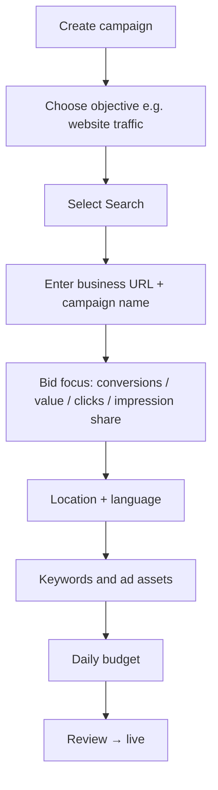
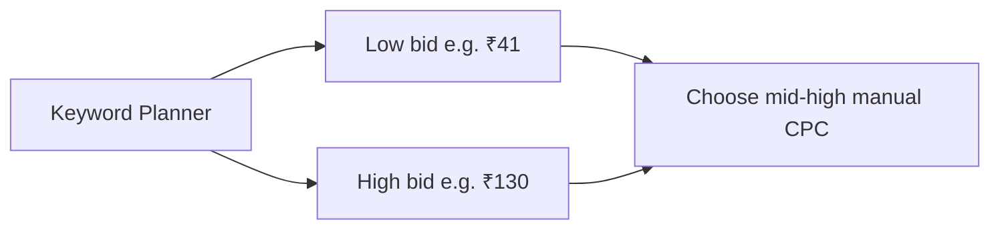

# Google Ads Lab: Dashboard, Search Campaigns, Performance Max, and CPC Bidding

## Intuition First

The Google Ads UI maps the theory: **structure (campaign → ad group → ads)**, **goal-led campaign types**, and **tools for planning**. A lead-gen business (e.g. insurance) usually starts by choosing traffic or leads as the objective, then Search or PMax, then keywords/assets, location, and budget. Keyword Planner turns guesswork about CPC into a range you can bid into.

---

## Account Interface Map

After signing up at ads.google.com, the left navigation centers on:

| Area | What you do |
|------|-------------|
| **Campaigns** | View and manage all campaigns |
| **Goals** | Align setup to outcomes |
| **Tools** | Asset Studio, planning, data, partnerships |
| **Billing** | Payment method (card) |
| **Settings** | Time zone, account name, etc. |

### Tools Worth Knowing

| Tool | Purpose |
|------|---------|
| **Asset Studio** | Prompt-based creation of images/videos for ads |
| **Keyword Planner** | Search volume and bid forecasts (by URL or keywords) |
| **Performance Planner** | Estimate media budget needs |
| **Reach Planner** | Especially useful for YouTube / reach planning |
| **Creator partnerships** | Link co-sponsored YouTube creator videos; track views, clicks, sales |
| **Data manager** | Connect Google properties (YouTube, Google Analytics, etc.) |

---

## Structure Reminder: Google vs Meta

| Platform | Hierarchy |
|----------|-----------|
| **Google Ads** | Campaign → **Ad group** → Ads |
| **Meta Ads** | Campaign → **Ad set** → Ads |

Same logic; only the middle name differs.

---

## Creating a Search Campaign (Lead / Traffic Focus)

Example framing: insurance or similar **lead-oriented** business wanting **website traffic** or leads.

### Key setup choices

| Step | Notes |
|------|-------|
| **Objective** | Leads or website traffic for lead-gen businesses |
| **Campaign type** | Search (this walkthrough); also PMax, Demand Gen, Video, Display, Shopping |
| **Final URL** | Business site (e.g. `abc.com`) |
| **Bid focus** | Conversions (e.g. form fill), conversion value, clicks, impression share |
| **Optional max CPC** | Cap (e.g. ₹50/click) or let Google AI set bids |
| **Location / language** | e.g. India or city (Delhi); English |
| **Ad groups** | AI can generate from site cues, or create manually (e.g. "Lifestyle" section URL) |
| **Budget** | Custom daily amount (e.g. ₹200–₹2,000) then submit for review |

**Conversion example**: For insurance, a conversion might be "form completed for callback."

Once live, dashboard metrics resemble other paid platforms (impressions, share-related stats, etc.).

---

## Creating a Performance Max Campaign

| Step | Notes |
|------|-------|
| Objective | e.g. website traffic |
| Type | **Performance Max** — one campaign across Search, Display, YouTube, Gmail, Maps, etc. |
| Final URL + name | Landing destination |
| Bidding | e.g. towards **conversions** |
| Location | e.g. India |
| **Asset group** | Logos, search/display creatives, YouTube — AI-generated from URL or manual upload + **previews** by placement |
| **Signals** | Cues to AI on who to reach (search themes, audience lists, interests) |
| Demographics | Age, gender, parental status, household income, etc. |
| Interests / life events | e.g. news & politics, TV news; or autos, life events |
| Budget | Custom or Google's recommended amounts → review → live |

### Signals (practical)

| Signal type | Use |
|-------------|-----|
| Search themes | Topics you associate with ideal customers |
| Audience signals | Customer lists (retarget), YouTube engagers, interest segments |
| Extra demographics | Age bands, income tiers, gender |

**Marketing example**: News site → signals for people who follow news/politics + age 25–54 + mid-to-top household income.

---

## Campaign Types Available in Setup

| Type | Scope |
|------|-------|
| **Performance Max** | All major Google properties from one campaign |
| **Search** | Google Search only |
| **Demand Gen** | YouTube, Discover, Gmail, related feed surfaces |
| **Video** | Primarily YouTube |
| **Display** | Image ads on partner sites across the web |
| **Shopping** | Product listings in Shopping results/tab |

Lab focus for this walkthrough: **Search** and **PMax**.

---

## Manual CPC Range via Keyword Planner

Prefer letting AI choose CPC when possible, but for a **manual bid floor/ceiling**:

1. Tools → Planning → **Keyword Planner**
2. **Get search volume and forecast**
3. Enter keyword (e.g. "online education") and geography (e.g. India)

| Metric from planner | Meaning |
|---------------------|---------|
| Top of page bid (high) | Competitive upper range (e.g. ₹130) |
| Low range bid | Floor to be competitive (e.g. ~₹41) |

**Practical bid band example**: Minimum around ₹41; competitive bids often toward ₹110–₹120 (below the high of ₹130) so the ad can appear without overpaying the extreme.

---

## Common Pitfalls / Exam Traps

- **Trap**: Confusing Google **ad group** with Meta **ad set**.
- **Trap**: Selecting Shopping or Display when the goal needs Search intent or PMax coverage.
- **Trap**: Setting a tiny max CPC below Keyword Planner's low range — ads may rarely show.
- **Trap**: Skipping audience **signals** in PMax — AI has fewer useful cues.
- **Trap**: Ignoring Asset Studio / previews — layout differs on Search vs Display vs YouTube.
- **Trap**: Treating "clicks" as equal to "conversions" for insurance — define form-fill conversions when leads matter.

---

## Quick Revision Summary

- UI: Campaigns, Tools (Keyword / Performance / Reach Planner, Asset Studio, Data manager), Billing, Settings
- Hierarchy: Campaign → Ad group → Ads
- Search setup: objective → Search → URL → bid → geo/language → keywords/assets → budget → review
- PMax: asset groups + signals + previews across Google inventory
- Keyword Planner forecasts give a **manual CPC range** (low to top-of-page high)
- Lead-gen example: insurance form fills as conversions; Search for intent + PMax for AI reach

---

**← [Previous](04-different-types-and-purpose-transcript.md) · [Index](../README.md) · [Next](06-summary-transcript.md) →**
