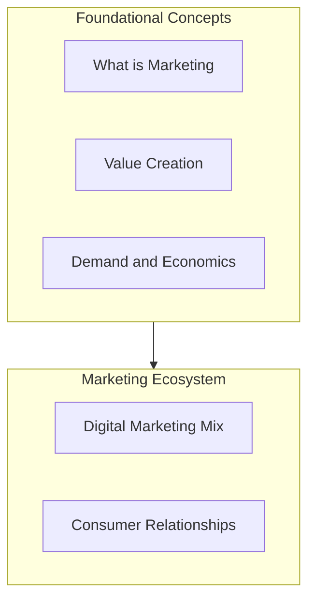

# Marketing Foundations: Module Overview

## Why This Module Matters

Marketing sits at the intersection of economics, psychology, and business strategy. Before advanced frameworks like STP, BCG, or digital analytics can be applied, a marketer must understand what marketing actually does, how consumers perceive value, and how demand is formed in real markets. This module builds that foundation.

---

## Core Topics Covered

### 1. Definition of Marketing

- **Conceptual definition**: Marketing as strategies and activities to acquire, engage, and retain customers while creating consumer value
- **Practical one-liner**: Marketing is about **managing perception and creating value**
- **Simplest form**: Providing value to final consumers

### 2. Value in Marketing

| Dimension | Focus |
|-----------|-------|
| Perceived value | How consumers weigh benefits against costs |
| Tangible value | Economic (price, efficiency) and functional (utility, performance) |
| Intangible value | Social (status, identity) and experiential (emotion, ambience) |
| Value equation | $\text{Value} = \frac{\text{Benefits}}{\text{Costs}}$ — high value when ratio exceeds 1 |

### 3. Demand and Economics

- **Demand**: Relationship between desire to purchase and willingness + ability to pay
- **Need vs want vs demand**: Essential requirements, shaped desires, and purchase-ready intent
- **Elastic vs inelastic demand**: Price sensitivity of quantity demanded
- **Forms of demand**: How demand types affect pricing and promotion decisions

### 4. Marketing Ecosystem

- How earned, owned, and paid media work together in digital marketing
- How macro and microeconomic conditions shape campaign strategy
- How customer relationship frameworks guide resource allocation

---

## Learning Outcomes

By the end of this module, you should be able to:

1. Define marketing from both formal and practical perspectives
2. Explain how value is created, perceived, and increased
3. Distinguish need, want, and demand with real examples
4. Interpret demand elasticity and its strategic implications
5. Describe the digital marketing mix and customer relationship quadrants

---

## Common Pitfalls / Exam Traps

- **Trap**: Treating marketing as only advertising. Marketing spans acquisition, engagement, retention, and value creation across the full customer lifecycle.
- **Trap**: Confusing want with demand. A strong want without purchasing power does not create demand.
- **Trap**: Assuming all products have elastic demand. Essentials (medicine, utilities) often show inelastic demand regardless of price changes.
- **Trap**: Equating fair value ($\text{Benefits} = \text{Costs}$) with success. Fair value satisfies but does not build loyalty — value must exceed cost perceptually.

---

## Quick Revision Summary

- Marketing = creating and managing perceived value for consumers
- Value = benefits divided by costs; aim for ratio $> 1$
- Demand requires need/want + ability + willingness to pay
- Needs are universal; wants are shaped by marketing; demand is purchase-ready intent
- Elastic demand = price-sensitive; inelastic = price-insensitive
- Digital mix = earned + owned + paid media working together
- Customer groups: strangers, butterflies, true friends, barnacles — each needs different investment
