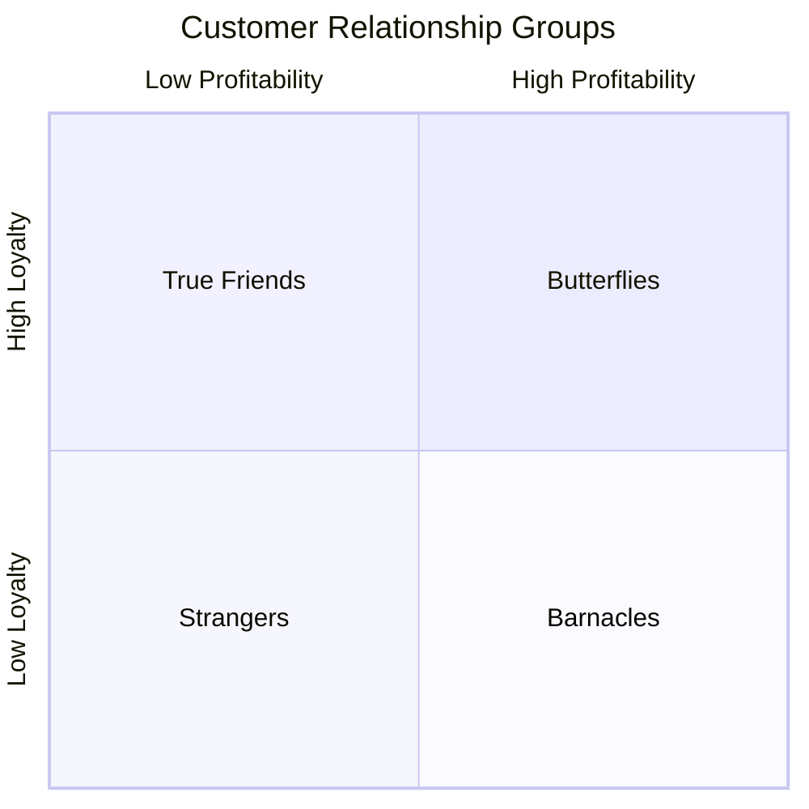
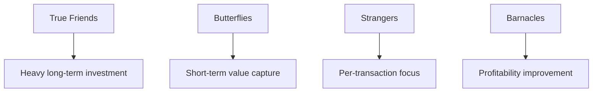

# Building Consumer Relationships: The Four Relationship Groups

## Intuition First

Not every customer deserves the same investment. A profitable loyal advocate and a one-time bargain hunter require opposite strategies. The four-group framework (strangers, butterflies, true friends, barnacles) helps allocate marketing resources by **projected loyalty** and **projected profitability**.

---

## The Relationship Matrix

| Group | Profitability | Loyalty | Strategy |
|-------|---------------|---------|----------|
| **Strangers** | Low | Low | Minimal investment; maximise per-transaction revenue |
| **Butterflies** | High | Low | Capture short-term value; promotions while they last |
| **True Friends** | High | High | Long-term investment; personalisation and loyalty rewards |
| **Barnacles** | Low | High | Increase profitability or upsell; avoid over-serving |

---

## Strangers

**Profile**: Low profitability, low loyalty — unlikely to return or contribute significantly.

**Strategy**:

- Do not over-invest in relationship building
- Focus on maximising revenue per transaction
- Treat as one-time customers; welcome repeat visits but do not chase conversion

**Example**: Tourist buying once at a convenience store with no local loyalty.

---

## Butterflies

**Profile**: High profitability, low loyalty — attracted briefly but shop around.

**Strategy**:

- Enjoy them while they last
- Short-term promotions and special deals to maximise spend during the window
- Do not expect long-term commitment — conversion efforts usually fail

**Example**: Stock trader switching between brokerage apps for best short-term deals and features.

---

## True Friends

**Profile**: High profitability, high loyalty — the ideal customer segment.

**Strategy**:

- Invest heavily: personalised experiences, loyalty programs, exclusive access
- Maintain strong relationships and reward advocacy
- Treat as brand ambassadors who drive word-of-mouth growth

**Characteristics**:

- Repeat purchases
- Positive referrals
- Active brand advocacy
- Resilient to competitor offers

---

## Barnacles

**Profile**: High loyalty, low profitability — return regularly but contribute little margin.

**Strategy**:

- Increase profitability through upselling, cross-selling, or premium tiers
- Convert toward "true friend" status by raising average transaction value
- Avoid excessive free services that drain resources

**Example**: Bank customer making frequent small transactions without maintaining a profitable balance.

---

## Resource Allocation Logic

| Group | Resource Priority |
|-------|-------------------|
| True friends | Highest — retention, CRM, loyalty programs |
| Butterflies | Medium-short — timed promotions |
| Barnacles | Medium — upsell and margin improvement |
| Strangers | Lowest — efficient transaction processing |

---

## Common Pitfalls / Exam Traps

- **Trap**: Treating all customers equally. Uniform CRM spend wastes budget on strangers and under-invests in true friends.
- **Trap**: Expecting butterflies to become loyal. They are profitable but transient by nature.
- **Trap**: Ignoring barnacles because they are loyal. Loyalty without margin drains resources.
- **Trap**: Confusing high spend with high profitability. A customer can spend often but on low-margin products.

---

## Quick Revision Summary

- Four groups: strangers, butterflies, true friends, barnacles
- Axes: projected profitability vs projected loyalty
- Strangers: low/low — minimal investment, maximise per sale
- Butterflies: high/low — short-term promotions, no loyalty expectation
- True friends: high/high — invest for retention and advocacy
- Barnacles: low/high — upsell to improve profitability
- Resource allocation should match group profile, not treat all customers equally
