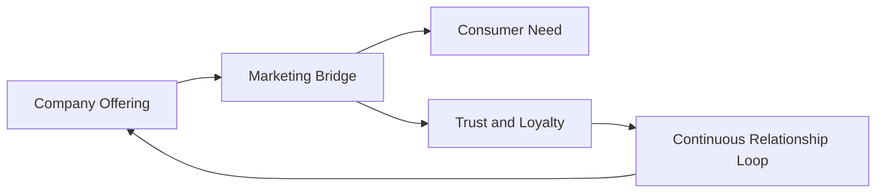

# What Is Marketing?

## Intuition First

Marketing answers a deceptively simple question: *How does a company convince people that its offering solves a real problem worth paying for?* It is not a one-time campaign or a billboard — it is an ongoing process of understanding human challenges and delivering solutions that resonate.

---

## Formal Definition

Marketing is a set of **strategies and activities** that companies use to:

1. **Acquire** customers
2. **Engage** them over time
3. **Build strong relationships**
4. **Create value** for the final consumer

### Simplified Definitions (Exam-Ready)

| Level | Definition |
|-------|------------|
| Formal | Strategies to acquire, engage, and retain customers while creating consumer value |
| One-liner | Managing perception and creating value |
| Simplest | Providing value to final consumers |

---

## What Marketing Actually Does

Marketing bridges the gap between **what companies offer** and **what consumers need**. This includes:

- Solving individual or societal problems
- Saving time or simplifying decisions
- Fostering emotional connection with a brand
- Influencing purchase decisions through credible messaging

---

## Core Activities

| Activity | Purpose | Example |
|----------|---------|---------|
| Understanding challenges | Identify unmet needs and desires | User research before product launch |
| Crafting messages | Communicate value clearly | "Zero sugar, same great taste" (Coke Zero) |
| Delivering solutions | Match offering to need | Home delivery for food (fulfilling the need for food with convenience) |
| Building trust | Enable repeat purchase | Consistent quality, transparent pricing |
| Driving loyalty | Long-term revenue | Rewards programs, personalised experiences |

---

## Marketing as an Ongoing Process

Successful marketing is **not a one-time event**. Companies that excel create a continuous loop:

1. Attract the right customers
2. Deliver promised value
3. Earn trust
4. Generate loyalty and advocacy
5. Reinvest insights into the next cycle

One-off campaigns may spike awareness, but sustainable growth comes from repeated value delivery and relationship building.

---

## Real-World Example: Messaging That Resonates

Consider how a small team decides what the world should hear about a product. The decision is not random — it is based on:

- Who the audience is
- What problem they face
- What language and imagery will capture attention
- What proof will convert attention into action

A campaign succeeds when the message feels relevant, credible, and worth acting on — not merely when it is loud.

---

## Common Pitfalls / Exam Traps

- **Trap**: Defining marketing as "selling products." Selling is one activity; marketing encompasses research, positioning, communication, distribution, and relationship management.
- **Trap**: Saying marketing "creates needs." Marketers cater to needs and **shape wants** — they do not create biological necessities like food or shelter.
- **Trap**: Treating marketing as only B2C. The same principles apply to B2B, services, and non-profits — the audience changes, not the core logic.

---

## Quick Revision Summary

- Marketing = acquire + engage + build relationships + create consumer value
- Simplest definition: providing value to final consumers
- Bridges company offerings and consumer needs
- Trust and loyalty are outcomes of consistent value delivery
- Marketing is continuous, not a one-time campaign
- Successful companies run a loyalty loop, not isolated promotions
