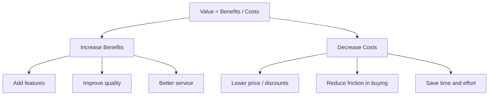

# Consumer Value: Benefits, Costs, and the Value Equation

## Intuition First

Consumers do not buy products — they buy **perceived worth**. Every purchase is a mental calculation: "Do the benefits I get justify what I give up?" Marketing succeeds when it shifts that calculation in the brand's favour.

---

## The Value Equation

$$\text{Perceived Value} = \frac{\text{Benefits}}{\text{Costs}}$$

| Component | What It Includes |
|-----------|------------------|
| **Benefits** | Features, quality, experience, status, convenience, emotional satisfaction |
| **Costs** | Price, time, effort, mental energy, risk, opportunity cost |

### Interpreting the Ratio

| Ratio | Consumer Feeling | Business Implication |
|-------|------------------|----------------------|
| $> 1$ | High value — "great deal" | Satisfaction, loyalty, positive word-of-mouth |
| $= 1$ | Fair value — "got what I paid for" | Neutral; no strong loyalty |
| $< 1$ | Low value — "overpaid" | Dissatisfaction, churn, negative reviews |

---

## Worked Example: Smartwatch Purchase

**Benefits**: fitness tracking, long battery life, sleek design, health insights

**Costs**: purchase price, learning curve, charging time

If benefits clearly outweigh price → high perceived value → purchase and brand affinity.

If price feels unjustified relative to features → value ratio drops below 1 → buyer regret.

---

## Fair Value vs High Value

**Fair value** ($\text{Benefits} = \text{Costs}$) means the consumer feels the transaction was equitable but not exciting. They got exactly what they paid for — no surplus delight, no emotional connection.

**High value** requires benefits to **exceed** costs perceptually. Marketers must aim above fair value because:

- Fair value does not build loyalty
- Competitors can match fair value easily
- Premium pricing requires surplus perceived benefit

---

## How to Increase Value

Two levers on the equation:

| Strategy | Example |
|----------|---------|
| Increase benefits | Add warranty, premium packaging, faster delivery |
| Improve quality | Better materials, more reliable performance |
| Reduce monetary cost | Discounts, bundling, financing |
| Reduce non-monetary cost | One-click checkout (Amazon), simplified onboarding |

---

## Why Perceived Value Matters More Than Price

Perceived value is **subjective**. Two consumers can pay the same price for the same product and feel entirely different about the deal because their benefit assessment differs.

Marketers influence perception through:

- Brand storytelling
- Social proof (reviews, endorsements)
- Experience design (store ambience, packaging)
- Comparison framing ("save 20% vs competitors")

---

## Common Pitfalls / Exam Traps

- **Trap**: Equating value only with low price. Value is a ratio — a premium product can deliver high value if benefits are exceptional.
- **Trap**: Ignoring non-monetary costs. Time, effort, and cognitive load are real costs (e.g., a 10-field checkout form increases perceived cost).
- **Trap**: Assuming fair value builds loyalty. Fair value satisfies once; high value creates repeat purchase and advocacy.
- **Trap**: Forgetting that benefits are perceived, not just objective. A ₹100 cup of coffee can feel high-value if ambience, status, and experience are strong.

---

## Quick Revision Summary

- Value = Benefits / Costs (perceived, not just monetary)
- Ratio $> 1$ = high value; $= 1$ = fair; $< 1$ = dissatisfaction
- Increase value by raising benefits OR lowering costs (including friction)
- Fair value satisfies but does not create loyalty
- Perception matters as much as product specs
- Long-term success requires consistently high perceived value
