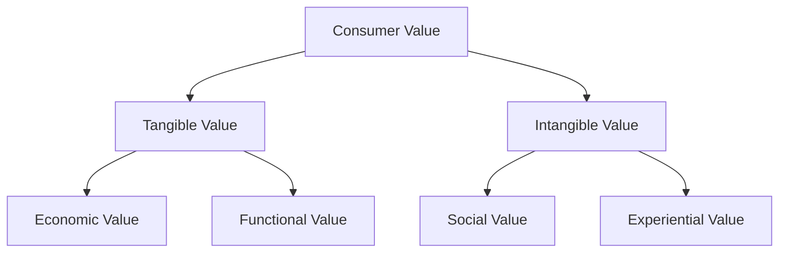

# Tangible and Intangible Value

## Intuition First

Consumers evaluate products on two parallel tracks: what they can **measure** (price, performance) and what they **feel** (status, experience). Strong brands engineer both — a fuel-efficient car (tangible) and the pride of owning a luxury badge (intangible).

---

## Two Broad Categories

---

## Tangible Value

Objective, measurable, logical benefits that are easy to quantify.

### Economic Value

Focus on **price and efficiency** — getting the best deal for money.

| Example | Economic Benefit |
|---------|------------------|
| Bulk coffee packs (20% savings) | Lower unit cost |
| Car with 25 km/l fuel efficiency | Lower running cost |
| Annual subscription vs monthly | Price arbitrage |

**Consumer question**: *Is this a good investment?*

### Functional Value

Focus on **utility and performance** — how well the product does its job.

| Example | Functional Benefit |
|---------|-------------------|
| Smartphone with 48-hour battery | Reliability without frequent charging |
| 10-minute grocery delivery app | Speed and convenience |
| Cloud storage with 99.99% uptime | Dependability for business data |

**Consumer question**: *Does this do what I need it to do?*

---

## Intangible Value

Subjective, emotional, psychological benefits — harder to quantify but often decisive.

### Social Value

How a product affects **status, identity, and belonging**.

| Driver | Example |
|--------|---------|
| Status signalling | Rolex watch as success symbol |
| Belonging | Buying brand sneakers because the peer group wears them |
| Identity expression | Eco-friendly products signalling environmental responsibility |

**Consumer question**: *What will people think of me if I use this?*

### Experiential Value

**Sensory and emotional satisfaction** from using the product or service.

| Element | Example |
|---------|---------|
| Aesthetics | Apple Store design, luxury car dashboard |
| Service warmth | High-end hotel reception greeting |
| Psychological ease | No-questions-asked return policy |
| Ambience | Starbucks — aroma, music, cup branding, barista interaction |

**Consumer question**: *How do I feel while using this?*

---

## The Value Equation in Practice

Recall: $\text{Value} = \frac{\text{Benefits}}{\text{Costs}}$

### Increasing the Numerator (Benefits): Starbucks

- Pay ₹300 for coffee worth ~₹50 in beans
- Benefits include: comfortable seating, Wi-Fi, status cup with logo, ambience, social signalling
- Combined tangible + intangible benefits outweigh monetary cost → high value ratio

### Decreasing the Denominator (Costs): Amazon

- "Buy Now" one-click removes form-filling, decision fatigue, and time
- Lower perceived **non-monetary cost** instantly improves value ratio
- Same price, better perceived deal

---

## Comparison Table

| Dimension | Tangible | Intangible |
|-----------|----------|------------|
| Measurability | High | Low |
| Decision driver | Logic, specs, price | Emotion, identity, experience |
| Examples | Fuel efficiency, bulk discount | Brand prestige, store ambience |
| Marketing lever | Feature comparison, pricing | Storytelling, experience design |
| Key question | Does it work? Is it worth the money? | How does it make me feel? What does it say about me? |

---

## Strategic Implication: Elasticity Shift

Products heavy on intangible/experiential value tend toward **inelastic demand** — consumers stay loyal despite price increases (Starbucks coffee vs generic coffee). This is a core reason brands invest in experience and identity beyond functional specs.

---

## Common Pitfalls / Exam Traps

- **Trap**: Treating intangible value as "soft" and unimportant. Premium pricing often depends entirely on intangible value.
- **Trap**: Assuming tangible value alone wins markets. Commodities compete on price; differentiated brands compete on experience and identity.
- **Trap**: Confusing social value with experiential value. Social = how others perceive you; experiential = how you feel during use.
- **Trap**: Forgetting non-monetary costs in the value equation. Convenience and friction reduction are cost-side levers, not benefit-side.

---

## Quick Revision Summary

- Tangible value = economic (price/efficiency) + functional (utility/performance)
- Intangible value = social (status/belonging) + experiential (emotion/ambience)
- Each sub-type maps to a consumer mental question (investment, utility, perception, feeling)
- Starbucks increases benefits; Amazon decreases costs — both raise value ratio
- Strong brands combine tangible proof with intangible differentiation
- Intangible value drives loyalty and pricing power
