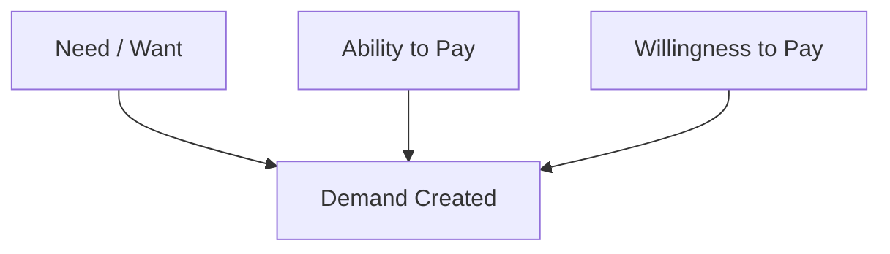

# Demand Fundamentals

## Intuition First

Demand is where marketing meets economics. A product can be desirable, beautifully branded, and widely advertised — but if consumers lack the ability or willingness to pay, no sale occurs. Demand is the **purchase-ready** expression of consumer desire.

---

## Definition

**Demand** is the relationship between:

1. Consumers' **desire** to purchase a good or service
2. Their **willingness** to pay at a given price
3. Their **ability** to pay (financial capacity)

All three must align for demand to exist.

---

## The Demand Triad

| Factor | Meaning | Example |
|--------|---------|---------|
| **Need** | Basic requirement driving purchase | Food, clothing, shelter |
| **Ability** | Financial capacity to buy | Income, savings, credit access |
| **Willingness** | Readiness to pay a specific price at perceived fair value | Choosing iPhone at ₹80,000 because value feels right |

### Worked Example: Smartphone

- **Need/want**: Person wants a smartphone for communication and apps
- **Ability**: Has sufficient income or EMI option
- **Willingness**: Believes the price matches the value offered

Only when all three align does "wanting an iPhone" become **demand** for an iPhone.

---

## Need vs Want vs Demand (Preview)

| Concept | Nature | Marketer's Role |
|---------|--------|---------------|
| Need | Essential, universal, stable | Cater to it (cannot create it) |
| Want | Specific, trend-driven, flexible | Shape and influence it |
| Demand | Need/want + ability + willingness | Convert want into purchase |

---

## Why Demand Matters for Marketers

Understanding demand helps answer:

- What do consumers want?
- How much are they willing to pay?
- At what price point does desire convert to purchase?
- Which segments have real purchasing power?

Demand analysis informs pricing, targeting, product design, and channel strategy.

---

## Factors Influencing Demand

| Factor | Effect |
|--------|--------|
| Income level | Higher income expands ability; recession shrinks it |
| Price | Higher price reduces quantity demanded (law of demand) |
| Perceived value | Higher value increases willingness even at premium prices |
| Substitutes | Availability of alternatives affects demand elasticity |
| Macro conditions | Inflation, interest rates, consumer confidence shift purchasing power |

---

## Common Pitfalls / Exam Traps

- **Trap**: Equating desire with demand. Wanting a luxury car without funds is want, not demand.
- **Trap**: Ignoring willingness. Ability to pay does not guarantee purchase if perceived value is too low.
- **Trap**: Defining demand as only "quantity sold." Demand is a relationship across price points, not a single number.
- **Trap**: Assuming needs automatically create demand. Needs create markets; demand requires ability and willingness.

---

## Quick Revision Summary

- Demand = desire + ability + willingness to pay
- All three factors must be present for a purchase to occur
- Needs are universal; wants are shaped; demand is purchase-ready
- Income, price, and perceived value are key demand drivers
- Marketers study demand to set price, target segments, and forecast sales
- High want without ability = no demand
