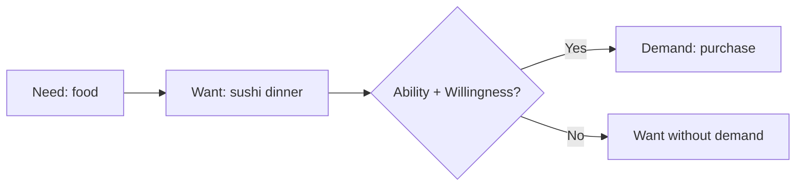

# Need, Want, and Demand

## Intuition First

These three terms sound interchangeable but drive different marketing strategies. **Needs** are survival basics. **Wants** are shaped desires. **Demand** is what actually shows up in sales data when money changes hands.

---

## Comparison Overview

| Dimension | Need | Want | Demand |
|-----------|------|------|--------|
| Nature | Essential for survival/function | Desire for specific products | Purchase-ready intent |
| Stability | Constant, universal | Changes with trends, culture, age | Fluctuates with income and price |
| Examples | Food, water, shelter, clothing | Sushi, Nike sneakers, multi-grain bread | iPhone purchase when buyer can afford it |
| Marketer's role | Cater (cannot create) | Create and influence | Convert through pricing and value |
| Depends on | Biology, basic living | Ads, peers, lifestyle | Need/want + ability + willingness |

---

## Need

**Definition**: Fundamental requirements for survival and functioning.

- Universal and unchanging (air, water, food, shelter, sleep)
- Marketers **do not create needs** — they provide options to fulfil them
- Competition is about *how* the need is met, not *whether* it exists

**Example**: Everyone needs food. Marketers offer fast food, home delivery, organic meals, meal kits — different solutions to the same need.

---

## Want

**Definition**: Desires for specific products or services that enhance quality of life but are not essential for survival.

- Shaped by advertising, peer pressure, culture, personal taste
- Changes over time (fashion trends, technology fads)
- Marketers **actively create and influence wants** through branding, positioning, and messaging

**Examples**:

| Need | Want |
|------|------|
| Food | Sushi at a high-end restaurant |
| Bread | Multi-grain artisan loaf |
| Clothing | Latest Nike sneakers |
| Transportation | Specific car brand/model |

### Marketing Mechanisms for Shaping Wants

- Strategic advertising and promotions
- Lifestyle association (brand = identity)
- Emotional storytelling
- Social proof and influencer marketing

---

## Demand

**Definition**: The combination of need or want with **ability and willingness to pay**.

- Reflects real purchasing power, not just desire
- Directly impacts sales and revenue
- Sensitive to price, income, and perceived value

**Example**: Many people **want** the latest iPhone. Demand exists only among those who can afford it and believe the price is justified.

### Factors Affecting Purchase Conversion

| Factor | Impact |
|--------|--------|
| Income level | Determines ability |
| Pricing | Affects willingness at margin |
| Perceived value | Shifts willingness threshold |
| Market affordability | iPhone demand limited in low-income segments despite high want |

---

## Strategic Implications

| Segment | Strategy |
|---------|----------|
| Need fulfilment | Compete on reliability, access, price efficiency |
| Want creation | Invest in brand, emotion, differentiation |
| Demand generation | Align price, financing, and value to purchasing power |

A campaign that generates buzz (want) but ignores affordability (ability) will not produce demand.

---

## Common Pitfalls / Exam Traps

- **Trap**: Saying marketers create needs. They create **wants**, not biological necessities.
- **Trap**: Assuming high want = high sales. Demand requires purchasing power.
- **Trap**: Treating wants as fixed. Wants shift with culture, trends, and life stage.
- **Trap**: Using need and demand interchangeably. Need is prerequisite; demand is the economic transaction.

---

## Quick Revision Summary

- Need = essential, universal, stable; marketers cater, not create
- Want = specific desire, trend-driven; marketers shape through branding
- Demand = need/want + ability + willingness to pay
- Want without money is not demand
- Pricing and perceived value convert want into demand
- Food (need) → sushi (want) → paid order (demand)
