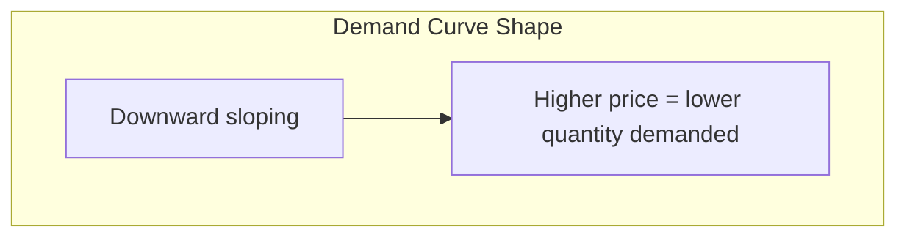

# Economics Foundations for Marketers

## Intuition First

Economics explains why consumers choose one product over another when resources are limited. Every marketing decision — pricing, bundling, positioning — sits on economic trade-offs. Understanding scarcity, demand curves, and elasticity turns gut-feel pricing into strategy.

---

## Scarcity and Trade-offs

**Economics** studies how choices are made when resources are limited.

- Humans have **unlimited wants** but **limited resources**
- Every purchase is a trade-off: buying a phone means not buying something else
- This scarcity drives all economic and marketing decision-making

---

## Consumer Choice Model

Consumer decisions are influenced by:

| Factor | Symbol | Effect |
|--------|--------|--------|
| Price of product | $P_x$ | Higher price → lower quantity demanded |
| Consumer income | $i$ | Higher income → more purchasing power |
| Price of related products | $P_y$ | Substitutes/complements shift demand |
| Tastes and preferences | $T$ | Brand loyalty, trends |
| Expectations | $E$ | Anticipated future prices or availability |

**Demand function**: $D_x = f(P_x, i, P_y, T, E)$

---

## Law of Demand and Demand Curve

**Law of demand**: As price increases, quantity demanded generally decreases; as price decreases, quantity demanded generally increases.

The demand curve is a graphical representation of the price-quantity relationship. Demand reflects both **desire** and **affordability**.

---

## Ceteris Paribus

Latin for *"all other things being equal."*

- Allows economists to isolate one variable's effect (e.g., price on demand)
- Holds income, preferences, and related prices constant
- Essential for clean causal analysis in exams and strategy

**Example**: If Pepsi price drops (ceteris paribus), demand for Pepsi rises.

---

## Price Elasticity of Demand

| Type | Definition | Typical Products | Price Change Effect |
|------|------------|------------------|---------------------|
| **Elastic** | Small price change → large quantity change | Wants, luxuries, substitutable goods (grapes, fashion) | Consumers switch easily |
| **Inelastic** | Price change → little quantity change | Needs, essentials (insulin, basic utilities) | Consumers buy regardless |

### Examples

- **Elastic**: Green grape price doubles → consumers switch to red grapes or strawberries
- **Inelastic**: Insulin price doubles → diabetic patients still need the same quantity

### Marketing Implication

| Elasticity | Pricing Strategy |
|------------|------------------|
| Elastic | Careful price management; promotions drive volume |
| Inelastic | More pricing power; can raise prices with less volume loss |

**Strategic goal**: Shift demand from elastic toward inelastic by adding intangible/experiential value (generic coffee → Starbucks experience).

---

## Substitutes and Complements

| Relationship | Definition | Price Effect |
|--------------|------------|--------------|
| **Substitutes** | Products used in place of each other | Pepsi price up → Coke demand may rise |
| **Complements** | Products used together | Printer price up → ink cartridge demand may fall |

**Marketing applications**:

- Bundle complements (printer + ink subscription)
- Differentiate against substitutes (unique features, brand loyalty)
- Monitor competitor pricing of substitutes

---

## Shifting Elastic to Inelastic: Starbucks Example

| Product | Elasticity | Why |
|---------|------------|-----|
| Generic coffee (₹100) | Elastic | Commodity; easy to switch cafés |
| Starbucks coffee (₹300–500) | More inelastic | Experience, ambience, brand loyalty |

By transforming a functional good into an experiential/social product, Starbucks gains **pricing power** and **consumer loyalty**.

---

## Common Pitfalls / Exam Traps

- **Trap**: Confusing demand with desire. Economic demand requires willingness and ability at a price.
- **Trap**: Assuming all goods are elastic. Essentials are typically inelastic.
- **Trap**: Ignoring ceteris paribus in analysis. Multiple variables change simultaneously in real markets.
- **Trap**: Treating substitutes and complements as the same. Substitutes compete; complements co-sell.
- **Trap**: Forgetting marketers can influence elasticity through branding and experience.

---

## Quick Revision Summary

- Economics = choices under scarcity and trade-offs
- Demand function: $D_x = f(P_x, i, P_y, T, E)$
- Law of demand: price up → quantity demanded down
- Ceteris paribus = isolate one variable's effect
- Elastic = price-sensitive (wants); inelastic = price-insensitive (needs)
- Substitutes replace each other; complements are bought together
- Brands shift elastic demand toward inelastic via experience and identity
