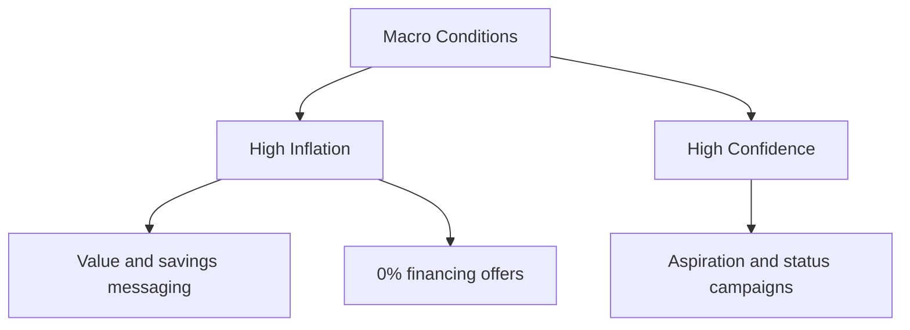
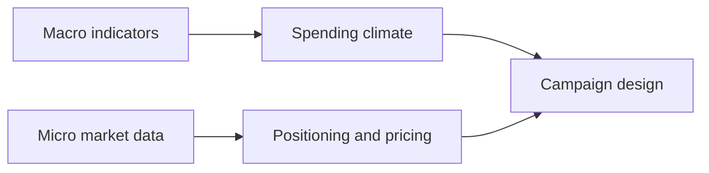

# Macro and Microeconomics in Marketing Strategy

## Intuition First

Marketing does not happen in a vacuum. **Macroeconomics** sets the spending climate (inflation, confidence, interest rates). **Microeconomics** shapes individual purchase decisions (utility, competitor pricing, differentiation). Effective campaigns read both layers.

---

## Macroeconomics: The Big Picture

**Definition**: Study of the economy as a whole.

| Indicator | What It Measures | Marketing Response |
|-----------|------------------|-------------------|
| **Inflation** | Rising cost of goods | Shift to value messaging; offer financing; bulk/home alternatives |
| **Interest rates** | Cost of borrowing | EMI campaigns when rates low; caution when rates high |
| **Consumer confidence** | Willingness to spend | Aspirational campaigns when high; savings-focused when low |

### Macro Examples

| Condition | Campaign Shift |
|-----------|----------------|
| High inflation | Car dealership offers 0% financing; grocery brands emphasise value packs |
| Low confidence | Discounts, essentials focus, trust-building |
| High confidence | Luxury, lifestyle enhancement, premium upsell |

---

## Microeconomics: Individual Markets

**Definition**: Study of individual consumer behaviour and firm-level market dynamics.

| Concept | Application |
|---------|-------------|
| **Consumer utility** | Perceived value from product features — highlight what solves the target's problem |
| **Competitor pricing** | Monitor and respond to rival price moves |
| **Differentiation** | Emphasise unique features when competitors undercut on price |

### Micro Tactics

- **Utility emphasis**: Smartphone brand leads with camera quality for photo enthusiasts, battery life for travellers
- **Comparison ads**: "Switch and save" campaigns targeting competitor customers
- **Value framing**: Show unique benefits that justify premium over cheaper alternatives

---

## Integrated Example: Neighbourhood Coffee Shop

| Level | Condition | Strategy |
|-------|-----------|----------|
| **Macro** | High inflation | Sell bulk coffee beans for home brewing (affordable alternative to daily café visits) |
| **Micro** | Remote workers need workspace | Add free Wi-Fi to increase utility vs competitors |
| **Micro** | Competing with Starbucks | Host local artist nights — unique experience large chains cannot replicate |

This shows how macro conditions shape *what* to sell and micro factors shape *how* to differentiate.

---

## Decision Framework

| Question | Lens |
|----------|------|
| Can consumers afford to spend? | Macro |
| What do they value most in this category? | Micro |
| How are competitors priced? | Micro |
| Should we message luxury or savings? | Macro |
| What feature should we lead with? | Micro |

---

## Common Pitfalls / Exam Traps

- **Trap**: Using only micro tactics during a recession. Premium positioning fails when macro purchasing power collapses.
- **Trap**: Ignoring competitor pricing in utility messaging. Features matter only if price-value balance is competitive.
- **Trap**: Treating macro indicators as independent. Inflation and consumer confidence interact (high inflation often lowers confidence).
- **Trap**: Applying the same campaign globally without regional macro differences.

---

## Quick Revision Summary

- Macroeconomics = economy-wide factors (inflation, rates, confidence)
- Microeconomics = individual utility, competitor pricing, differentiation
- High inflation → value messaging, financing, affordable alternatives
- High confidence → aspirational, luxury, lifestyle campaigns
- Micro: emphasise utility, monitor rivals, differentiate uniquely
- Best strategies combine macro spending climate with micro competitive positioning
- Coffee shop example: bulk beans (macro) + Wi-Fi + local events (micro)
