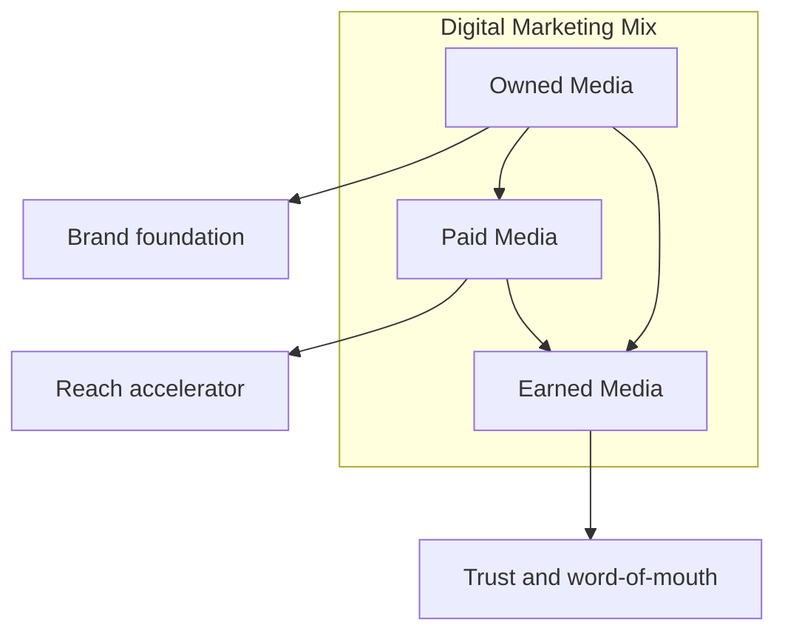
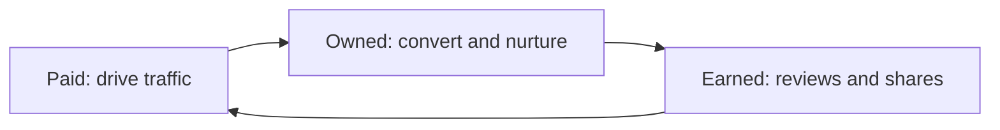

# Digital Marketing Mix: Earned, Owned, and Paid Media

## Intuition First

Modern marketing does not rely on a single channel. Sustainable growth comes from balancing three media types: what you **earn** through reputation, what you **own** through your platforms, and what you **pay** for to accelerate reach. Each plays a distinct role; together they compound.

---

## The Three Components

---

## Earned Media

**Definition**: Publicity gained organically through reputation, word-of-mouth, and third-party mentions — not purchased.

| Source | Example |
|--------|---------|
| Customer reviews | Glowing product review on Amazon |
| Social shares | User posts about brand experience |
| Media coverage | Press article featuring company story |
| Influencer mentions | Unpaid organic endorsement |
| Guest posts | Third-party blog featuring brand |

### Why It Matters

- Highest **credibility** — people trust peer recommendations over ads
- **Zero direct media cost** (though product quality investment is required)
- Drives awareness and influences purchase decisions authentically

**Marketer's goal**: Earn media through exceptional product, service, and shareable experiences.

---

## Owned Media

**Definition**: Digital assets the brand **fully controls**.

| Asset | Purpose |
|-------|---------|
| Website | Brand story, product showcase, conversion hub |
| Blog | Thought leadership, SEO, traffic generation |
| Social profiles | Direct audience communication |
| Email lists | Nurture relationships, retention, promotions |
| App | Engagement, loyalty, data collection |

### Why It Matters

- Complete control over **messaging and user experience**
- Foundation for long-term audience relationships
- Hub that paid and earned strategies point toward

---

## Paid Media

**Definition**: Marketing efforts requiring payment to promote content or products.

| Format | Example |
|--------|---------|
| PPC (Pay-Per-Click) | Google Search ads — pay per click |
| Display ads | Banner ads on websites |
| Social media ads | Facebook/Instagram targeted campaigns |
| Native ads | Sponsored content matching platform style |
| Remarketing | Re-engage users who visited site but did not convert |

### Why It Matters

- **Instant visibility** and scalable reach
- Precise audience targeting and real-time performance tracking
- Acts as **catalyst** for earned media (more visibility → more conversation)

---

## How the Three Work Together

| Relationship | Dynamic |
|--------------|---------|
| Paid → Earned | Ads increase visibility; satisfied customers generate organic buzz |
| Owned → Paid | Landing pages and content convert paid traffic |
| Owned → Earned | Quality owned content gets shared organically |
| Balance | Over-reliance on paid without owned/earned = expensive, low-trust growth |

---

## Comparison Table

| Dimension | Earned | Owned | Paid |
|-----------|--------|-------|------|
| Cost | Free (organic) | Platform maintenance | Per impression/click |
| Control | Low | High | Medium (platform rules) |
| Credibility | Highest | High | Lower |
| Speed | Slow to build | Medium | Fast |
| Sustainability | Long-term if earned | Long-term | Stops when budget stops |

---

## Common Pitfalls / Exam Traps

- **Trap**: Treating paid media as sufficient alone. Without owned assets, paid traffic has nowhere credible to land.
- **Trap**: Confusing earned with owned. A brand's Instagram post is owned; a customer's share of that post is earned.
- **Trap**: Buying fake reviews to simulate earned media. Destroys credibility when discovered.
- **Trap**: Ignoring the earned media flywheel. Paid can spark conversation, but product quality sustains it.

---

## Quick Revision Summary

- Digital mix = Earned + Owned + Paid
- Earned = organic publicity (reviews, shares, press) — highest trust
- Owned = brand-controlled assets (website, blog, email, social)
- Paid = purchased reach (PPC, display, social ads, remarketing)
- Owned is the foundation; paid is the accelerator; earned is the credibility layer
- Balance all three for sustainable long-term marketing
